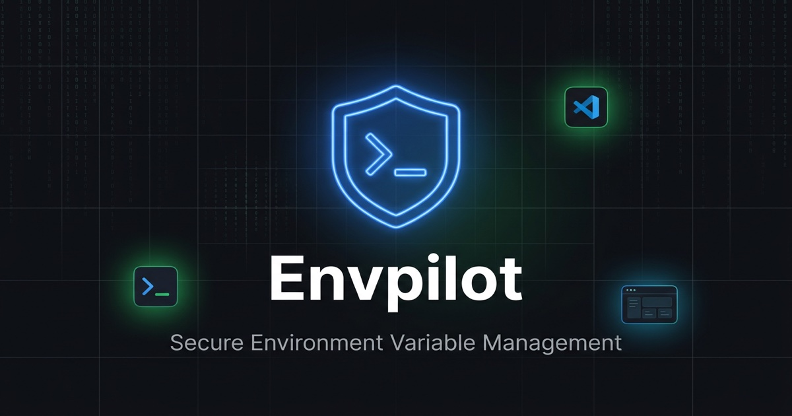

<p align="center">
  
</p>

<h1 align="center">Envpilot</h1>

<p align="center"><strong>The open-source environment variable &amp; secrets manager for teams — built for the AI-agent era.</strong></p>

<p align="center">
  <a href="https://www.envpilot.dev">Website</a> ·
  <a href="https://docs.envpilot.dev">Docs</a> ·
  <a href="https://blog.envpilot.dev">Blog</a> ·
  <a href="https://www.envpilot.dev/changelog">Changelog</a> ·
  <a href="https://www.envpilot.dev/wishlist">Roadmap</a> ·
  <a href="https://github.com/rafay99-epic/envpilot.dev/issues/new">Report a bug</a>
</p>

<p align="center">
  <a href="./LICENSE"></a>
  <a href="https://github.com/rafay99-epic/envpilot.dev/actions/workflows/ci.yml"></a>
  <a href="./CONTRIBUTING.md"></a>
  <a href="https://www.npmjs.com/package/@envpilot/cli"></a>
  <a href="https://marketplace.visualstudio.com/items?itemName=EnvPilot.envpilot"></a>
  <a href="https://open-vsx.org/extension/envpilot/envpilot"></a>
  <a href="https://plugins.jetbrains.com/plugin/33946-envpilot"></a>
</p>

<p align="center">
  
</p>

Most teams still paste `.env` files into Slack and hope for the best. Envpilot
replaces that with one encrypted source of truth that your whole team — and
your AI tooling — pulls from. Secret values are encrypted in WorkOS Vault
(AES-256-GCM); the database stores only opaque reference IDs, so a database
breach yields zero plaintext secrets.

## Features

**Secrets management**

- [Per-environment variables](https://docs.envpilot.dev) — `DATABASE_URL` for
  development and production are independent values with one deterministic
  resolution rule per (key, environment) pair
- Version history, trash & restore, bulk import/export
- Secret rotation reminders with email notifications
- Variable requests — members propose, admins approve

**Access control & audit**

- Role-based access control — admin / team lead / member, down to
  per-variable permissions
- Full audit log of every read, write, share, and denial
- Org-scoped API keys stored as SHA-256 hashes with dynamic scopes and
  optional expiry

**Every surface you work in**

| Surface           | Install                                                                                                                                             |
| ----------------- | --------------------------------------------------------------------------------------------------------------------------------------------------- |
| Web dashboard     | [envpilot.dev](https://www.envpilot.dev)                                                                                                            |
| CLI               | [`npm i -g @envpilot/cli`](https://www.npmjs.com/package/@envpilot/cli)                                                                             |
| VS Code extension | [Marketplace](https://marketplace.visualstudio.com/items?itemName=EnvPilot.envpilot) · [Open VSX](https://open-vsx.org/extension/envpilot/envpilot) |
| JetBrains plugin  | [JetBrains Marketplace](https://plugins.jetbrains.com/plugin/33946-envpilot)                                                                        |
| GitHub Action     | [`rafay99-epic/envpilot-action@v1`](https://github.com/rafay99-epic/envpilot-action)                                                                |
| REST API          | [API docs](https://docs.envpilot.dev)                                                                                                               |
| MCP server        | [MCP docs](https://docs.envpilot.dev/mcp/overview)                                                                                                  |

**Built for AI agents**

Agents (Claude Code, Cursor, anything MCP-capable) get scoped, audited,
revocable access to exactly the secrets you grant — via the MCP server and
scoped API keys. Your raw `.env` never enters a prompt.

## Getting started

|                                                 Envpilot Cloud                                                  |                                                 Self-host                                                 |
| :-------------------------------------------------------------------------------------------------------------: | :-------------------------------------------------------------------------------------------------------: |
| The fastest way in — [sign up free](https://www.envpilot.dev/sign-up): 3 projects, 3 teammates, no credit card. | Run your own instance on your own infrastructure — follow the [self-hosting guide](docs/SELF_HOSTING.md). |

Then connect from your terminal:

```bash
npm install -g @envpilot/cli

envpilot login          # device-flow authentication
envpilot init           # link this repo to a project
envpilot pull           # fetch variables for your environment

# or inject variables at runtime — no .env file on disk at all
envpilot run -- npm run dev
```

## Security

Envpilot is a secrets manager, so the boring details matter:

- Secret values live encrypted in WorkOS Vault; the database holds only vault
  reference IDs — never plaintext.
- API keys and service tokens are hashed (SHA-256) at rest, org-scoped, with
  optional expiry.
- Reads fail loudly — never partial data, never sentinel values.
- Every access is audit-logged, including denials.

Found a vulnerability? **Please report it privately** — see
[SECURITY.md](SECURITY.md).

## Open source vs paid

The code in this repo is [MIT-licensed](./LICENSE) — read it, audit it, run
it yourself. [Envpilot Cloud](https://www.envpilot.dev) is the hosted version:
the free tier covers small teams, and the pro tier funds development with
higher limits and team features (see [pricing](https://www.envpilot.dev/pricing)).
Self-hosted instances are yours to run however you like.

## Contributing

Issues and PRs welcome — see [CONTRIBUTING.md](CONTRIBUTING.md) for the
workflow and [good first issues](https://github.com/rafay99-epic/envpilot.dev/issues?q=is%3Aissue+is%3Aopen+label%3A%22good+first+issue%22)
for a place to start.

<details>
<summary><strong>Development setup &amp; repo layout</strong></summary>

Envpilot is a Bun + Turborepo monorepo: Next.js web app, Convex backend, CLI,
VS Code extension, JetBrains plugin, and shared packages.

```bash
bun install
bun run setup
# edit .env.local with your credentials
bun run dev
```

```
apps/
  web/                # Next.js web dashboard (@envpilot/web)
  blog/               # Blog — blog.envpilot.dev (@envpilot/blog)
  docs/               # Docs site — docs.envpilot.dev (@envpilot/docs)
  cli/                # CLI npm package (@envpilot/cli)
  admin/              # Admin dashboard (@envpilot/admin)
  vscode-extension/   # VS Code extension (envpilot)
  jetbrains-plugin/   # JetBrains IDE plugin (Gradle, Kotlin)
convex/               # Shared Convex backend
packages/
  ui/                 # Shared React UI components (@envpilot/ui)
  tsconfig/           # Shared TypeScript configs
  eslint-config/      # Shared ESLint config
  prettier-config/    # Shared Prettier config
```

Contributor docs:

- [Setup](docs/setup.md) — prerequisites, env vars, install
- [Commands](docs/commands.md) — dev, build, test, deploy
- [Architecture](docs/architecture.md) — data flow, auth, RBAC
- [Project Structure](docs/structure.md) — folder layout
- [CI / CD](docs/ci.md) — GitHub Actions
- [Development Guide](docs/DEVELOPMENT.md) — conventions, Convex, TypeScript
- [Deployment Guide](docs/DEPLOYMENT.md) — Vercel, Convex, npm, Open VSX
- [Features](docs/FEATURES.md) — full feature inventory
- [Self-Hosting](docs/SELF_HOSTING.md) — run your own instance

</details>

## License

[MIT](./LICENSE) © Syntax Lab Technology and Rafay.

---

<p align="center">
  Built in the open &middot; <a href="https://www.envpilot.dev">envpilot.dev</a>
  <br />
  <sub>Developed at <a href="https://syntaxlabtechnology.com">Syntax Lab Technology</a> &middot; Lead dev <a href="https://rafay99.com">rafay99.com</a></sub>
</p>
