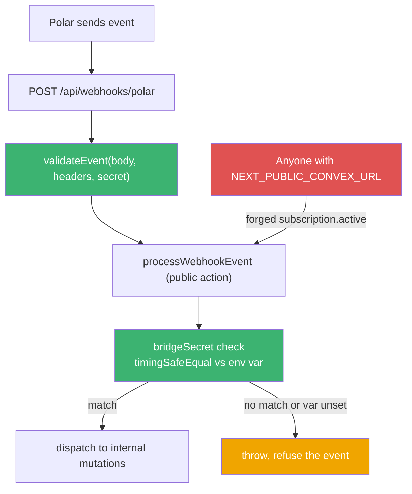
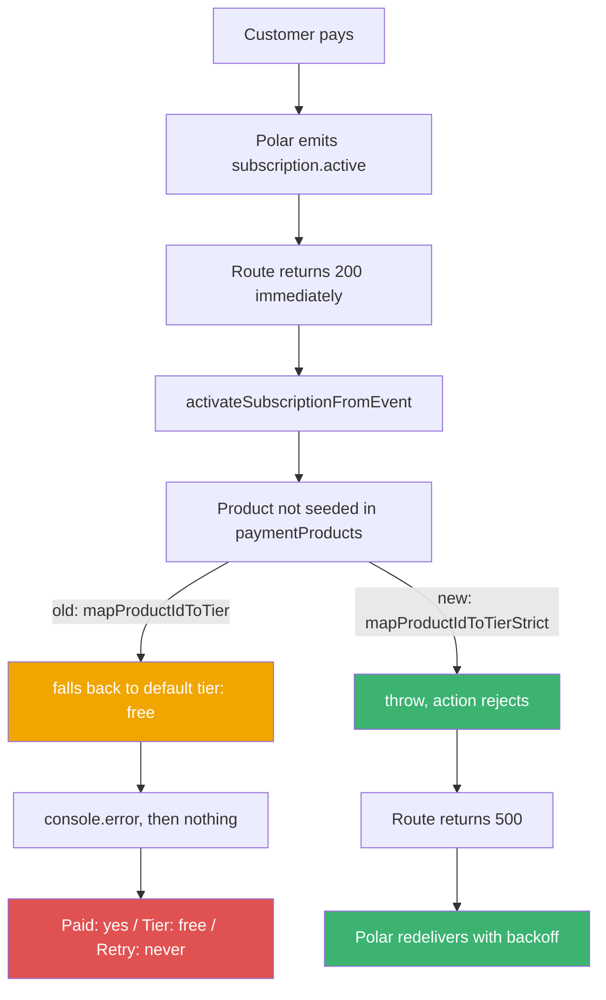
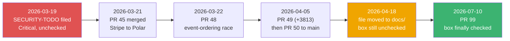

On **19 March 2026** I committed a file called `SECURITY-TODO.md`. The commit message was, and I'm quoting the whole thing here, `security-todo.md`. Top item, marked Critical, unchecked:

> - [ ] **Make `processWebhookEvent` internal** (`convex/subscriptions.ts:605`)
>   - Currently a public `action` — anyone with the Convex URL can call it directly, bypassing Stripe signature verification

I knew about the bug. I wrote the bug report myself. I filed it the same day the billing foundation merged.

Then I shipped around it until **10 July**.

That's **113 days**. This is the story of how that happens, and — because I want to be fair to past-me — of the one detail that made the "obvious" fix not actually work.

## Why I left Stripe in the first place

The reason is boring and it is not a reason anyone writes a blog post about, so let me just quote the first bullet of PR [#45](https://github.com/rafay99-epic/envpilot.dev/pull/45) verbatim:

> - **Replace Stripe with Polar.sh** as the payment gateway — Stripe is unavailable in certain regions

That's it. No feature matrix. No pricing spreadsheet. Geography.

If you're building from a place Stripe hasn't reached, that bullet is the entire decision tree. You don't get to compare fee structures. You take the processor that will actually take your money.

PR #45 merged **21 March 2026, 20:47 UTC**. **+920 / −634**. Every `stripe*` field in `convex/schema.ts` became `polar*`. The `stripeCustomers` table became `polarCustomers`. `stripePriceId` became `polarProductId` everywhere in the admin panel. `bun.lock` lost `stripe` and gained `@polar-sh/sdk` plus `@polar-sh/nextjs`. The event handler was rewritten for eight Polar event types — `checkout.updated`, `subscription.created`, `subscription.active`, `subscription.updated`, `subscription.canceled`, `subscription.uncanceled`, `subscription.revoked`, `order.paid`.

And the diff touched `SECURITY-TODO.md` too.

Not to fix it. To find-and-replace it. `Stripe` became `Polar.sh`. `STRIPE_WEBHOOK_SECRET` became `POLAR_WEBHOOK_SECRET`.

The `[ ]` stayed a `[ ]`.

**The Facepalm:** I updated the wording of my own bug report as part of a migration, and shipped the bug. The TODO was in the diff. I wrote that diff. I merged it myself, unreviewed.

## The 29 minutes I'd like back

The migration didn't land cleanly either, and the PR list is the receipt. #45 merged to `staging` at 20:47. PR [#46](https://github.com/rafay99-epic/envpilot.dev/pull/46) — same title, same **+920 / −634**, `staging` → `main` — got **closed at 21:16**, 29 minutes later, never merged. PR [#47](https://github.com/rafay99-epic/envpilot.dev/pull/47) merged at 22:26 off the _same head branch_ as #45, adding **+318 / −27**.

Three PRs, one title, two of them merged, one of them dead, all inside two hours.

What #47 added is the interesting part: an eager sync route at `apps/web/src/app/api/billing/sync/route.ts`, described in the body as handling "webhook race conditions."

Read that again. I shipped a workaround for a race condition before I'd found the race condition.

I found it the next day. PR [#48](https://github.com/rafay99-epic/envpilot.dev/pull/48), **22 March, 09:17 UTC**, **+475 / −71**:

> The `subscription.created`/`subscription.active` handler was failing silently because it depended on `checkout.updated` creating a `polarCustomers` record first. Due to event ordering, this record often didn't exist yet.

The fix was a three-strategy resolution chain that's still in the code today — metadata from checkout first, then `customer.externalId`, then the table lookup that had been the original approach — the one that kept losing the race:

```ts
// convex/features/billing/webhooks.ts
// Strategy 1: metadata from checkout (most reliable)
if (metadata.userId) {
  resolvedUserId = metadata.userId;
  resolvedOrgId = metadata.organizationId;
}

// Strategy 2: customer.externalId (= Convex user ID, set at checkout)
if (!resolvedUserId && customerExternalId) {
  resolvedUserId = customerExternalId;
}

// Strategy 3: polarCustomers table lookup (original approach)
if (!resolvedUserId) {
  const polarCustomer = await ctx.runQuery(/* ... */);
  if (polarCustomer) resolvedUserId = polarCustomer.userId ?? undefined;
}
```

**The words I wrote and did not act on:** "failing silently." I named the exact failure mode in March. #48 fixed _why_ resolution failed. It did not touch _what happens when it fails anyway_ — which is the bug that survived until July.

## The 5,155-line merge with the five-line body

Two weeks later, PR [#49](https://github.com/rafay99-epic/envpilot.dev/pull/49), **+3813 / −408**. This is the one where I got defensive about payment providers, and honestly, the schema change is the smartest thing in this whole story:

```ts
// convex/schema.ts
paymentProducts: defineTable({
  tierName: v.string(), // "free", "pro"
  provider: v.string(), // "polar", "stripe", "lemonsqueezy"
  productId: v.string(),
  isActive: v.boolean(),
  // ...
}).index("by_tier_and_provider", ["tierName", "provider"]),
```

Having just rewritten the entire schema to un-hardcode one processor, I built a table so I'd never have to do it again. #49 also added a `processedWebhookEvents` table keyed on the `webhook-id` header with a 6-hour cleanup cron, and a DB-level payment kill switch to go with the existing `NEXT_PUBLIC_PAYMENTS_ENABLED` build flag (the UI didn't actually honor both until #99).

Then PR [#50](https://github.com/rafay99-epic/envpilot.dev/pull/50) took the whole thing to `main`. **+5155 / −1060**. It merged **4 minutes and 34 seconds** after #49.

Here is the complete body of that pull request:

```
# Changes:
- Check the following PR for more details
- #45
- #47
- #48
- #49
```

Five thousand lines of payment-processing code entering the main branch behind a list of pointers. Note which number is missing from that list: #46, the one that never merged.

## What the public action actually meant

Fast-forward to July. Going live with real transactions, so I audited the thing properly. The finding, from the body of PR [#99](https://github.com/rafay99-epic/envpilot.dev/pull/99):

> `processWebhookEvent` was a **public Convex action with zero caller verification** — anyone with the public Convex URL could post a forged `subscription.active` event and self-grant pro tier, bypassing the route-side Polar signature check entirely.

The signature verification was real. `validateEvent(body, headers, webhookSecret)` in the Next.js route, Standard Webhooks, 403 on failure. Solid.

It was also a lock on a door nobody had to walk through.



Trace the red lane: it never touches the green signature check at all.

**But here's the kicker:** the credential for that attack ships inside my own products. The Convex URL is `NEXT_PUBLIC_CONVEX_URL`, and per my own `CLAUDE.md`, it's baked into every CLI and VS Code extension build at build time. Anyone who installed the CLI had the address of the unlocked door baked into the build they installed.

## Why `internalAction` wasn't the fix

The TODO said "make it internal." Obvious. One-word change. Done in thirty seconds.

Except it doesn't work.

Convex's `internalAction` is callable from other Convex functions, not from the outside. My Next.js server calls Convex over HTTP with no admin identity — so an internal action is a function my webhook route _cannot call_. The fix the TODO prescribed would have taken billing offline.

So the action stays public, and re-authenticates itself:

```ts
export const processWebhookEvent = action({
  args: {
    type: v.string(),
    data: v.string(),
    webhookId: v.optional(v.string()),
    bridgeSecret: v.string(),
  },
  handler: async (ctx, args) => {
    const expectedSecret = process.env.BILLING_WEBHOOK_BRIDGE_SECRET;
    if (!expectedSecret) {
      throw new Error(
        "BILLING_WEBHOOK_BRIDGE_SECRET is not set on this Convex deployment — refusing to process billing webhooks"
      );
    }
    if (!timingSafeEqual(args.bridgeSecret, expectedSecret)) {
      throw new Error("Invalid billing webhook bridge secret");
    }
```

**Fail closed:** a deployment missing the env var refuses every billing event rather than processing them unauthenticated. If I misconfigure production, payments stop. That's the correct failure — a stalled webhook queue is recoverable, a self-service pro-tier grant is not.

And I got the compare wrong on the first commit. Here's what shipped in `0dd12add`:

```ts
if (aBytes.length !== bBytes.length) return false;
```

A Greptile review caught it. Commit `bb2db945` replaced it with a loop that always runs to the longer input:

```ts
const maxLength = Math.max(aBytes.length, bBytes.length);
let diff = aBytes.length ^ bBytes.length;
for (let i = 0; i < maxLength; i++) {
  diff |= (aBytes[i] ?? 0) ^ (bBytes[i] ?? 0);
}
return diff === 0;
```

I wrote a constant-time comparison and then handed an attacker a timing oracle for the secret's byte length in the first line of it. Being careful is not the same as being correct.

## The bug that would have eaten the money

The trust-boundary hole was the headline. The one that matters more is this one, because nobody would ever have reported it.

Polar redelivers a webhook only on a non-2xx response. My route returned 200 the moment it dispatched. So if the handler couldn't map the product ID to a tier — say, because I hadn't seeded the production product yet — it fell back to the default tier and logged an error into the void.



Follow the orange branch to its terminal state and read the three words in the red box.

Paid: yes. Tier: free. Retry: never. A card gets charged, the payer lands on the confetti page, and the platform hands them the free plan forever. No alert. No retry. One `console.error` nobody is watching.

The fix was splitting one function into a strict one and a lenient one:

```ts
/**
 * Maps a Polar product ID to a tier name, or null when the product is not
 * seeded anywhere. Activation paths MUST treat null as a hard error — a
 * silent default-tier fallback turns "product not seeded yet" into "customer
 * paid and got the free tier".
 */
async function mapProductIdToTierStrict(/* ... */): Promise<string | null>;
```

Display paths keep the friendly fallback. Activation paths throw, the action rejects, the route returns 500, and Polar retries with backoff until I seed the product. **The 500 is a feature.** It's the only thing standing between a config mistake and a stolen payment.

There were six more in the same sweep, and my favourite is the anti-abuse check that was itself the abuse vector. The grace-period cooldown returned early if you'd had a grace period in the last 30 days — no grace row created. But the expiry cron only downgrades users who _have_ a grace row. So: subscribe, cancel, resubscribe, cancel again inside 30 days, and you keep Pro forever. Free. The fraud prevention was the fraud.

Three separate bugs also came from `.first()` in Convex returning the **oldest** row, not the newest. A stale revoked subscription shadowed a live one, which let a subscriber buy twice.



Note the middle of that line — the file moved to `docs/` in April with the box still empty — 113 days of a critical item surviving two migrations and a directory move.

## What I'd tell March-me

Don't file the TODO. Fix it, or don't write it down.

That sounds backwards, so let me be precise about the failure. Writing it down felt like handling it. The file existed, the item was marked Critical, and every time I thought about the trust boundary I got a little hit of "yeah, that's tracked." The TODO wasn't documentation. It was a way of not doing the work while feeling responsible.

Worse: it kept the fix looking small. "Make it internal" is one word. Because the entry looked cheap, it never competed with anything for a slot — and when I finally sat down with it, it turned out the prescription was wrong and the real fix was **+841 / −663** across the billing module.

If a security item survives a migration by getting find-and-replaced, it isn't a backlog entry anymore. It's a decision.

And I'm not done. `.env.example` — the file whose entire job is documenting env vars — still has no `BILLING_WEBHOOK_BRIDGE_SECRET` line. So does `CLAUDE.md`. The repo's commit guard blocks staging `.env*` files, so that one-file diff is still sitting uncommitted.

`docs/SECURITY-TODO.md` has seven unchecked boxes on it right now.

I'll let you guess how confident I am about those.

Until then, check your webhook retry semantics, nerds.
