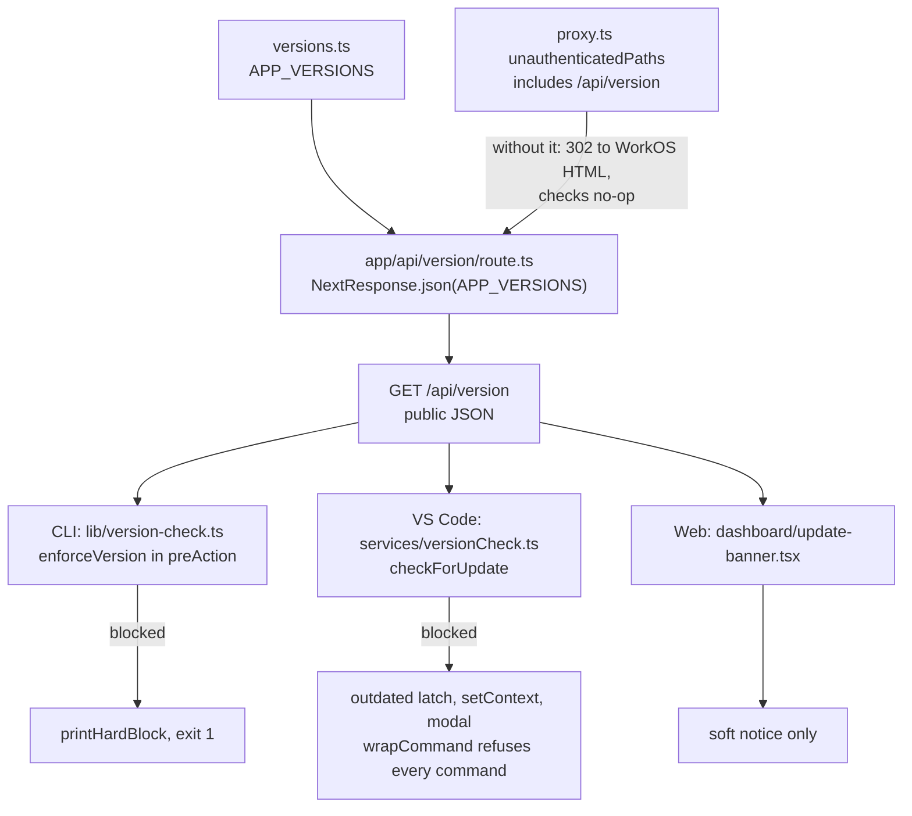
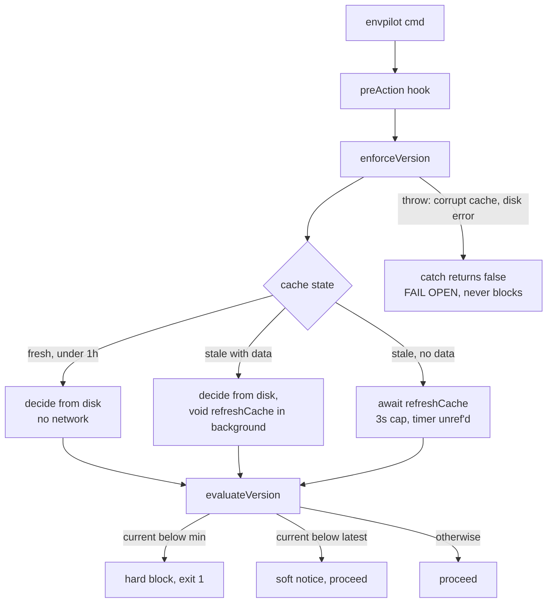
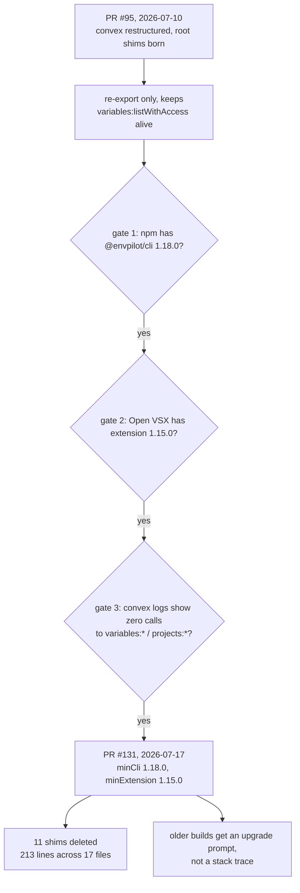

Somebody on an old CLI build runs `envpilot pull` and gets back `session not authorized`.

Their session is completely fine.

What actually happened is that I moved vault crypto into Convex in [PR #86](https://github.com/rafay99-epic/envpilot.dev/pull/86) and deleted `GET/POST /api/cli/variables` along with its `/bulk` sibling. Their build is calling a route that stopped existing. The error string is a lie, and it's the worst kind of lie — the kind that points you at the wrong fix. They'll re-login. It won't help.

And that is the actual problem with deleting things. Not that old clients break — old clients are _supposed_ to break, that's the entire definition of a breaking change.

The problem is that they break **illegibly**.

A deleted REST endpoint gives you a 404, which some client-side branch three files away converts into whatever error string was nearest to hand. A deleted Convex function gives you `function not found`. Go read both of those again and tell me where the word "update" appears.

Here's the thing though: I already had an update-notification system. It shipped in [PR #26](https://github.com/rafay99-epic/envpilot.dev/pull/26), back in March. Soft notice, tells you a newer version exists, job done.

When I finally went and looked at it, it was broken in three independent ways.

## Three quiet failures in the one thing meant to warn people

**Failure one.** `/api/version` was not listed in `unauthenticatedPaths` in `apps/web/src/proxy.ts`.

Think about who calls that endpoint. Every single version check comes from a signed-out client — the CLI polls before it has a session at all, the extension polls the moment it activates. So every one of those requests got a WorkOS redirect to an HTML sign-in page instead of JSON.

It didn't error. It didn't log. It just quietly did nothing, forever.

And a version check that does nothing looks _exactly_ like "you're up to date."

**Failure two.** The manifest was stale. `APP_VERSIONS.cli` and `.extension` both still said `1.3.3` while the CLI was out there shipping 1.12.x. So even in the universe where the request succeeded, the server was advertising an ancient build as "latest" — a running 1.12 compares as **newer** than latest, and no notice ever fires.

**Failure three.** The CLI ran its check in a Commander `postAction` hook.

After the command. A hook that tells you your version is unsupported once the unsupported command has already blown up is not a guardrail, it's decoration.

Three for three. It took the device-flow auth cutover and #86 ripping out the vault routes to make me look at any of it. The guardrail had never once been load-bearing, and I only found out at the exact moment I needed to lean on it.

## Two tiers, because "outdated" and "broken" are different problems

The design in [PR #89](https://github.com/rafay99-epic/envpilot.dev/pull/89) is one constant with two tiers per client surface. That's it. That's the whole server side.

```ts
export const APP_VERSIONS = {
  web: "1.51.0",
  cli: "1.18.0",
  extension: "1.16.0",
  // Registry-native floors: 1.18.0 (CLI) / 1.15.0 (extension) are the first
  // builds that call the real features/* Convex paths and consume
  // capability-driven role metadata. Everything below called the legacy root
  // shim paths (convex/<module>.ts), DELETED in the same release that set
  // these floors — older builds would fail with "function not found" instead
  // of an upgrade prompt, exactly what min versions exist to prevent.
  minCli: "1.18.0",
  minExtension: "1.15.0",
} as const;
```

**The split:** below `cli`/`extension` you get a soft notice and your command still runs like normal. Below `minCli`/`minExtension` you get hard-blocked before anything executes. The entire server implementation is that constant plus `return NextResponse.json(APP_VERSIONS)` in a twelve-line route handler.

All the complexity lives in the clients, and all of it is about failure modes.

The design I didn't build was per-endpoint capability negotiation — clients advertise what they support, server routes accordingly. It is genuinely the more correct design. It is also completely wrong here, because it requires every endpoint to carry a compatibility matrix _forever_, which is precisely the maintenance cost I was trying to delete in the first place.

A single version floor is coarse. It blocks a 1.17 client from commands that would have worked fine.

Coarse is the point. One number, one place, one thing to reason about on merge day.



Follow the signed-out path and notice it's the only path that matters.

The CLI hook is four lines, and honestly the comment on it does more work than the code:

```ts
// Enforce the version policy BEFORE any command runs (parseAsync awaits this).
// Below the server's minimum supported version → hard-block and exit, since
// the command would otherwise call server/Convex contracts that no longer
// exist. Merely-outdated just prints a soft update notice and proceeds.
// `--version`/`--help` short-circuit Commander before actions, so they are
// naturally exempt (users can always check their version / read help).
program.hook("preAction", async () => {
  const blocked = await enforceVersion();
  if (blocked) process.exit(1);
});
```

**The exemption I got for free:** somebody who's hard-blocked still needs to be able to ask what version they're even on. `--version` and `--help` never reach `preAction` because Commander short-circuits them first, so that came for free — but it's exactly the kind of thing you only discover was missing after you've locked somebody out with no way to see why.

## Twice I had to teach the gate not to be a gate

The first working `enforceVersion()` awaited the network on the hot path. Every command, a fetch.

Fine idea, right up until the server is slow, at which point every `envpilot list` takes three seconds.

Commit `176ebb25` restructured it. Fresh cache is a pure disk read with zero network. Stale-but-populated decides from disk and refreshes in the background. Only a first-ever run awaits, bounded to 3s. The throttle timestamp gets written _before_ the fetch, so a down server gets hit at most once an hour and can never turn every command into a hang.

Then commit `b07ae212` fixed the failure mode I hadn't thought about at all. Not the network.

The disk.

```ts
  } catch {
    // FAIL OPEN. A version-check failure (corrupt cache file, disk/permission
    // error, unexpected Conf throw) must NEVER block a command — the check is a
    // guardrail, not a gate on the CLI working at all.
    return false;
  }
```

**The Facepalm:** a corrupt cache file or a read-only home directory throws out of `Conf`, rejects the `preAction` hook, and takes down _every command in the CLI_. I shipped a version check capable of bricking the tool it existed to protect from being bricked.

Twice in one PR I had to walk the same thing back toward "advisory unless it is certain."



Count how many arrows lead to "run the command anyway" — that's deliberate.

The decision itself is a pure function with no I/O, which is the only piece that gets unit tests:

```ts
export function evaluateVersion(
  current: string,
  latest: string | undefined,
  min: string | undefined
): VersionVerdict {
  const blocked = !!min && compareVersions(current, min) < 0;
  const updateAvailable =
    !!latest && compareVersions(current, latest) < 0 ? latest : null;
  return { blocked, updateAvailable };
}
```

One systems detail in that file is worth stealing outright: the fetch timeout does **not** use `AbortSignal.timeout()`. That keeps a _referenced_ timer on the event loop, so a command that finishes in 40ms sits there doing nothing for the full 3s before the process is allowed to exit. Manual `setTimeout` plus `timer.unref?.()` instead.

The extension landed on a stricter rule than the CLI — fail open only on no-cache _and_ network error. A block it has already learned survives going offline. Otherwise the hard block silently evaporates the first time the network blips after the fetch interval lapses, which is precisely the moment a stale client is most likely to be doing something it shouldn't.

## The floor is really a permission slip

Here's the part that makes all of the above worth building.

[PR #95](https://github.com/rafay99-epic/envpilot.dev/pull/95) restructured the Convex backend from flat root modules into `convex/features/<feature>/`. Published CLI and extension builds call Convex functions by baked-in string references — `"variables:listWithAccess"` — so every moved function would have vanished out from under every installed client on the planet.

So it shipped with nine compatibility shims re-exporting sixteen functions. This is what backwards compatibility physically looks like on disk. Seventeen lines, fourteen of them comment:

```ts
/**
 * LEGACY CLIENT COMPAT SHIM — DO NOT ADD EXPORTS, DO NOT IMPORT FROM HERE.
 *
 * Published CLI (>= 1.14.0) / VS Code extension (>= 1.7.2) builds call
 * the function path(s) below by baked-in string refs. This shim keeps those
 * exact paths registered on the deployment. All monorepo code uses the real
 * feature paths.
 *
 * Removal: once the CLI/extension releases that use the features/* paths are
 * the minimum supported versions (minCli/minExtension in
 * apps/web/src/lib/versions.ts), delete this file.
 */

export { listWithAccess } from "./features/variables/queries";
// Called by published extension builds (1.7.2 – 1.13.0); missed in the PR #95
// shim set, which broke the extension's real-time metadata subscription.
export { listMetadataByProject } from "./features/variables/queries";
```

Read that second comment again.

The shim set in #95 was declared complete — "verified as the complete set across the git history of both clients." It was not. `listMetadataByProject` got missed, and the extension's real-time metadata subscription broke.

> You cannot reliably enumerate what published clients call by reading your own source. The callers are compiled artifacts sitting on other people's machines. You find out from breakage.

By the time I came to remove them, there were **eleven** shim files, not nine.

[PR #131](https://github.com/rafay99-epic/envpilot.dev/pull/131) deleted all eleven and set the floors to `minCli: 1.18.0` / `minExtension: 1.15.0` in the same change. **48 insertions, 213 deletions, 17 files.** `deviceSessions.ts`, `featureRegistry.ts`, `organizations.ts`, `permissionRevocationEvents.ts`, `projectAccess.ts`, `projectMembers.ts`, `projects.ts`, `tierLimits.ts`, `variableRequests.ts`, `variables.ts`, `variableValues.ts` — gone. The `convex/` root is back down to `schema.ts`, `crons.ts`, `auth.config.ts`, and `convex.config.ts`.

The floor and the deletion have to move together, in one commit. Raise the floor without deleting and you're just carrying dead code around. Delete without raising the floor and old clients get `function not found` instead of an upgrade prompt — which is the original bug, faithfully reintroduced by its own fix.



Notice the shim's whole life is bounded by a number in a different repo directory.

## The hard part wasn't code, it was proving npm had the upgrade

#131's description opens with a merge-gate block, and neither gate is about code:

1. npm must actually be serving `@envpilot/cli@1.18.0`. It was not — publishing was blocked on a missing `NPM_TOKEN` in CircleCI, and npm was still handing out 1.17.0.
2. Open VSX must actually have extension 1.15.0. Publishing had been hanging, and the reason is stupid in the best way: `vsce` prompts `Do you want to continue? [y/N]` when a package ships without a LICENSE file, CI has no TTY to answer it, and the CircleCI job just sat there until the ten-minute no-output timeout put it down. [PR #129](https://github.com/rafay99-epic/envpilot.dev/pull/129) shipped the LICENSE into the VSIX to unblock it.

From the PR body, verbatim, because it's the whole thesis:

> Setting a minimum above a published, installable version is a **total lockout** — every blocked user would have no upgrade target. The Playwright `version-endpoint` spec asserts `min ≤ latest`, but "actually published" is verified by a human. That human is you, on merge day.

The spec is a backstop and it knows it. Note the `maxRedirects: 0` — that was written specifically to catch the original WorkOS-redirect failure, not just to assert a 200:

```ts
const response = await request.get("/api/version", { maxRedirects: 0 });
expect(response.status()).toBe(200);
expect(response.headers()["content-type"]).toContain("application/json");
```

```ts
// Minimum must never exceed latest, or every client would be hard-blocked.
expect(compare(body.minCli, body.cli)).toBeLessThanOrEqual(0);
expect(compare(body.minExtension, body.extension)).toBeLessThanOrEqual(0);
```

There's a third gate recommended in that PR body that nothing automates: check Convex function logs for calls to the old root paths for a few days before merging. Telemetry is the real permission slip. The version floor is only the enforcement.

## Distribution has a way of humbling you

While building the Homebrew tap, [PR #92](https://github.com/rafay99-epic/envpilot.dev/pull/92) added a five-attempt retry with 3→15s backoff around the npm tarball fetch, because the registry has a propagation delay after publish.

Good fix. Sensible fix.

The actual failure was that the URL was wrong. npm strips the scope from tarball filenames, so `@envpilot/cli` publishes to `.../cli-{version}.tgz`, not `.../envpilot-cli-{version}.tgz`.

I shipped a retry loop for a 404 that was never, under any circumstances, going to succeed.

It gets better: the URL fix itself got orphaned during the merge and had to be cherry-picked separately as `2945131a` the same evening. Adding resilience to a deterministic failure is a specific and deeply embarrassing genre of bug, and I have now written one.

## What actually landed

| PR                                                            | What it changed                                                                                                                                                                      |
| ------------------------------------------------------------- | ------------------------------------------------------------------------------------------------------------------------------------------------------------------------------------ |
| [#26](https://github.com/rafay99-epic/envpilot.dev/pull/26)   | Add update notification system — first-generation soft notice; the one later found broken three ways.                                                                                |
| [#89](https://github.com/rafay99-epic/envpilot.dev/pull/89)   | Two-tier client version enforcement (warn + hard-block) — `minCli`/`minExtension`, `/api/version` made public, `postAction` → `preAction`, extension latch, `version-endpoint` spec. |
| [#91](https://github.com/rafay99-epic/envpilot.dev/pull/91)   | Homebrew distribution via the existing public `rafay99-epic/homebrew-apps` tap, so the monorepo stays private.                                                                       |
| [#92](https://github.com/rafay99-epic/envpilot.dev/pull/92)   | Retry npm tarball fetch on 404 for registry propagation delay (the URL fix itself was cherry-picked separately as `2945131a`).                                                       |
| [#94](https://github.com/rafay99-epic/envpilot.dev/pull/94)   | Sentry backlog triage; raised `minCli` 1.12.1 → 1.14.0 because ≤1.13.x called the deleted REST vault routes.                                                                         |
| [#129](https://github.com/rafay99-epic/envpilot.dev/pull/129) | Ship LICENSE in the VSIX — unblocked `publish-extension`, which had been hanging on a `vsce` prompt with no TTY.                                                                     |
| [#131](https://github.com/rafay99-epic/envpilot.dev/pull/131) | Retire legacy client fallback: 11 shims deleted, floors raised to `minCli` 1.18.0 / `minExtension` 1.15.0.                                                                           |

Rollback, straight from the PR: revert `versions.ts` and redeploy web to lower the floors, which takes minutes. Or revert the PR and redeploy Convex to restore the shims — they're pure re-exports, zero data risk. Both directions cheap, and that's the only reason merging felt reasonable at all.

## Where I land

Not everything went. `convex/lib/roleCompat.ts` and `resolveLegacyRoles` are still sitting there, because they shape wire fields that _current_ clients read. That's not shim plumbing, that's the actual contract, and it needs its own deprecation with its own floor.

And the enforcement mechanism needed a fix the day after the deletion shipped. `checkForUpdate()` used to fetch first and evaluate after, which meant `wrapCommand` could happily run commands on a known-outdated build for the several seconds the round trip took. Commit `9ef9de68` split it into `evaluate(false)` before the fetch and the full evaluation after.

The thing I built to make breakage legible was itself unreliable in exactly the window that mattered. That's the fourth time in this post the guardrail was the bug.

Here's what I actually believe now: backwards compatibility is not a code problem, it's a distribution problem wearing a code problem's clothes. The eleven shims were a few lines of re-export apiece and trivially deletable — 213 deletions across the whole PR. The hard part was proving that npm and Open VSX were genuinely serving a build people could upgrade _to_ — and that part was blocked on a missing token and a CLI prompt waiting for a keypress nobody could send.

The third gate, the one where Convex logs prove zero calls to the old paths, is still just a sentence in a PR description instead of a query anybody runs. Until somebody automates it, "is it safe to delete this yet" stays a judgment call made by a human on merge day.

Which is precisely the kind of decision humans are worst at.

Until then, raise your floors before you delete your shims, nerds.
