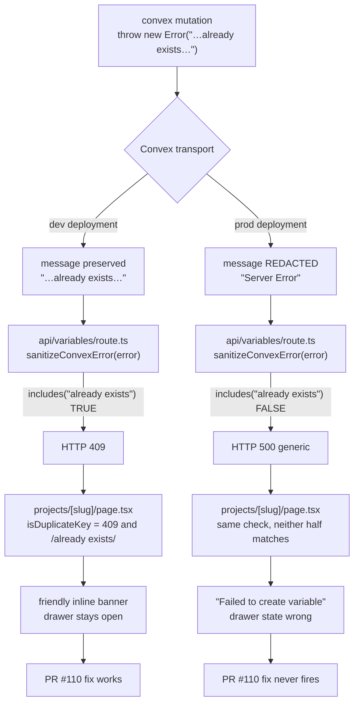
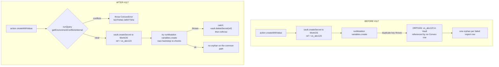
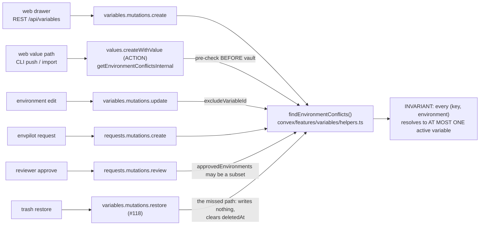

Paste a production `.env` into a project that already holds the development copies of the same keys. Every row fails. Every row gives you the same reason:

`Server Error`

That's it. That's the whole message. No key name, no environment, no hint about what to do next — just two words that could mean anything from "your database is on fire" to "you typed a space wrong."

And here's the part that matters: five days earlier I had shipped a PR to make that exact error message friendly.

[PR #110](https://github.com/rafay99-epic/envpilot.dev/pull/110) did real work. It stripped the ugly `Uncaught Error:` prefix off Convex errors, wrote nicer copy for duplicate keys, and surfaced bulk-paste failures that had been getting silently swallowed. I tested it. It worked.

The duplicate-key half of it was a **no-op in production**. It was rewriting a string that production never produces.

Let me walk you through how I found that out, and the much worse bug hiding underneath it.

## The message that only exists on my laptop

Quick fundamentals, because this one detail is the whole story.

Convex is the database and backend my app runs on. Backend functions throw errors, clients catch them. Simple.

Except production Convex deployments **redact** plain `Error` messages. If a mutation throws `new Error("Variable key already exists in this project")`, a dev client receives exactly that sentence. A production client receives `"Server Error"`. Same code, same throw, different string depending on where it runs.

Read that again, because it's genuinely nasty. My development environment is _more informative_ than production, in exactly the dimension that makes this bug class invisible.

Once you know it, the failure chain reads completely differently:



Follow the red path — that's what a real user got, every time.

**The Discovery:** three separate layers were keyed off a substring that production erases. The backend threw the text. The API route picked an HTTP status by reading `error.message`. The UI matched on `error.message` to decide which friendly sentence to show. All three, on a platform that deletes `error.message`.

Stated plainly: **`.data` is a contract, `.message` is a courtesy the platform can withdraw.**

The fix itself is boring. Convex ships `ConvexError`, whose application payload survives redaction. So the sanitizer gets an early return:

```typescript
export function sanitizeConvexError(error: unknown): string {
  // ConvexError application payloads survive prod redaction (plain Error
  // messages become "Server Error" on production deployments). The payload
  // is already a clean user-facing string — return it directly.
  if (
    error instanceof Error &&
    "data" in error &&
    typeof (error as Error & { data: unknown }).data === "string"
  ) {
    return (error as Error & { data: string }).data;
  }
  // …regex chain below is now a fallback for non-user-facing errors
}
```

**The Fix:** that early return is [#117](https://github.com/rafay99-epic/envpilot.dev/pull/117). The regex chain still living below it is #110's work, and to be fair to past-me, it fixes something real — a Convex _action_ re-throwing a _mutation's_ error double-wraps the prefix (`Uncaught Error: Uncaught Error: …`), and stripping only one layer leaked the inner one.

Everything below that early return is archaeology now. A museum of what production used to leak.

## The rule underneath was backwards

The redaction bug hid the message. Fine. Fixed.

But then I actually read the message it was hiding, and the message was defending a rule that should never have shipped.

Keys were unique per **project**:

```typescript
const existingVariable = await ctx.db
  .query("environmentVariables")
  .withIndex("by_project_and_key", (q) =>
    q.eq("projectId", args.projectId).eq("key", args.key)
  )
  .first();

if (existingVariable && !existingVariable.deletedAt) {
  throw new Error("Variable key already exists in this project");
}
```

Look at what that forbids. `DATABASE_URL` for `[development]` and `DATABASE_URL` for `[production]` are two different variables with two different values. That is not some exotic edge case in a secrets manager.

That is the entire product.

I had written a constraint that made my core use case illegal, and the thing that triggered it — pasting a `.env` file — is the most ordinary action a user can take.

The obvious fix would be a database-level unique index on `(projectId, key, environment)`. I couldn't take it. Convex has no unique constraints, and the schema stores `environments` as an array on the variable row, not one row per environment. Normalizing into a join table means a schema migration, a rewrite of every read path, and — the part that killed it — a change to what CLI `pull`, extension sync, and the public API receive.

I wanted a rule that changed nothing for clients. So I wrote it as an invariant instead of a constraint:

> Every `(key, environment)` pair resolves to **at most one** active variable.

That's precisely strong enough and not one inch stronger. CLI `pull`/`push`/`sync`, `pushBulk`, `importValues`, extension sync and `/api/v1/secrets` are already environment-scoped, so if the invariant holds, all of them stay deterministic.

The receipt: `APP_VERSIONS.cli` stayed `1.17.0` and `APP_VERSIONS.extension` stayed `1.13.0` across every single PR in this story. **Zero client changes.** That was the whole point.

Mechanically, overlap is a set intersection, not a first-match lookup:

```typescript
export async function findEnvironmentConflicts(
  ctx: QueryCtx,
  args: {
    projectId: Id<"projects">;
    key: string;
    environments: string[];
    excludeVariableId?: Id<"environmentVariables">;
  }
): Promise<string[]> {
  const sameKey = await ctx.db
    .query("environmentVariables")
    .withIndex("by_project_and_key", (q) =>
      q.eq("projectId", args.projectId).eq("key", args.key)
    )
    .collect();

  const clashes = new Set<string>();
  for (const existing of sameKey) {
    if (existing.deletedAt) continue;
    if (args.excludeVariableId && existing._id === args.excludeVariableId) {
      continue; // don't let a variable conflict with its own past self
    }
    for (const env of existing.environments) {
      if (args.environments.includes(env)) clashes.add(env);
    }
  }
  return [...clashes];
}
```

**The Insight:** same index, same read shape, only the predicate changed. And the return type — it hands back _which_ environments clash instead of a boolean, because "already exists" without naming an environment is now a lie.

The create path shed both bugs in one hunk. `.first()` became the intersection, `Error` became `ConvexError`:

```typescript
const envClashes = await findEnvironmentConflicts(ctx, {
  projectId: args.projectId,
  key: args.key,
  environments: args.environments,
});
if (envClashes.length > 0) {
  throw new ConvexError(environmentConflictMessage(args.key, envClashes));
}
```

Two bugs down. There was a third, and it never showed up on screen at all.

## The orphan nobody saw

`createWithValue` is a Convex _action_ — the kind of function allowed to talk to the outside world. It writes the actual secret value to WorkOS Vault, then calls the create mutation to write the database row that points at it.

In that order. Vault first, database second.

The duplicate check lived in the mutation. So every clash wrote encrypted bytes into Vault and then failed to create the row that owns them. The import that failed on every row minted **one orphaned secret per row.**



Trace the failing branch: the vault write already happened before anything says no.

(#117 also points `vaultGc` at the existing backlog, so the ones already out there get collected.)

Belt and braces on the fix. The pre-check is an `internalQuery` wrapping the same helper, so an action can run a `QueryCtx` check without duplicating a single line of the logic:

```typescript
const envClashes: string[] = await ctx.runQuery(
  internal.features.variables.queries.getEnvironmentConflictsInternal,
  { projectId: args.projectId, key: args.key, environments: args.environments }
);
if (envClashes.length > 0) {
  throw new ConvexError(/* …clashing environments named… */);
}

const vault = await ctx.runAction(internal.features.vault.vault.createSecret, {
  /* … */
});

try {
  variableId = await ctx.runMutation(api.features.variables.mutations.create, {
    /* … */
  });
} catch (error) {
  // The DB row never materialized — don't leave the secret orphaned.
  await ctx
    .runAction(internal.features.vault.vault.deleteSecret, {
      vaultRef: vault.id,
    })
    .catch(() => {});
  throw error;
}
```

**The Point:** the mutation stays the authority. The pre-check isn't enforcement, it's orphan avoidance — which is exactly why duplicating the check here is correct instead of redundant.

## Fourteen minutes later

Convex has no unique constraint. So this invariant isn't a constraint at all — it's a convention I enforce by hand at every write path.

Which means the design is really an _enumeration_. And an enumeration is only ever as good as its audit.

#117 listed five write paths: create, `createWithValue`, update, request-create, request-approve. Shipped it.

[#118](https://github.com/rafay99-epic/envpilot.dev/pull/118) merged **fourteen minutes and thirty-five seconds** after it. The follow-up audit had found a sixth.

**Restore from trash.**

Delete `API_KEY` for `[development]`. Create a new `API_KEY` for `[development]`. Restore the old one. Now two active variables live in one environment and every pull is nondeterministic.

I missed it because restore is a write path that writes nothing new. It clears `deletedAt`. Any audit that greps for `db.insert` walks straight past it.

Soft delete quietly turns _un_-delete into an unaudited creation path. I'd never thought about it that way before, and now I can't stop seeing it.

```typescript
const envClashes = await findEnvironmentConflicts(ctx, {
  projectId: variable.projectId,
  key: variable.key,
  environments: variable.environments,
});
if (envClashes.length > 0) {
  throw new ConvexError(
    `Cannot restore: variable "${variable.key}" already exists in environment(s): ${envClashes.join(", ")}. Delete or re-scope the active variable first.`
  );
}
```

Deliberately not the shared message helper — the user's remedy here is different, so the sentence is different.

Six call sites, four files, one helper:



Notice every arrow converges on the same function. That convergence _is_ the invariant.

The approve path is the subtle one. It validates `approvedEnvironments`, not `request.environments`, because a reviewer can approve a _subset_ of what was asked for. Approval is a fresh write with reviewer-chosen scope, not a rubber stamp on the original request.

#118 also reverted a bug this work had just caused: the project page and the bulk-paste drawer were rewriting the backend's shiny new environment-specific message back into "already exists in this project" — now factually wrong, and it threw away the one piece of information the user actually needed.

The audit cleared everything else, with reasons worth writing down: key rename via `update` is impossible (`update` takes no `key` argument); CLI pull/push/sync are environment-scoped and default to `development`; `pushBulk` and `importValues` diff against environment-scoped queries; rollback is per-variable-id and changes neither key nor environments; account restore enforces no name uniqueness at all, so there's nothing there to break.

## The same bug, wearing different clothes

#117 closed with a note to myself: every _other_ plain `Error` in Convex is still redacted in prod.

[#121](https://github.com/rafay99-epic/envpilot.dev/pull/121) was that sweep. It found the same root cause everywhere.

The worst one had nothing to do with variables. Every terminal state of a share link — expired, burned, revoked, locked out, invalid OTP — arrived at the recipient's viewer page as `"Server Error"`. The page couldn't classify it, so it did the only thing it knew how to do: ask for the code again.

Enter a code. Generic failure. Enter another code. Generic failure. Forever, on a link that had been dead the entire time.

An **infinite OTP loop**, built entirely out of a missing error type.

All of those are `ConvexError` now, and the attempt counter actually reaches a human:

```typescript
const remaining = 5 - newAttempts;
throw new ConvexError(
  remaining > 0
    ? `Invalid verification code. ${remaining} attempt${remaining === 1 ? "" : "s"} remaining.`
    : "Too many failed attempts. This email has been locked out."
);
```

Rate limiting gave me the cleanest statement of the lesson. `@convex-dev/rate-limiter` throws `new ConvexError({ kind: "RateLimited", … })`. The structured payload survives; the message does not. So you detect it by _shape_, never by text:

```typescript
export function isRateLimitError(error: unknown): boolean {
  return (
    error instanceof Error &&
    "data" in error &&
    typeof (error as Error & { data: unknown }).data === "object" &&
    (error as Error & { data: { kind?: unknown } }).data?.kind === "RateLimited"
  );
}
```

And here's the route diff that is basically this entire post compressed into eight lines:

```diff
   } catch (error) {
-    const message =
-      error instanceof Error ? error.message : "Verification failed";
+    if (isRateLimitError(error)) {
+      return NextResponse.json(
+        { error: "Too many requests. Please try again later." },
+        { status: 429 }
+      );
+    }
+    const message = sanitizeConvexError(error);
```

One casualty from that sweep deserves its own paragraph, because it shows the second-order cost. In `apps/cli/src/commands/request.ts`, #121 deleted this:

```typescript
// The server is the source of truth for authorization — surface its
// 403 message directly instead of a generic stack trace.
if (err instanceof APIError && err.statusCode === 403) {
```

`createVariableRequest` goes straight to Convex. It never throws an `APIError` with a status code. That branch had been dead since the migration and nobody noticed.

**But here's the kicker:** when every error surfaces as `Server Error`, you cannot tell a dead branch from a working one. Redaction didn't just hide errors from users. It hid the shape of my own code from me.

## The receipts

| PR                                                            | What changed                                                                                                                                                                                                                                                          |
| ------------------------------------------------------------- | --------------------------------------------------------------------------------------------------------------------------------------------------------------------------------------------------------------------------------------------------------------------- |
| [#110](https://github.com/rafay99-epic/envpilot.dev/pull/110) | `fix(web): friendly duplicate-variable-key feedback, never raw Convex errors (web v1.38.1)` — `sanitizeConvexError` strips repeated `Uncaught Error:` prefixes; bulk-paste failures stop being silently swallowed. Web 1.38.1 → 1.38.2.                               |
| [#117](https://github.com/rafay99-epic/envpilot.dev/pull/117) | `feat(variables): per-environment key uniqueness + prod error visibility + vault orphan fix` — `findEnvironmentConflicts` replaces per-project uniqueness; rejections become `ConvexError`; `createWithValue` pre-checks before the vault write. Web 1.41.0 → 1.42.0. |
| [#118](https://github.com/rafay99-epic/envpilot.dev/pull/118) | `fix(variables): trash-restore re-validates per-env uniqueness; UI surfaces clashing environments` — the sixth write path, plus the UI stops overwriting the backend's environment-specific message. Web 1.42.0 → 1.42.1.                                             |
| [#120](https://github.com/rafay99-epic/envpilot.dev/pull/120) | `docs: align CLAUDE.md + all repo docs with current reality` — both rules promoted to CRITICAL sections in `CLAUDE.md`. The bug became a law.                                                                                                                         |
| [#121](https://github.com/rafay99-epic/envpilot.dev/pull/121) | `fix(sharing,requests): trustworthy errors in prod + share lifecycle + request notifications` — the `ConvexError` sweep beyond variables; `isRateLimitError` classifies by data shape; `revokeSharesForResource`. Web 1.42.1 → 1.43.0.                                |

## Now the part where I stop congratulating myself

The sweep is nowhere near finished.

The working tree today holds **286** `throw new Error(` against **164** `throw new ConvexError(` across `convex/`. The single worst file is — of course — the one this entire post is about. `convex/features/variables/mutations.ts`, with **33** plain throws.

Including this one, sitting in the same file as the fix:

```typescript
throw new Error(
  "Secret rotation requires a higher tier. Upgrade to enable rotation schedules."
);
```

`isTierLimitError()` classifies that by substring-matching `"requires a higher tier"`. In production that string reads `"Server Error"`. The exact bug class #121 fixed for share links is still live for rotation tier gates.

The bug outlived its own fix by a few hundred lines. In the same file.

Two more, honestly. `importValues` on the request path still writes to Vault inside a bare `try/catch` that swallows the error with no `deleteSecret`, so a rejected request there still orphans a secret. And `updateWithValue` mints the vault secret before the mutation validates, with only best-effort cleanup and no pre-check — no permanent leak, but a wasted external write on every conflicting update.

There's a live trap in the test suite too. The e2e spec #110 added still asserts `A variable named "${key}" already exists` — copy that no product code emits anymore, since #118 changed the page to surface the backend message verbatim. The full local Playwright run is my only merge gate, because e2e is disabled in CI. A stale assertion there is a blocker sitting quietly, waiting.

## What I'd tell past-me

Here's where I land.

Both #117 and #121 shipped with a post-deploy manual check as their only proof. Not because I got lazy about tests — because the redaction behavior _does not exist locally_. Dev deployments hand over the plain message like nothing's wrong.

My development environment is strictly more forgiving than production, in precisely the dimension that makes this whole bug class invisible until a real person hits it. There is no test I can write on my laptop that catches it.

That's why the rule went into `CLAUDE.md` as a hard convention instead of a spec. When the environment cannot enforce an invariant, the only enforcement left is a rule you read before you type `throw`.

And the deeper one, the one that actually cost me five days: I spent a whole PR making an error message friendlier before I asked whether the error should exist. Polishing the copy on a rule that was wrong is the most expensive kind of productive.

Ask what the error is defending. Then ask if it deserves defending.

Until then, throw `ConvexError` and read your own constraints, nerds.
