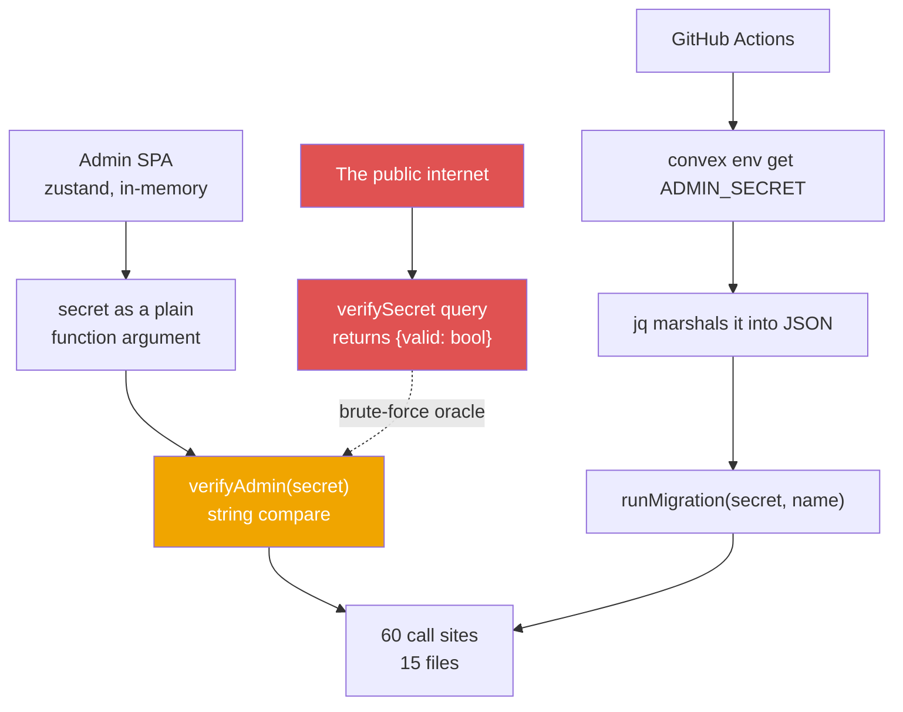
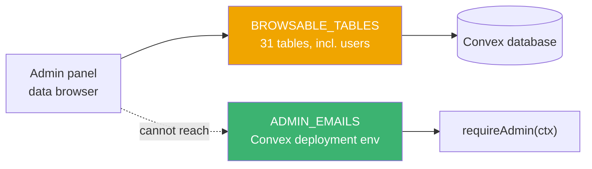
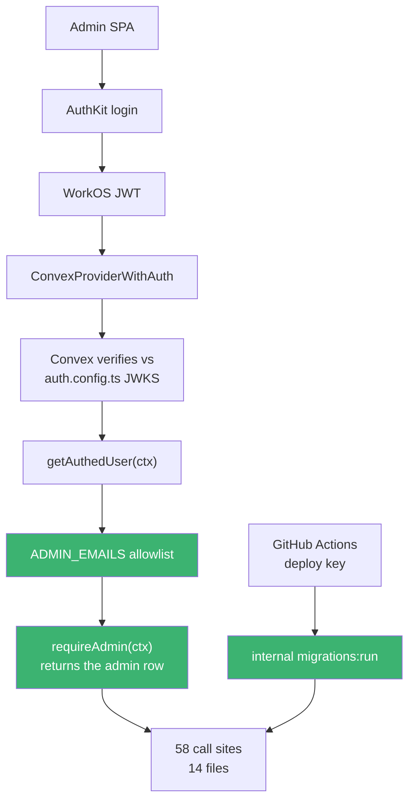

On 2026-03-18 I merged [PR #36](https://github.com/rafay99-epic/envpilot.dev/pull/36) — "Implement dynamic tiers and complete admin dashboard." Squash-merged as `f65fd7a2`, it shipped the whole admin panel and the dynamic tier system together. It needed some kind of auth to sit in front of it.

I gave it six lines.

Exactly four months later, on 2026-07-18, I deleted those six lines in [PR #145](https://github.com/rafay99-epic/envpilot.dev/pull/145) — 71 files, **+6,299 / −5,783**. Same day of the month, four months apart. That symmetry is a coincidence, but it's a tidy one.

This is the story of what those six lines actually guarded, the public query I left sitting next to them, and why the thing that finally forced me to fix it was not the security hole at all.

## Six Lines And A Free Oracle

Here's the entire authorization model of my admin backend as it stood on July 17th:

```typescript
// convex/features/admin/auth.ts — deleted in ec6875d4
export function verifyAdmin(secret: string) {
  const adminSecret = process.env.ADMIN_SECRET;
  if (!adminSecret || secret !== adminSecret) {
    throw new Error("Unauthorized: Invalid admin secret");
  }
}
```

A string compare. That's it. And right underneath it, in the same file, this:

```typescript
// convex/features/admin/auth.ts — also deleted in ec6875d4
export const verifySecret = query({
  args: { secret: v.string() },
  handler: async (_ctx, args) => {
    const adminSecret = process.env.ADMIN_SECRET;
    return { valid: !!adminSecret && args.secret === adminSecret };
  },
});
```

**The Problem:** that's a `query`, not an `internalQuery`. In Convex, that means it's a public endpoint. Anybody with my deployment URL could call it, pass any candidate string, and get back a clean boolean telling them whether they'd guessed right. No rate limit. No identity. No logging.

I built a brute-force oracle and shipped it. To my own product. On purpose, because I needed the login screen to know whether to let you in, and this was the shortest path from "type a password" to "see the dashboard."

Read that again. The login form asked the server _"is this the password?"_ and the server answered honestly, forever, to anyone.

## What Was Behind The Door

I want to be specific about the blast radius, because "admin panel" is vague and the actual list is not.

`verifyAdmin(args.secret)` appeared **60 times across 15 files** in `convex/features/admin/`. `tiers.ts` had 10 of them. `roles.ts` and `featureRequests.ts` had 6 each. `changelog.ts`, `inbox.ts`, `users.ts` and `featureFlags.ts` had 5 apiece. `migrations.ts` had 2.

Behind that string: editing tier definitions for every paying organization, banning users, a raw data browser over **31 tables** in `BROWSABLE_TABLES`, and `runMigration` — the function that reseeds the entire feature registry that decides who gets which features.



Follow the red edges. Every path into `verifyAdmin` is a string, and one of them starts at the open internet.

## The Tell I Should Have Noticed Sooner

There's a moment in every bad-auth story where the code quietly admits what it is. Mine was in `users.ts`:

```typescript
// convex/features/admin/users.ts BEFORE (ec6875d4^)
await ctx.db.patch(args.userId, {
  isBanned: true,
  bannedAt: Date.now(),
  bannedBy: "admin", // ← the entire audit trail
  banReason: args.banReason,
});
```

**The Revelation:** `bannedBy: "admin"`. A hardcoded string literal. Not a user id, not an email — a literal.

I didn't write that because I was lazy about audit logging. I wrote it because there was _nothing else to write._ A shared secret has no identity attached to it. The system genuinely did not know who had just banned somebody, and it never could. The audit field was honest. That's the depressing part.

## The Secret Leaked Into Everything It Touched

A shared secret doesn't stay in one file. It has to travel to every place that needs to call a guarded function, and each of those places becomes a new handling problem.

CI had to fish it back out of the deployment it was stored on:

```yaml
# .github/workflows/deploy-convex.yml BEFORE
ADMIN_SECRET=$(bunx convex env get ADMIN_SECRET)
if [ -z "$ADMIN_SECRET" ]; then
  echo "::error::ADMIN_SECRET is not set on the production Convex deployment — seeds cannot run"
  exit 1
fi
echo "::add-mask::$ADMIN_SECRET"
for migration in seed-feature-registry seed-tier-features seed-role-registry migrate-roles seed-changelog; do
  echo "Running $migration..."
  bunx convex run features/admin/migrations:runMigration \
    "$(jq -cn --arg secret "$ADMIN_SECRET" --arg name "$migration" '{secret: $secret, name: $name}')"
done
```

A `::add-mask::` so it wouldn't print. A `jq` invocation because shell interpolation would mangle it. And the local dev setup script did the thing you're not supposed to do at all:

```bash
# scripts/convex-local-setup.sh BEFORE
ADMIN_SECRET=$(openssl rand -hex 16)
bunx convex env set ADMIN_SECRET "$ADMIN_SECRET" >/dev/null
echo "   ✓ ADMIN_SECRET (generated: $ADMIN_SECRET — needed for the admin panel)"
```

It generated a credential and echoed it to the terminal. Straight into shell history and any CI log that ran it.

## The Bug That Actually Paid For The Fix

Here's the thing though: I knew the oracle was bad. I'd known for months. What actually made me sit down and do the work was something far dumber.

Every hard refresh logged me out.

```typescript
// apps/admin/src/stores/auth-store.ts — deleted in ec6875d4, 15 lines
import { create } from "zustand";

export const useAuthStore = create<AuthState>((set) => ({
  secret: null,
  isAuthenticated: false,
  login: (secret: string) => set({ secret, isAuthenticated: true }),
  logout: () => set({ secret: null, isAuthenticated: false }),
}));
```

**The Insight:** look at what's missing. No `persist` middleware. The secret lived in a plain JavaScript variable in a plain Zustand store. Every reload wiped it and bounced me back to the password box. You don't need my word for that — it's visible in fifteen lines.

And every query re-attached that string as a function argument, on every single call:

```typescript
// apps/admin/src/hooks/useAdminQuery.ts BEFORE
const secret = useAuthStore((s) => s.secret);
const shouldSkip = !secret || args === "skip";
const queryArgs = (shouldSkip ? "skip" : { ...args, secret }) as
  | FunctionArgs<F>
  | "skip";
return useQuery(query, queryArgs) as FunctionReturnType<F> | undefined;
```

Now here's the trap, and it's the reason this sat unfixed for four months. The obvious fix for the annoyance is `persist` — one middleware, one line, secret survives reload. And that fix makes the security posture **strictly worse**, because now the admin secret to my entire backend is sitting in `localStorage` where any script on the page can read it.

There was no cheap fix. The annoyance and the hole were the same bug wearing two hats, and the only exit was real auth.

Which is _exactly_ why the annoyance is what finally got it funded. The oracle never inconvenienced me. Refreshing the page did.

## What Replaced It

The new guard doesn't take an argument at all:

```typescript
// convex/features/admin/auth.ts AFTER
function adminEmailAllowlist(): string[] {
  return (process.env.ADMIN_EMAILS ?? "")
    .split(",")
    .map((e) => e.trim().toLowerCase())
    .filter(Boolean);
}

async function getAdminUser(
  ctx: QueryCtx | MutationCtx
): Promise<Doc<"users"> | null> {
  const user = await getAuthedUser(ctx);
  if (!user || user.isBanned) return null;
  return adminEmailAllowlist().includes(user.email.toLowerCase()) ? user : null;
}

export async function requireAdmin(
  ctx: QueryCtx | MutationCtx
): Promise<Doc<"users">> {
  const admin = await getAdminUser(ctx);
  if (!admin) throw new ConvexError("Unauthorized: admin access required");
  return admin;
}
```

**The Fix:** three decisions in there matter more than the code.

First, `requireAdmin` **returns the admin's row** instead of returning void. That single choice is what makes `bannedBy` a real user id instead of the string `"admin"`.

Second, the allowlist lives in `ADMIN_EMAILS` on the Convex deployment, not in a database table. The comment in the source says why, and I'm quoting it because I want it on the record:

> The allowlist deliberately lives in the environment, not the database, so it cannot be edited through the admin data browser itself.

`BROWSABLE_TABLES` includes `users`. If admin rights lived in a row, the panel could grant them to anyone through its own data browser. The panel must not be able to rewrite the rules that admit it.



The dotted line is the whole point — the data browser reaches 31 tables, and the allowlist isn't in any of them.

Third: `!user || user.isBanned`. A banned account loses admin instantly. Elegant. Also a landmine, which I'll get to.



Notice there is no edge from the public internet anymore. That's the entire security argument of the PR in one missing arrow.

CI got the better end of it. The migration runner grew a second door — an `internalMutation`, callable only with the deploy key:

```yaml
# .github/workflows/deploy-convex.yml AFTER
bunx convex run features/admin/migrations:run \
  "$(jq -cn --arg name "$migration" '{name: $name}')"
```

And the client hook collapsed into this:

```typescript
// apps/admin/src/hooks/useAdminQuery.ts AFTER
export function useAdminQuery<F extends FunctionReference<"query">>(
  query: F,
  args: FunctionArgs<F> | "skip"
) {
  const { isAuthenticated } = useConvexAuth();
  return useQuery(query, isAuthenticated ? args : "skip");
}

export const useAdminMutation = useMutation;
export const useAdminAction = useAction;
```

`export const useAdminMutation = useMutation`. That line is the punchline of the whole refactor. Once auth moved into the transport, the wrapper had literally nothing left to do.

## The Ugly Line I'm Not Hiding

`convex/features/admin/migrations.ts` shows **1,697 changed lines** in the diffstat. Almost none of the migration logic actually changed. Here's why:

```typescript
async function runMigrationByName(ctx: MutationCtx, name: string) {
  // Keeps the original `args.name` references below working untouched.
  const args = { name };
```

That's a deliberate hack. There's a long chain of `if (args.name === ...)` blocks below it, and I refused to touch a single one of them during a security cutover. Rebuilding the shell and rewriting the contents at the same time is how you end up unable to tell which half broke.

Not clever. Correct.

## The Review Pass Found The Footguns I Created

Commit `e0b80d64` fixed 10 defects. The sharpest one was caused by the new model, not the old one:

```typescript
// convex/features/admin/users.ts AFTER
// Self-ban would atomically revoke this admin's own access (banned users
// fail requireAdmin) with no in-panel recovery path.
if (args.userId === admin._id) {
  throw new ConvexError("You cannot ban your own account");
}
```

Under the shared secret this was impossible — the secret wasn't a user, so it couldn't ban itself. Give the admin a real identity and "ban user" plus "banned users fail `requireAdmin`" compose into a permanent self-lockout with no recovery path inside the product.

The same pass caught a live-billing data-loss bug in the tier matrix. Unchecking "unlimited" used to immediately commit `0` as a real limit. One stray click could set a production tier's limit to zero. Now coming off unlimited only opens the cell for editing — nothing saves until blur or Enter, and Escape reverts. That commit also converted roughly **29 sites** to `ConvexError`, because production Convex redacts plain `Error` messages to "Server Error" and users see nothing.

Same PR, I also split `tiers.tsx` — **2,336 lines** with **8** always-on Convex subscriptions — into a 146-line shell and seven tab components totalling 2,240 lines. To be precise about what that bought: the tabs are statically imported, not code-split. Only the _active_ tab mounts, so its subscriptions open and close with the tab. That's a subscription-lifecycle win, not a bundle win.

## What It Cost, Honestly

There is no Playwright coverage for the admin panel. My own PR body says it: _"Manual verification (no Playwright suite for admin — this is the gate)."_

A 71-file security cutover touching twelve thousand lines shipped on a hand-run checklist. Plus four out-of-band setup steps no code could enforce: redirect URIs on two WorkOS clients, `ADMIN_EMAILS` on two Convex deployments, `WORKOS_CLIENT_ID` on Vercel, and Vercel Deployment Protection.

And the thing I replaced the secret with isn't free either. `convex/auth.config.ts` carries a two-warning comment block from an earlier incident where a prod deploy froze the auth providers against a stale client id and produced `"No auth provider found matching the given token"` — fixed by hardcoding, then walked back to `process.env.WORKOS_CLIENT_ID || "client_01KHWDD75944NBADKY0ANTRXR8"` because dev and prod trust different WorkOS clients. Real identity has its own scar tissue.

## The Part I Haven't Finished

`ADMIN_SECRET` is gone from every line of code. It is still in three files right now.

`docs/SELF_HOSTING.md:58` still tells self-hosters to run `bunx convex env set ADMIN_SECRET`, and line 70 still shows the old `migrations:runMigration` call, with a `secret` argument on the line below it — a copy-pasteable command that **cannot work anymore**. `docs/ci.md:82` still describes the old CI behaviour. `.env.example:53` still mentions it.

I also promised a follow-up dropping `organizationTiers`, `organizations.settings` and `usageCounters` after prod drain checks. `convex/schema.ts` still defines `organizationTiers` at line 1474 and `usageCounters` at line 1048. That PR does not exist.

So: I removed the vulnerability and left the instructions for recreating it. Deleting code is easy. Deleting the _story_ the repo tells about that code is the part everyone forgets, me included.

Here's where I land. The shared secret wasn't a shortcut I regretted immediately — it worked fine, for four months, and it would have kept working. What it couldn't do was answer "who did this?", and everything downstream of that question was quietly broken because of it. Attribution isn't an audit feature you bolt on later. It's a property of your auth model, decided on day one, and you inherit it whether you meant to or not.

Go grep your own repo for `process.env.SOMETHING_SECRET` inside a string compare. I'll wait.

Until then, rotate your secrets and check your `internalQuery` keywords, nerds.
