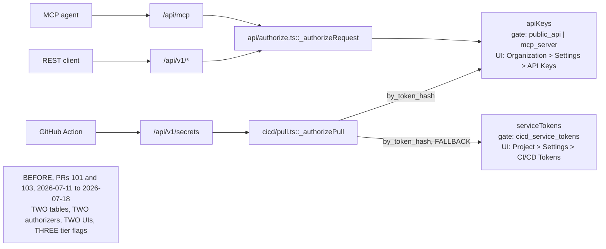
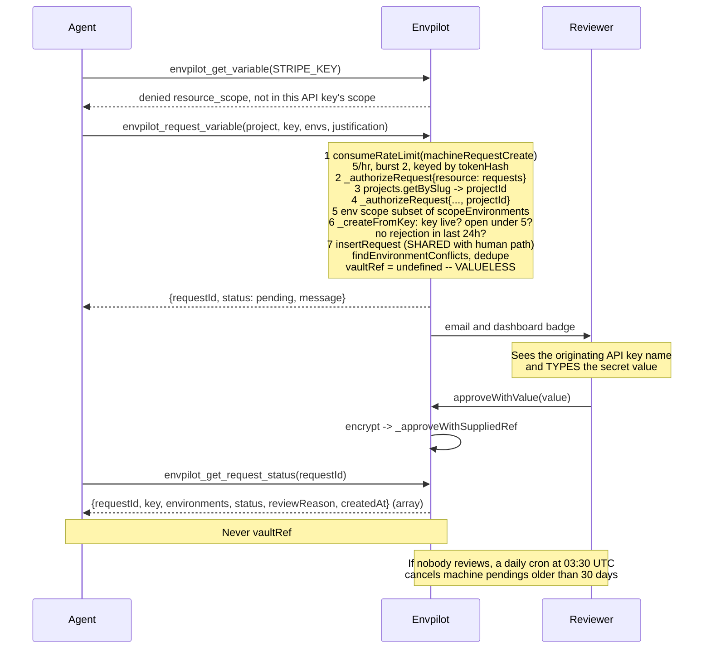

On 2026-07-11 I merged two pull requests into Envpilot.

[#101](https://github.com/rafay99-epic/envpilot.dev/pull/101) added CI/CD service tokens, so a GitHub Action could pull secrets during a build. [#103](https://github.com/rafay99-epic/envpilot.dev/pull/103) added the public REST API, an MCP server, and a whole API keys platform.

Different features. Different tickets in my head. Same day.

And both of them created a database table that holds a SHA-256 hash of a bearer credential issued to a machine.

Read that again. Same primitive. Built twice. Shipped hours apart. By one person — me — who did not stop for a second to notice they were the same thing.

## What a machine credential actually is, before I trash my own work

Quick detour for anyone who doesn't spend their days in auth code, because the rest of this is unreadable without it.

A **bearer credential** is a long random string. Whoever holds it gets in — there's no password, no username, no second factor. "Bearer" literally means the bearer of this thing is the authority. That's why they leak so badly: a string in a CI log is a string anyone can copy.

You never store the string itself. You store a **SHA-256 hash** of it — a one-way fingerprint. When a request arrives, you hash what it sent and look for a matching row. If the database gets dumped, the attacker gets fingerprints, not keys.

So both of my features boiled down to the same three moves: mint a random string, store its hash, look up the hash on every request.

I wrote that twice.

## Here's what the mess actually looked like



Follow the two paths and notice they never meet — that's the whole problem in one picture.

Two tables. Two places in the UI to manage them (project settings for one, org settings for the other). Three separate tier flags: `cicd_service_tokens`, `public_api`, `mcp_server`. And two authorization code paths — one of which my own `CLAUDE.md` explicitly says must never exist:

> route EVERY request through `convex/features/api/authorize.ts::_authorizeRequest` — never re-implement authorization for a new surface.

I wrote that rule. Then I broke it in the same week, in a different pull request, because I was looking at the feature and not at the primitive.

The credential type lived **seven days**. Born 2026-07-11 in #101. Retired 2026-07-18 in [#147](https://github.com/rafay99-epic/envpilot.dev/pull/147).

## Nobody got breached. That's not why it was urgent

There was no incident. No leak. Nothing on fire.

What made it urgent is that the duplication was still _cheap_ to remove, and was about to stop being cheap. Every week both tables stayed alive, more code learned to depend on both shapes.

Because here's the thing — one of them was strictly better already. `apiKeys` was org-scoped, with `scopeProjects` (either `"all"` or an explicit list), `scopeEnvironments`, `scopeResources`, and optional expiry. `serviceTokens` was a subset of that: one project, a list of environments, read-only. Nothing more.

The schema comment on `apiKeys` in `convex/schema.ts` had said so since the day I typed it. It "Evolves serviceTokens into a scoped platform."

I knew. I just hadn't done anything about it.

The proof is a migration called `migrate-service-tokens` that already existed, whose own description string is a confession:

> "NOT a one-time migration: serviceTokens still receives live inserts from the CI/CD tab, so re-run this whenever new tokens are created there. Retiring serviceTokens creation is a separate decision."

A migration you have to run forever is not a migration. It's a sync job between two systems of record. It exists because nobody made the separate decision.

I was nobody.

## The fix is one optional field. That's it

The obvious design — the one I rejected — was a `credentialType` discriminator column on `apiKeys`, with validation branching per type. Sounds tidy. It isn't. That just moves the fork inside one table: still two shapes, still two rule sets, still two mental models, now sharing a room.

What actually shipped is one optional array:

```ts
surfaces: v.optional(
  v.array(
    v.union(
      v.literal("github_action"),
      v.literal("rest_api"),
      v.literal("mcp_server")
    )
  )
);
```

**Why optional does all the work:** a key minted before this field existed has `surfaces === undefined`, and stays valid everywhere. It's grandfathered into exactly the behavior it was sold under. Any other choice is a silent privilege change to a credential someone is already using in production. Every key minted after is explicit about where it works.

That's also what made moving the old tokens safe. A `serviceTokens` row could become an `apiKeys` row without gaining a single new power, because the drain stamped it on the way in (this migration shipped in #146 and was deleted in #147, once the drain was confirmed):

```ts
await ctx.db.insert("apiKeys", {
  organizationId: token.organizationId,
  name: token.name,
  tokenHash: token.tokenHash,
  scopeProjects: [token.projectId],
  scopeEnvironments: token.environments,
  scopeResources: ["variables"],
  // Service tokens were only ever an Action credential — stamp the
  // surface explicitly instead of grandfathering them onto all three.
  surfaces: ["github_action"],
  createdBy: token.createdBy,
  createdAt: token.createdAt,
  lastUsedAt: token.lastUsedAt,
  revokedAt: token.revokedAt,
  revokedBy: token.revokedBy,
});
```

Then the enforcement side, in `convex/features/api/authorize.ts`:

```ts
const surface =
  args.surface ??
  (args.gateFeature === "mcp_server" ? "mcp_server" : "rest_api");
if (key.surfaces !== undefined && !key.surfaces.includes(surface)) {
  await logDenied(key, "surface_out_of_scope");
  return { ok: false as const, denied: "surface_scope" as const };
}
```

And because I would rather be honest in a comment than over-claim on a security page later, the caveat lives in the file:

```ts
// KNOWN LIMIT: `surface` is caller-asserted, not transport-derived —
// the reads/requests actions are the shared backend of both HTTP
// surfaces, so a key holder calling Convex directly can claim either
// surface. The field segments well-behaved surfaces (a leaked Action
// key stays useless on REST/MCP routes); the hard security boundary
// remains the key's resource/environment/project scope + tier gates,
// which no claimed surface can widen.
```

The tier gate is _derived_ from the surface instead of being passed next to it, so nobody can pair the MCP surface with the `public_api` gate and outlive their own gate getting switched off:

```ts
const gate = await checkBooleanFeature(
  ctx.db,
  key.organizationId,
  args.surface !== undefined
    ? args.surface === "mcp_server"
      ? "mcp_server"
      : "public_api"
    : (args.gateFeature ?? "public_api")
);
```

And the GitHub Action key is the one shape where the endpoint takes no project parameter — the key _is_ the project. So its shape gets locked at mint time in `convex/features/api/keys.ts`:

```ts
if (surfaces.includes("github_action")) {
  if (scopeProjects === "all" || scopeProjects.length !== 1) {
    throw new ConvexError(
      "A GitHub Action key must be scoped to exactly one project — the Action's pull endpoint takes no project parameter, the key IS the project scope"
    );
  }
  if (scopeResources.length !== 1 || scopeResources[0] !== "variables") {
    throw new ConvexError(
      'A GitHub Action key must have exactly the "variables" resource — that is all the Action pulls, and an Action credential must not double as broader REST/MCP access'
    );
  }
}
```

## The bug that only existed because my migration was older than my field

Then I looked at the drain migration again.

It predated `surfaces`. Rows it had already copied in earlier runs landed with `surfaces === undefined` — which, by the grandfathering rule I had literally just written three paragraphs of enforcement for, means _valid on all three surfaces_.

A CI token drained the week before would have quietly become a REST and MCP credential. Nobody would have seen it happen.

The fix is a backfill branch on the already-exists path, rerun-safe because the token hash is the identity:

```ts
if (existing) {
  // Rows copied by earlier runs predate the surfaces field and would
  // otherwise stay grandfathered onto EVERY surface — a leaked CI
  // token must never widen into a REST/MCP credential. Same tokenHash
  // = same credential, so stamping is always correct here.
  if (existing.surfaces === undefined) {
    await ctx.db.patch(existing._id, { surfaces: ["github_action"] });
    backfilled++;
  } else {
    skipped++;
  }
  continue;
}
```

**The general shape of this trap:** a backwards-compatibility default that's correct for the population you designed it for (keys a human minted through the wizard) and wrong for a population arriving through a side door (rows a migration wrote).

"Absent means permissive" is only safe if you can name every writer. I couldn't, until I went looking.

## Why deleting a table takes two pull requests

[#146](https://github.com/rafay99-epic/envpilot.dev/pull/146) shipped the model, the enforcement, the wizard changes, and stopped the CI/CD tab from minting new tokens. It deliberately left the `serviceTokens` table alive. Its body lists what it is _not_ doing:

> serviceTokens table drop, pull-path fallback removal, `cicd/tokens.ts` deletion, `securityHold`/`SuspendMemberDialog` service_token removal, `cicd_service_tokens` registry retirement.

#147's body states the gate:

> **Merge only after the prod drain is confirmed** (run `migrate-service-tokens` from the admin panel post-#146 deploy until it reports 0 migrated; it also backfills surfaces on previously-migrated rows).

That split isn't stylistic. A single pull request cannot express "deploy this, then verify it against live production data, then delete the table." The verification happens _between two deploys_, and there is no syntax for a deploy boundary in the middle of a diff.

The ordering matters because the retirement is lossy in one direction. Before #147, `_authorizePull` checked `apiKeys` and fell back to `serviceTokens`. #147 deleted the fallback. What stands at the end of that function today:

```ts
// Unknown hash: nothing to attribute the attempt to — no audit
// possible. The serviceTokens fallback that used to live here is gone:
// the table was drained into apiKeys before its retirement.
return { ok: false as const, denied: "invalid_token" as const };
```

An undrained token doesn't degrade gracefully. It becomes an unknown hash, gets a flat `invalid_token`, and generates no audit record — because there's nothing left to attribute the attempt to.

That's why "0 migrated" is a precondition and not a nice-to-have.

## The reward: letting the machine ask for its own keys

Once there's one key model with a `resource` list, adding a capability is adding a string. `VALID_RESOURCES` became `["variables", "accounts", "projects", "requests"]`.

`requests` is the only _mutating_ capability a key can hold, and it exists because of one specific dead end. An agent using the MCP server hits a variable outside its scope, gets a `resource_scope` denial, and… stops. It has nowhere to go. A human has to notice, open the dashboard, and widen the key by hand.

So I let the machine file the request itself. Then I constrained it hard.



Watch where the human sits in that sequence — everything before them is a proposal, nothing before them is a secret.

Three constraints carry the design.

**The request is valueless.** `vaultRef: undefined`. An agent never proposes a secret value; the human types it at approval time via `approveWithValue`. A `vaultRef` is never in anything returned to a machine caller.

**`github_action` keys can never carry `requests`.** CI cannot sit around waiting for human approval, so the shape validator rejects that combination outright.

**The machine path reuses `insertRequest`** — the same core the human dashboard uses. That's what keeps the per-environment key-uniqueness invariant (`findEnvironmentConflicts`) enforced exactly once. A second write path is precisely how that invariant would have quietly forked — the exact mistake this whole post is about.

The non-obvious piece is dedupe. Human requests dedupe per requester, because two developers can legitimately race the same key and a reviewer sorts it out. Machine requests deliberately ignore who filed them:

```ts
// Machine dedupe ignores WHO filed it: an agent gains nothing from a
// second identical pending request, and per-requester dedupe would let
// key rotation bypass the guard. Humans keep per-requester dedupe (two
// developers may legitimately race the same key; the reviewer resolves).
const hasPendingDuplicate = pendingForKey.some(
  (request) =>
    request.status === "pending" &&
    (args.requestedByKeyId !== undefined ||
      request.requestedBy === args.requestedBy) &&
    // A pending request for DISJOINT environments is a different variable.
    request.environments.some((env) => args.environments.includes(env))
);
```

Per-requester dedupe would have been a guard you defeat by minting a new key.

Anti-spam is three bounds I chose, not measured: a `machineRequestCreate` token bucket at rate 5 per hour with capacity 2, a standing cap of `MAX_OPEN_MACHINE_REQUESTS_PER_KEY = 5`, and a 24-hour rejection cooldown that hands the reviewer's reason back so the agent learns _why_ instead of retrying blind:

```ts
throw new ConvexError(
  `A request for "${args.key}" was rejected in the last 24 hours${
    recentRejection.reviewReason ? ` ("${recentRejection.reviewReason}")` : ""
  } — do not re-file it; ask the user to talk to their reviewer instead`
);
```

## What review caught that I didn't

Both PRs went through a three-dimension adversarial review — correctness, security, simplicity — plus cubic, with fixes landing in a second commit inside each squash. #146 reports **10 verified findings**. #147 reports **16** across two passes.

The ones worth naming:

- Environment names weren't validated in the shared `insertRequest` core. So an unknown environment name coming in from the machine create path produced a **permanently unapprovable request** — the reviewer's approve-time validation rejects the very name the request was filed with. Worse, it could have created a variable tagged with an environment that doesn't exist.
- `_readKeyRequests` used the `(requestedByKeyId, status)` index with an unbound status, which orders by status _before_ recency — so old rejected rows could shadow a live pending one. Fixed with a bounded newest-first window per status, merged:

```ts
const perStatus = await Promise.all(
  REQUEST_STATUSES.map((status) =>
    ctx.db
      .query("environmentVariableRequests")
      .withIndex("by_requested_key_and_status", (q) =>
        q.eq("requestedByKeyId", args.keyId).eq("status", status)
      )
      .order("desc")
      .take(20)
  )
);
```

- `review` now authorizes org membership and reviewer capability **before** disclosing request status or origin-key liveness across orgs.
- `approveWithValue` preflights pending and valueless state before the Vault write, so a doomed call stops minting secret objects.
- The stale-request TTL sweep processes a bounded oldest-first batch, so a big pending backlog can't blow the transaction and roll everything back.
- From #146: `surface_scope` denials now map to a 403 `FORBIDDEN_SURFACE` instead of a 500 and a stream of Sentry noise.

The finding least like a bug and most like a design control is the MCP tool description for `envpilot_request_variable`. It's prompt engineering doing security work:

> "File a request for an environment variable this key cannot read — a HUMAN reviewer must approve it in the Envpilot dashboard and supply the secret value; nothing is created until they do. [...] Never proposes secret values. Strictly rate limited — do NOT retry in a loop."

I don't _rely_ on that text. The rate limit is the actual enforcement. But an agent that reads the description does the right thing on the first try instead of burning its bucket, and that's worth writing carefully.

## The receipts

| PR                                                            | Title                                                                                    | What changed                                                                                                                                                                                                                                                                                                                                                                                                                                                                                           |
| ------------------------------------------------------------- | ---------------------------------------------------------------------------------------- | ------------------------------------------------------------------------------------------------------------------------------------------------------------------------------------------------------------------------------------------------------------------------------------------------------------------------------------------------------------------------------------------------------------------------------------------------------------------------------------------------------ |
| [#101](https://github.com/rafay99-epic/envpilot.dev/pull/101) | `feat(cicd): service tokens + GitHub Action secret pulls (web v1.34.0)`                  | Created the `serviceTokens` table — the credential type this story kills. Merged 2026-07-11.                                                                                                                                                                                                                                                                                                                                                                                                           |
| [#103](https://github.com/rafay99-epic/envpilot.dev/pull/103) | `feat: public REST API + MCP server + API keys platform + docs (web v1.35.0)`            | Created `apiKeys` and `_authorizeRequest` — the credential type that survived. Merged 2026-07-11.                                                                                                                                                                                                                                                                                                                                                                                                      |
| [#146](https://github.com/rafay99-epic/envpilot.dev/pull/146) | `One Token Model: surfaces field unifies GitHub Action / REST / MCP credentials (PR-A)`  | Added `apiKeys.surfaces`; `_authorizeRequest` gains a `surface` arg and a `surface_scope` denial; the tier gate is derived from the surface; `github_action` keys locked to one project and the `variables` resource; the API Keys wizard gains a Surfaces multi-select; the CI/CD tab stops minting; `migrate-service-tokens` stamps and backfills `surfaces`. +680/−523 across 20 files.                                                                                                             |
| [#147](https://github.com/rafay99-epic/envpilot.dev/pull/147) | `Machine-initiated variable requests + serviceTokens retirement (PR-B, stacked on #146)` | Deleted `serviceTokens` end to end — table definition, `convex/features/cicd/tokens.ts`, the pull-path fallback, the CI/CD tab UI, the `securityHold` branch, the `cicd_service_tokens` flag, and the drain migration itself. Added machine-initiated variable requests: the `requests` resource, `envpilot_request_variable` and `envpilot_get_request_status`, `_createFromKey`, the anti-spam trio, and a 30-day TTL cron. Extracted `convex/features/api/helpers.ts`. +2216/−1719 across 54 files. |

Both #146 and #147 merged on 2026-07-18, **five minutes and twenty-five seconds apart**. Versions after #147: `apps/web` 1.51.0, root 1.41.0, `apps/docs` 1.2.0, with `APP_VERSIONS.web` matched to 1.51.0. `minCli` and `minExtension` stayed at 1.18.0 and 1.15.0 — machine keys don't touch CLI or extension login, so nothing needed hard-blocking.

## Now the part where I stop congratulating myself

`convex/features/cicd/pull.ts` is _still_ a second authorizer.

The GitHub Action pull path does not route through `_authorizeRequest`. It has its own inline revoked/expired/surface/scope/gate ladder, and it re-derives the token hash instead of calling `hashToken` from `features/api/helpers.ts`. The invariant I wrote down has exactly one standing exception, and it's the oldest surface in the product.

That's the next thing to delete.

The surface field is caller-asserted, like the comment says. It segments well-behaved surfaces. It does not survive a key holder calling Convex directly. The real boundary is still scope plus tier gates, and I'd rather say that plainly here than let someone read `surfaces` as a wall.

The `cicd_service_tokens` rows still sit in production feature-registry tables even though nothing reads them. Any leftover `serviceTokens` rows are now unvalidated data Convex will happily keep until someone purges them from the dashboard. Per-key usage is a bounded audit scan rather than a counter — marked in `convex/features/api/keys.ts` with a `ponytail:` comment naming the upgrade path, day-bucket counter rows, if any org ever outgrows the window.

None of that is urgent. All of it is the cost of collapsing two things into one without stopping the world.

Here's where I land: the mistake wasn't building the second credential type. Building it is how I found out the first one was the wrong shape. The mistake was letting a "run this forever" migration sit in the codebase for a week as a substitute for making a decision.

If you've got a sync job between two systems of record, you don't have a migration. You have a fork with a chore attached, and the chore is there so you never have to admit the fork.

Delete the fork. Keep the chore's receipts.

Until then, hash your tokens and drain your tables, nerds.
