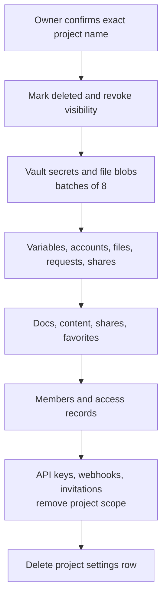

A project in Envpilot is not one database row.

It can own environment variables, every historical version of those variables, shared accounts, encrypted files, access requests, secret shares, documentation, member assignments, API access, and integration scopes. Some of that data lives in Convex. Secret values live in WorkOS Vault. Encrypted file blobs live in object storage.

The old project delete mutation tried to handle part of that relationship in the request that started it. It hid the project, collected related rows, patched some of them, and returned.

That model had two problems.

First, disappearing from the dashboard is not the same as being deleted. Data that the cascade did not know about could survive under a project users could no longer reach.

Second, a project can grow without a practical upper bound. An unbounded synchronous cascade makes the most expensive customer the most likely to hit a Convex transaction limit at the exact moment they are trying to leave.

[PR #174](https://github.com/rafay99-epic/envpilot.dev/pull/174) changes the contract. The click records deletion intent and removes access immediately. A durable worker finishes the job in stages.

## Fast revocation, patient destruction

The first transaction is deliberately small. It verifies that the caller is the organization owner, marks the project deleted, records the first cleanup stage, and schedules the worker atomically.

From that moment, normal project queries exclude the row. The project disappears from lists and stale URLs stop exposing its content. The user does not wait for every Vault and storage call before leaving the settings page.

The permanent cleanup then follows this sequence:

The order matters more than the diagram's shape. External data is deleted before the database row that points to it. If WorkOS or blob storage fails, Envpilot retains the pointer and retries. It does not erase its only map to a secret that still exists.

## What deletion covers now

The worker removes project-owned:

- environment variables, version history, and variable permissions;
- shared accounts and account permissions;
- secret files, file permissions, encrypted blobs, and Vault keys;
- variable requests and any Vault value attached to them;
- shared secrets and their recipient records;
- documentation pages, document content, and document shares;
- favorites, project members, and project access records.

Organization-level resources need a different rule. An API key, webhook, or invitation can refer to several projects, so deleting one project must not destroy the whole organization resource. The worker removes only the deleted project from its scope. An API key with no scope left is revoked, and a webhook with no destination left is disabled.

Security audit history remains. Deleting a secret should remove the secret, not erase the record that a destructive action occurred.

## Convex cost is part of correctness

The cascade is split by resource type because each stage has a different cost.

External stages process at most eight resources at once. A Vault request can wait on a provider timeout, so the worker holds a two-minute lease and schedules a watchdog rather than letting a duplicate batch race a healthy one.

Database-only stages process up to 64 rows. Organization-wide scope cleanup uses cursor pagination, also 64 records at a time. Nothing calls `collect()` over a customer's entire project.

If an external deletion fails, the worker retries with exponential backoff capped at one hour. A successful batch advances the stored stage and schedules the next unit of work. The state is on the project row, so cleanup survives the browser closing, the original request ending, or a worker interruption.

This is not merely an optimization for the Convex bill. A cleanup that only works for small test projects is not a cleanup.

## The confirmation now matches the consequence

Permanent deletion should require more than a button placed near a warning paragraph.

The new Danger Zone flow names the categories that will be removed and requires the owner to type the exact project name. A partial or incorrect name keeps the final button disabled. Once submitted, the button becomes a disabled loading state while the deletion mutation secures the job, then navigation replaces the deleted settings route with the projects list.

We tested this with a disposable project containing a synthetic sensitive variable, a Vault-backed shared account, a published document, an encrypted secret file, and project settings. The project disappeared from the list, and direct visits to its Accounts, Files, Docs, and Settings URLs returned a not-found state.

That last check found one more bug: the Settings page tried to render its form after the project query returned `null`, then crashed while reading the missing slug. The route now handles a deleted or inaccessible project explicitly and offers a clean path back to Projects. The same case is covered in the lifecycle test.

Web `v1.59.4` makes the promise behind the button precise: access ends immediately, cleanup continues durably, external secrets go first, and the project row is the last thing removed.
