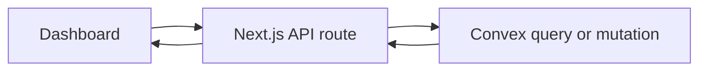
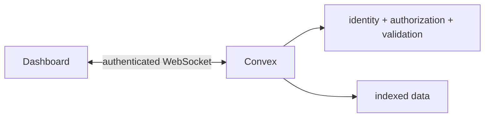

Envpilot is built on Convex. The dashboard subscribes to live data, Convex authenticates the caller, and the backend owns the rules that decide who may read or change a project.

But several ordinary dashboard workflows still took a detour:

The route parsed JSON, checked a session, translated an error, and forwarded the operation to the backend that already knew how to authenticate and validate it. Then the browser manually refreshed data that Convex was already capable of keeping live.

That detour was not catastrophic. It was worse in a quieter way: it made the system harder to reason about. Every new project or organization action had two possible homes for authorization, two error shapes, and two places where the UI could fall out of sync.

[PR #173](https://github.com/rafay99-epic/envpilot.dev/pull/173) removed that middle layer from the dashboard workflows where it was adding no useful boundary.

## The dashboard now talks to the backend it actually uses

Project creation, updates, moves, member management, organization workflows, and tags now go through small React hooks backed by Convex queries and mutations.

This is not a claim that every API route is bad or that every route disappeared. Public APIs, provider callbacks, and compatibility surfaces still need HTTP boundaries. The change is narrower: a signed-in dashboard should not pretend Convex is a remote service hidden behind another backend when Convex is already the backend.

For users, the effect is simple:

- project and organization changes use the same live connection as the data they update;
- routine mutations avoid an extra application-server round trip;
- loading and error behavior is consistent across the dashboard;
- pages no longer need to manually invalidate a second client-side cache after a successful change.

There is no invented latency number here. We did not ship a benchmark claiming a percentage improvement. We removed work that did not need to exist.

## Authorization moved closer to the write

The architectural cleanup also closed an important ambiguity: who is the actor?

The browser no longer supplies identity fields for tag writes. Convex derives the user from the authenticated request and checks organization or project capabilities beside the mutation. Current-user organization queries return only active memberships for that caller.

That gives us one security rule for every dashboard caller instead of a route-level interpretation followed by a backend-level interpretation.

It also improves errors. User-facing validation and permission failures are emitted as structured Convex errors and sanitized once in the client. A missing permission no longer becomes a different message depending on which route happened to wrap it.

## Removing a hop does not make database work free

Direct access can become expensive if the query behind it is careless. The most interesting part of #173 was not deleting route files; it was making the remaining Convex work bounded.

Deleting a tag sounds small until that tag is attached to variables and projects across a large organization. The old shape encouraged collecting every matching row and cleaning it in one operation. That makes cost and execution time grow with the size of the organization, exactly where a serverless database is least forgiving.

The replacement separates intent from cleanup:

1. validate the request and mark the tag for deletion;
2. clean variable references in paginated scheduled mutations;
3. clean project references in their own paginated stage;
4. reschedule until both scans finish.

Tag lists also expose an overflow signal for older organizations instead of silently reading an unlimited set. The UI can remain useful while maintenance continues, and Convex only reads a controlled page at a time.

This is the cost model we want across Envpilot: indexes for interactive reads, explicit limits for lists, and scheduled batches for work whose size depends on customer data.

## The smaller architecture is the product change

Most people will never know which request path created their project. They will notice when a page updates without a reload, when a permission error is understandable, and when a large cleanup does not freeze the action that started it.

That is what shipped in web `v1.59.2`: fewer layers in the common path, one source of truth for identity and authorization, and bounded work where the data can grow.

The next pull request put the same principles under the most destructive action in the product: deleting an entire project.
