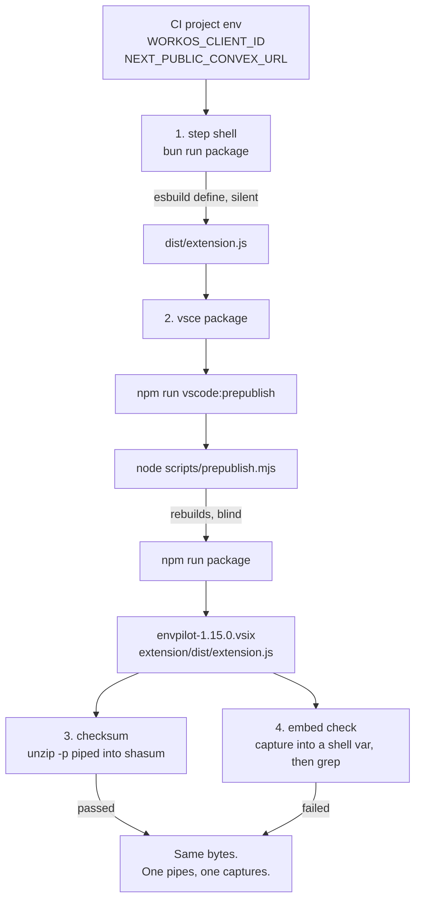

On 2026-07-17 at 21:33, a CI job told me the WorkOS client id was not inside my packaged VS Code extension.

It was inside the packaged VS Code extension.

I know it was, because twenty minutes later I made the same job checksum the file in `dist` against the exact same file unzipped back out of the `.vsix`, and the hashes matched. Same bytes. One step said the value is here. The next step, reading those bytes, said it isn't.

This is the story of the next 52 minutes, the six pull requests I merged straight to `main` chasing that contradiction, and the deeply unsatisfying way it ended.

## The two characters, and why they can kill you quietly

The extension bakes two values into its bundle at build time: the WorkOS AuthKit client id and the Convex deployment URL. Neither is a secret in the scary sense — the client id is public. But if either one goes missing, nothing complains. The extension builds fine, packages fine, publishes fine, and then silently fails to sign anyone in.

Here's the line in `apps/vscode-extension/scripts/build.mjs` that makes that possible:

```js
__WORKOS_CLIENT_ID__: JSON.stringify(process.env.WORKOS_CLIENT_ID || ""),
__CONVEX_URL__: JSON.stringify(process.env.NEXT_PUBLIC_CONVEX_URL || ""),
```

**The `|| ""` is the whole problem.** An absent environment variable isn't an error here. It's an empty string. And an empty string travels all the way to the marketplace looking exactly like a successful release.

If you're wondering how I know that so confidently — I shipped it. [PR #90](https://github.com/rafay99-epic/envpilot.dev/pull/90), eleven days earlier, is where I added a guard that unzips the packaged `.vsix` and greps the bundle for both values before letting the publish happen.

That guard is the thing that started refusing. My own tripwire, doing its job, on a build that was fine.

## Why I couldn't just delete the guard and go home

The obvious lazy move is to comment out the check. I couldn't.

[PR #131](https://github.com/rafay99-epic/envpilot.dev/pull/131) was sitting in the queue: delete all eleven legacy root `convex/<module>.ts` compatibility shims and raise the client floors in `apps/web/src/lib/versions.ts` to `minCli: 1.18.0` / `minExtension: 1.15.0`. Its body carries a merge gate I wrote myself, and it's worth quoting because it's the reason nobody was going to hand-wave anything:

> Setting a minimum above a published, installable version is a **total lockout** — every blocked user would have no upgrade target.

Raise the floor to 1.15.0 before 1.15.0 exists, and every single user gets an upgrade prompt pointing at a version that isn't there. So extension 1.15.0 had to genuinely land on Open VSX first.

And the publish job only runs on `main`. Not on branches. Which is why the next hour looks like recklessness and was actually the only available debugger: **six merges to main, each one a hypothesis**, because a branch physically could not reproduce the failure.

The warm-up act was [#129](https://github.com/rafay99-epic/envpilot.dev/pull/129), merged at 21:06. `vsce` was prompting `Do you want to continue? [y/N]` because the extension had no LICENSE file — and a headless CI job has no TTY to answer a prompt. The job just sat there, politely, until the 10-minute no-output timeout killed it. Shipping a LICENSE got me far enough to reach the real failure.

Progress, technically.

## Four places a value can die

Before the fixes, here's the chain the client id has to survive to reach the marketplace.



Notice there are four independent places to lose it. Over the next 52 minutes I blamed all four, in order, and was wrong every time.

## #132: blame the process tree

The observation that kicked it off was genuinely good, and I still like it.

The `publish-cli` job runs an _identical_ embed check against the CLI bundle. Same project env vars, same image, same idea. It passes every time. So what's structurally different about the extension?

The CLI builds in the step shell. The extension was getting rebuilt inside `vsce`'s spawned npm chain — three processes deep from where the env vars live. [PR #132](https://github.com/rafay99-epic/envpilot.dev/pull/132) moved the build up out of that chain:

```yaml
command: |
  bun run package
  EXT_PREBUILT=1 bunx @vscode/vsce package --no-dependencies
```

Plus a new `vscode:prepublish` hook that bails out early when `EXT_PREBUILT=1`, so `vsce` keeps the dist I'd just built instead of blindly rebuilding it.

Textbook differential diagnosis. Compare the passing case to the failing case, isolate the difference, remove it.

It did not work.

## #133: my own rules, working perfectly, against me

[PR #133](https://github.com/rafay99-epic/envpilot.dev/pull/133) is four added lines and two removed. It is the least interesting diff in the sequence and my favourite one to admit to.

#132 had committed the new `prepublish.mjs` unformatted, plus a unicode-escaped em dash into `package.json`. So `prettier --check .` went red. And the CircleCI pipeline I'd built the day before puts the quality gate first on purpose, with nothing running downstream of a red verdict.

Which means the publish job I was actively debugging never ran at all.

**A full cycle burned on a formatting fix** — by a rule I wrote, that I still think is correct, and that I had tripped myself.

## #134: if the environment dies, so does the flag

This is the sharpest reasoning in the whole sequence, and it's the one that should have won.

Follow it: I claimed `vsce`'s npm chain scrubs environment variables. Fine. But `EXT_PREBUILT=1` is _an environment variable_. If the scrubbing theory is true, my own escape hatch never reaches the hook either — so the hook rebuilds without env and overwrites the good bundle with a broken one.

Filesystem state survives what env does not. So [PR #134](https://github.com/rafay99-epic/envpilot.dev/pull/134) swapped the flag for a marker file. It's still in the tree today:

```js
const marker = fileURLToPath(new URL("../.prebuilt", import.meta.url));

if (process.env.EXT_PREBUILT === "1" || existsSync(marker)) {
  rmSync(marker, { force: true }); // one-shot: never leaks into a later local build
  console.log(
    "prebuilt marker found — keeping the CI-built dist, skipping rebuild."
  );
  process.exit(0);
}
execSync("npm run package", { stdio: "inherit" });
```

`.prebuilt` went into `.vscodeignore` so it never ships to anyone.

#134 also added the instrumentation that made the next PR's paradox possible: fail fast if either value is empty in the step shell, grep `dist` immediately after the build, then checksum `dist/extension.js` against the same file unzipped straight back out of the VSIX.

```bash
grep -rqF "$WORKOS_CLIENT_ID" dist || { echo "ERROR: client id missing from dist straight after the step-shell build."; exit 1; }
shasum dist/extension.js > /tmp/dist-checksum
touch .prebuilt
bunx @vscode/vsce package --no-dependencies
unzip -p envpilot-*.vsix extension/dist/extension.js | shasum | awk '{print $1}' > /tmp/vsix-checksum
```

And on the way past, it caught a completely separate real bug: `NEXT_PUBLIC_CONVEX_URL` had been deleted from the CircleCI project env at some point. The proof it once existed is quietly satisfying — the already-published CLI 1.18.0 has the correct production Convex URL baked into it, so the variable was definitely there when that artifact got built. Re-added. Cause never determined.

The escape hatch was shut too. From #134's body: the dormant GitHub Actions path returned "account payments have failed" on dispatch. Jobs never started.

## #135: the impossible log

#134's run came back with a contradiction I could not argue with.

`dist` contained the client id. The VSIX bundle was checksum-identical to `dist`. And then a later step, grepping those same bytes, said the value was not there.

Read that again. Same bytes. Two different answers.

[PR #135](https://github.com/rafay99-epic/envpilot.dev/pull/135) concluded the two steps must be resolving _different values_ for `$WORKOS_CLIENT_ID`, and merged the check into the same shell that bakes them in. That conclusion was wrong.

It doesn't matter, because of what else it shipped:

```bash
echo "diag: len=${#val} sha8=$(printf '%s' "$val" | shasum | cut -c1-8)"
echo "diag: dist files containing it:"; grep -rlF "$val" dist || echo "  (none)"
```

Every prior PR changed the build. **This one changed what the failure _printed_** — a length and a hash prefix that identify a value without leaking it, and a list of the files that actually contain it.

Three PRs of pure inference, then one that finally bought an observation. If you take one thing out of this post, take that: when your hypotheses are cheap and wrong, stop shipping fixes and start shipping instrumentation.

## #136: the ending I thought I'd found

The diagnostics printed. The value was in `dist/extension.js`. The VSIX bundle was byte-identical to it. The embed grep still failed.

[PR #136](https://github.com/rafay99-epic/envpilot.dev/pull/136) proposed a mechanism, and it's a good one. The grep ran against `BUNDLE=$(unzip -p ...)` — a 500 KB minified bundle captured into a shell variable. Bash mangles binary bytes in command substitution, so the captured copy was corrupt and grep missed a value genuinely present in the file. The checksum step never broke because it _pipes_ instead of capturing.

One line. Capture becomes pipe:

```bash
- if ! printf '%s' "$BUNDLE" | grep -qF "$val"; then
+ if ! unzip -p "$VSIX" extension/dist/extension.js | grep -qF "$val"; then
```

The PR body declares: "This was the cause the whole time — not env vars, not the marker, not two different values."

It reads like the last paragraph of a good debugging post.

## #137: it was not the last paragraph

Twelve minutes later, [PR #137](https://github.com/rafay99-epic/envpilot.dev/pull/137):

> The stream fix (#136) failed identically to variable-capture, which is impossible if the checksum (dist==vsix) truly passed — so an assumption is wrong.

So #136 was a hypothesis, not a finding, and the evidence is against it. Worth flagging for anyone reaching for the same explanation: `$(...)` in bash _removes_ NUL bytes rather than truncating at the first one, which on its own would never hide a plain-ASCII client id.

#137 stopped fixing entirely. It replaced the whole verification block with `set -x` and unconditional evidence collection, then `exit 1` before publish, deliberately. Every boolean became a count. Every artifact got a sha256. `rm -rf dist ./*.vsix .prebuilt` guaranteed a clean slate. And one grep looks for the string `client_` rather than the exact expected value — asking "is there _any_ client id in here" independent of which one I think it should be:

```bash
echo "client_ occurrences in dist/extension.js:"; grep -c "client_" dist/extension.js || true
echo "=== vsix extension.js byte size ==="; unzip -p "$VSIX" extension/dist/extension.js | wc -c
echo "=== FORENSIC RUN — intentionally stopping before publish ==="
exit 1
```

Its commit subject is the thesis of the entire sequence: `ci(debug): forensic dump in extension package step — stop guessing, read bytes`.

## How it actually ended, which is not how I wanted it to end

It ended by moving house.

I migrated the pipeline off CircleCI in [#139](https://github.com/rafay99-epic/envpilot.dev/pull/139) — renaming `.circleci/config.yml` to `config.yml.old`, since CircleCI only ever reads `config.yml`. Its body notes, almost as an aside, that CircleCI "is also where the extension-publish env flakiness lived."

The tag tells the rest. `extension-v1.15.0` is a lightweight tag on `0c058de9` — the merge commit of #139 itself. The extension published on the first GitHub Actions run. #131 unblocked **eight minutes later**.

And the code that published it? `.github/workflows/deploy-extension.yml` still greps a captured variable:

```bash
BUNDLE=$(unzip -p "$VSIX" extension/dist/extension.js)
if ! printf '%s' "$BUNDLE" | grep -qF "$WORKOS_CLIENT_ID"; then
```

The #136 "real fix" only ever existed in `.circleci/jobs.yml`, which #139 archived. The unchanged, supposedly-broken pattern has since published 1.15.0 and 1.16.0 without a word of complaint.

I did not fix the bug. I outran it.

## The receipts

| PR                                                            | What it changed                                                                                                      |
| ------------------------------------------------------------- | -------------------------------------------------------------------------------------------------------------------- |
| [#90](https://github.com/rafay99-epic/envpilot.dev/pull/90)   | Build CLI/extension directly, never via turbo; verify the _packaged_ artifact — where the guard was born             |
| [#119](https://github.com/rafay99-epic/envpilot.dev/pull/119) | CircleCI pipeline v2: dynamic per-surface workflow generation, quality gate first, deploys only from main            |
| [#129](https://github.com/rafay99-epic/envpilot.dev/pull/129) | Ship LICENSE in the VSIX so vsce stops prompting and hanging the headless job                                        |
| [#132](https://github.com/rafay99-epic/envpilot.dev/pull/132) | Build in the step shell; `EXT_PREBUILT=1` tells vsce not to rebuild                                                  |
| [#133](https://github.com/rafay99-epic/envpilot.dev/pull/133) | Prettier fix — #132's own files failed the quality gate before any publish job ran                                   |
| [#134](https://github.com/rafay99-epic/envpilot.dev/pull/134) | `.prebuilt` marker file instead of an env flag; dist-vs-VSIX checksum; re-added the missing `NEXT_PUBLIC_CONVEX_URL` |
| [#135](https://github.com/rafay99-epic/envpilot.dev/pull/135) | Embed check moved into the build shell, plus the non-leaking diagnostics that finally produced evidence              |
| [#136](https://github.com/rafay99-epic/envpilot.dev/pull/136) | Stream the VSIX into grep instead of capturing it in a shell variable                                                |
| [#137](https://github.com/rafay99-epic/envpilot.dev/pull/137) | Forensic dump: `set -x`, sha256 everything, `exit 1` before publish                                                  |
| [#138](https://github.com/rafay99-epic/envpilot.dev/pull/138) | Relicense the monorepo under MIT                                                                                     |
| [#139](https://github.com/rafay99-epic/envpilot.dev/pull/139) | Migrate CircleCI → GitHub Actions, add a gitleaks secret scan to the quality gate                                    |
| [#131](https://github.com/rafay99-epic/envpilot.dev/pull/131) | Delete 11 legacy Convex shims, raise `minCli`/`minExtension` — the thing all of this was blocking                    |
| [#148](https://github.com/rafay99-epic/envpilot.dev/pull/148) | Re-enable Vercel prod deploys, which the migration had left switched off at both ends                                |

## What's still broken, including me

The forensic output was never recorded anywhere. No PR, no commit, no comment says what #137 actually printed. I built the instrument and then didn't write down the reading.

The incident closed by migration, not by diagnosis, and that's worse than it looks: if #136's mechanism is real, `deploy-extension.yml` is carrying a latent version of it right now. The `.prebuilt` marker machinery is dead code on the live path, because GitHub Actions never writes the marker. And `.circleci/jobs.yml` is still sitting in the repo under an active-looking filename.

The one thing that generalised: [#148](https://github.com/rafay99-epic/envpilot.dev/pull/148) moved the Vercel builds off the runner and onto Vercel's own infrastructure, specifically because the workflow-level CI stub `NEXT_PUBLIC_CONVEX_URL: http://127.0.0.1:3210` would otherwise have been baked into a production bundle.

Same class of bug. A build-time env var silently embedded into a shipped artifact. Caught in review this time, instead of over six merges to `main`.

That's the only part of this I'd call a fix.

Here's where I land. The instinct that a fast hypothesis is cheaper than a slow observation is a lie, and it cost me four PRs before I bought a single piece of evidence. The guard was right the whole time — it just described the failure in a vocabulary I couldn't read yet. And I'd rather ship a tripwire that fires confusingly than a marketplace build that signs nobody in.

Until then, read the bytes, nerds.
