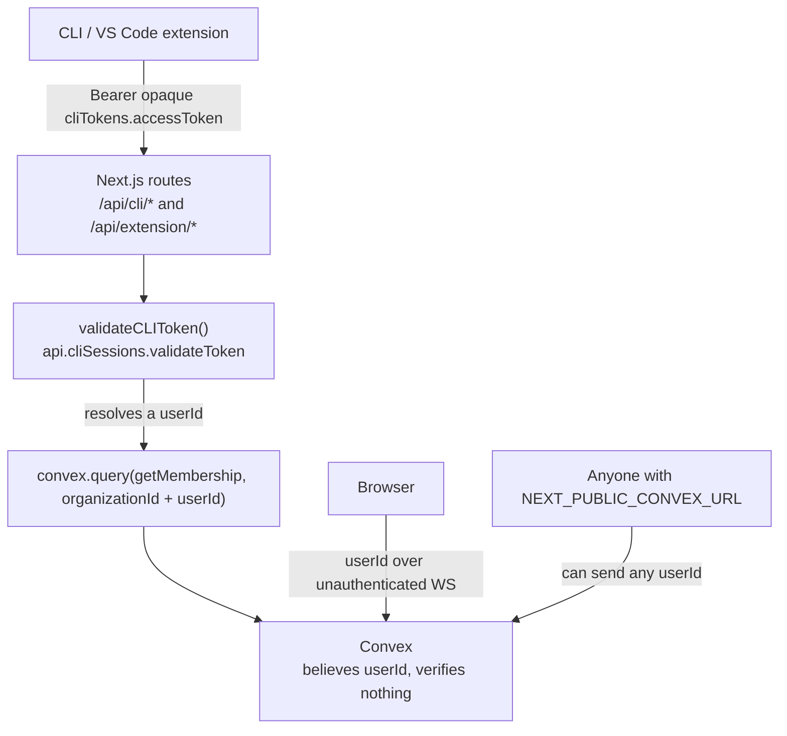
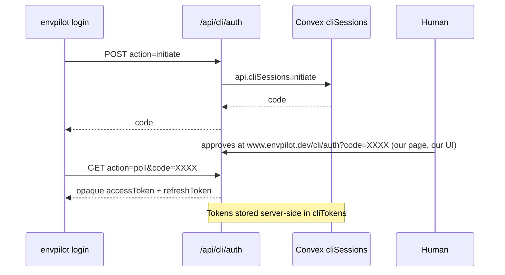
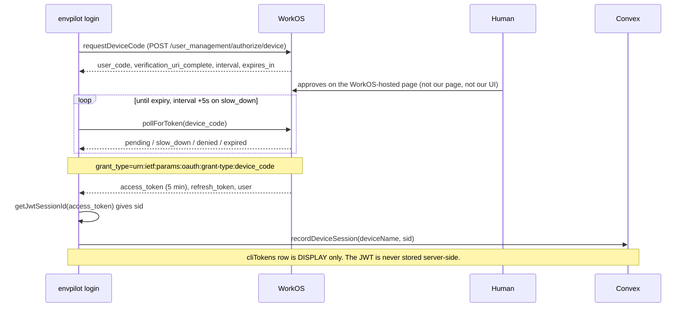
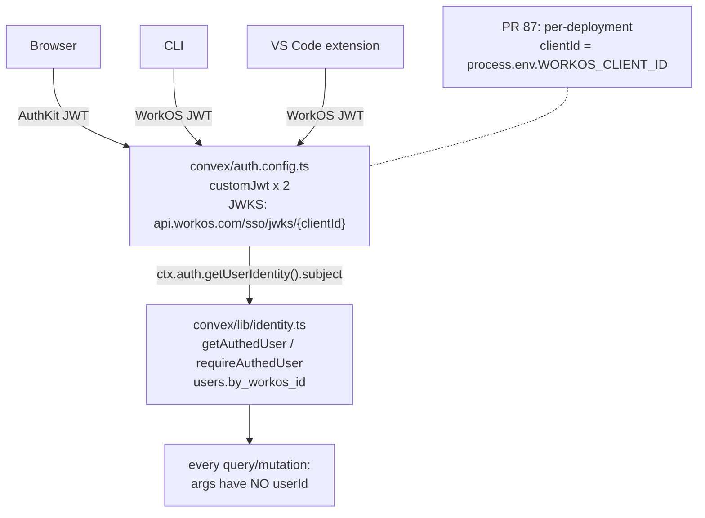

There is a comment I wrote in `apps/web/src/app/api/extension/auth/callback/route.ts`:

```typescript
// Pending auth sessions stored in memory (in production, use Redis or similar)
const pendingSessions = new Map<string, { ... }>();
```

Past-me wrote a note telling future-me to fix this before production.

It was in production.

That `Map` lived inside a serverless function. Vercel spins those up per request, on whatever instance it feels like. So the VS Code extension would kick off a sign-in, the browser callback would land on instance A and write to A's `Map`, and then the extension would poll — and hit instance B, whose `Map` was empty. Poll again. Instance C. Empty.

The extension hung, then timed out.

That's where this story starts, and it takes **eighty days** to end: April 16th to July 5th, 2026. This is every way my homegrown auth broke, and how I eventually deleted all of it.

## The handshake that only worked on one machine

[PR #56](https://github.com/rafay99-epic/envpilot.dev/pull/56) is the fix for the `Map`, merged April 16th, **+914 / −114**.

The fix itself is obvious once you see the bug: move the handshake somewhere every instance can reach. That's Convex. A `pendingExtensionAuthSessions` table with atomic store-then-consume semantics and a fifteen-minute cleanup cron.

```typescript
// Store the short-lived handshake record in Convex so the polling
// check endpoint can read it regardless of which Lambda it hits.
await convex.mutation(api.pendingExtensionAuthSessions.store, { ... });
```

**The lesson I actually took:** I had no way to see this happening. Every failure looked identical from the outside — "auth timed out" — and there was nothing in the logs that would tell you _which_ of the four possible causes it was. So #56 also added `apps/web/src/lib/logger.ts`, structured JSON logging with automatic redaction of sensitive fields, and instrumented the whole auth flow: initiation, browser open, polling lifecycle, timeouts.

It also fixed something embarrassing. Rate limit responses from upstream were being caught and re-thrown as a generic 500. So a user who hit a rate limit got told the server was broken. Now they get a 429 and a message that tells them what to do.

Extension 1.3.7. Web 1.11.4.

## The next day

[PR #60](https://github.com/rafay99-epic/envpilot.dev/pull/60), merged April 17th. One day later.

The symptom this time was on the CLI: stored credentials getting wiped mid-session. Not on login — during ordinary authenticated requests. Credentials gone, back to `envpilot login`.

Here's what was happening. If you typed `envpilot config set apiUrl envpilot.dev`, the CLI stored the apex domain. Every request then went to `envpilot.dev`, which 301s to `www.envpilot.dev`.

Node's `fetch` follows that redirect for you. **It does not re-attach the `Authorization` header when the hostname changes.** So the request arrives at `www` with no credentials, comes back a bogus 401 — and the CLI's error handling saw a 401 and did the responsible-looking thing.

It cleared your credentials.

The fix is `fetchWithSafeRedirects()` in the CLI's `APIClient`: follow redirects manually, keep the `Authorization` header when the next hop is the same registrable domain, strip it when it isn't.

```typescript
const nextUrl = new URL(location, currentUrl);
const prevHost = new URL(currentUrl).hostname;
const sameSite =
  registrableDomain(nextUrl.hostname) === registrableDomain(prevHost);

const headers = new Headers(currentInit.headers);
if (!sameSite) {
  // Cross-site redirect — strip credentials (matches fetch spec)
  headers.delete("Authorization");
}
```

Plus `normalizeApiUrl()`, which canonicalizes `envpilot.dev` to `www.envpilot.dev` on both read and write, so older installs get fixed transparently. And the credential-clearing got a lot less trigger-happy: only a definitive 401 from the server clears anything.

### But here's the kicker

While I was in that file, I read the token generator.

```typescript
/**
 * Generate a random alphanumeric code
 */
function generateCode(length: number): string {
  const chars = "ABCDEFGHJKLMNPQRSTUVWXYZ23456789"; // Removed ambiguous chars (0, O, I, 1)
  let code = "";
  for (let i = 0; i < length; i++) {
    code += chars.charAt(Math.floor(Math.random() * chars.length));
  }
  return code;
}
```

`Math.random()` is not a cryptographic random number generator. It never claimed to be. It's a fast PRNG for shuffling arrays and picking colours, and its output is predictable from previous output.

That function generated the twelve-character session codes for my device flow. And a few lines down, the _same_ pattern generated the actual bearer tokens — `env_` access tokens good for **30 days** and `env_refresh_` tokens good for **90 days**.

Ninety-day credentials from `Math.random()`.

```typescript
/**
 * Generate a secure token using a CSPRNG.
 * Access and refresh tokens are long-lived (30–90 days) so they MUST
 * be generated with crypto.getRandomValues(), not Math.random().
 */
function generateToken(prefix: string): string {
  const bytes = new Uint8Array(48);
  crypto.getRandomValues(bytes);
  // ...
}
```

**And one more:** the collision check on session codes only rejected codes matching a _pending_ session. If the previous session with that code was `authenticated` or `expired`, the code got handed out again — and `poll()` used `.first()` on the same index, so it could hand you back the old session's state. I fixed it to reject collisions against any existing session.

CLI 1.6.0 → 1.6.1. A patch bump. Look at what was in it.

## The part where I admit the whole design was the bug

Everything above is me patching a system that should not have existed.

Here's the thing underneath all of it. A Convex deployment is publicly reachable — the URL lives in `NEXT_PUBLIC_CONVEX_URL`, which is shipped to every browser and printed in every bundle. That's by design. Convex verifies the caller from a JWT on the connection.

I was not sending a JWT. Every query and mutation took the actor as an _argument_:

```typescript
export const getMembership = query({
  args: {
    organizationId: v.id("organizations"),
    userId: v.id("users"), // <- "trust me bro, this is who I am"
  },
  handler: async (ctx, args) => {
    // ...uses args.userId as the actor
  },
});
```

So the authorization model was: whatever user id the caller claims to be, is the user. Anyone who could reach the deployment — which is anyone — could pass any `userId`.

That is the whole bug. It is one line of args.

And the CLI and extension made it worse in a way that took me a while to see clearly. Neither of them talked to Convex at all. They talked to twenty-six Next.js routes under `/api/cli/*` and `/api/extension/*`. Those routes held an opaque bearer token, looked it up, resolved a `userId`, and passed it to Convex as an argument. I called this the bridge.



Follow the arrows: nothing in that chain ever proves who you are.

I used to describe this as "the CLI has an extra HTTP hop." That undersells it badly. The bridge was a second, parallel identity system — its own token format, its own `cliTokens` storage, its own refresh endpoint at `/api/cli/auth?action=refresh`, its own approval page at `apps/web/src/app/cli/auth/page.tsx`. I had written my own OAuth device flow, with `Math.random()`, on top of a backend that verified nothing.

The tell that it had rotted further than I thought: my Playwright suite had been _exploiting_ the hole. Variable-request seeding worked by having an unauthenticated client pass `requestedBy` directly.

My own tests were the proof of concept.

## Stage 1: verify identity, keep the bridge on life support

The replacement already existed in the tree as dormant scaffolding. `convex/identity.ts` (today `convex/lib/identity.ts`) had a header reading "CURRENTLY UNUSED / DORMANT. No function calls these yet." [PR #83](https://github.com/rafay99-epic/envpilot.dev/pull/83), July 5th, **+3,208 / −2,250**, turned it on:

```typescript
export async function getAuthedUser(
  ctx: MutationCtx | QueryCtx
): Promise<Doc<"users"> | null> {
  const identity = await ctx.auth.getUserIdentity();
  if (!identity) return null;

  // WorkOS AuthKit puts the WorkOS user id in the JWT `sub` claim, surfaced by
  // Convex as `identity.subject`. That maps 1:1 to `users.workosId`.
  const workosId = identity.subject;
  if (!workosId) return null;

  return await ctx.db
    .query("users")
    .withIndex("by_workos_id", (q) => q.eq("workosId", workosId))
    .first();
}
```

`convex/auth.config.ts` registers two WorkOS `customJwt` providers, the browser gets `ConvexProviderWithAuth`, and roughly **eighty-four functions** were converted in four risk-ordered batches: RBAC first, then secrets, then token minting, then everything else. The diff hunk carrying the entire story is four lines:

```diff
   args: {
     organizationId: v.id("organizations"),
-    userId: v.id("users"),
   },
   handler: async (ctx, args) => {
+    const actor = await requireAuthedUser(ctx);
```

The interesting decision was the CLI and extension, which had no JWTs yet. The obvious move is to keep passing userIds from the routes — they're my routes, they're trusted. I rejected that. `ConvexHttpClient` can't call internal functions so it wasn't available anyway, and more to the point: in-Convex validation is a strictly stronger boundary. Even a compromised route shouldn't be able to impersonate anyone.

So #83 added `requireBearerUser` and a set of `*ForToken` public variants. The route forwards _the token itself_; Convex resolves it.

```typescript
/**
 * The token itself is the proof of identity — it is validated INSIDE Convex
 * (active, unexpired, user exists), so even a compromised route cannot
 * impersonate an arbitrary user by passing a made-up id. ...
 *
 * TEMPORARY BRIDGE: goes away in Stage 2 when the CLI/extension move to
 * WorkOS device-flow JWTs and call the JWT-verified functions directly.
 */
export async function requireBearerUser(
  ctx: MutationCtx | QueryCtx,
  accessToken: string
): Promise<Doc<"users">> {
```

**That's the beat that made everything after it cheap.** The bridge got _demoted_ before it got deleted — from identity authority to dumb pipe. Every converted function split into a `*Core(ctx, userId)` helper with two thin wrappers, one per caller class:

```typescript
export const listForUser = query({
  args: {},
  handler: async (ctx) => {
    const actor = await requireAuthedUser(ctx);
    return listForUserCore(ctx, actor._id);
  },
});

export const listForUserForToken = query({
  args: { accessToken: v.string() },
  handler: async (ctx, args) => {
    const actor = await requireBearerUser(ctx, args.accessToken);
    return listForUserCore(ctx, actor._id);
  },
});
```

Stage 2 then became a deletion instead of a rewrite. Drop the second wrapper.

(The PR body counts twelve `*ForToken` functions. The PR that deleted them counts eighteen. I never reconciled that.)

## Stage 2: the good part

[PR #84](https://github.com/rafay99-epic/envpilot.dev/pull/84) is **+1,818 / −4,811**.

Net three thousand lines gone. The `cliSessions` and `pendingExtensionAuthSessions` tables and modules — yes, the one I'd built in April — every `*ForToken` variant, `requireBearerUser` itself (shipped and removed one PR apart, exactly as its docstring promised), the `/cli/auth` page, and roughly twenty API routes.

What replaced it: RFC 8628 device authorization against WorkOS directly, over raw HTTP with no SDK, plus `ConvexHttpClient.setAuth(jwt)` for data.

Here's the thing I built, with the codes and tokens I generated myself:



Count the pieces I owned. Now here's #84, in `apps/cli/src/lib/auth-flow.ts`:



`cliTokens` survives, repurposed as a display-and-revoke record. No client JWT is ever stored server-side.

The polling loop maps a single HTTP attempt onto a discriminated union and owns the retry policy itself, which keeps the transport function honest:

```typescript
export type PollResult =
  | { status: "complete"; token: TokenResponse }
  | { status: "pending" }
  | { status: "slow_down" }
  | { status: "denied" }
  | { status: "expired" }
  | { status: "network" };
```

The same distinction shows up in refresh, where getting it wrong logs people out for a blip — the exact failure mode #60 had already burned me with:

```typescript
//   - 5xx / 429           → server unavailable or rate-limited; the refresh
//                           token is probably still valid. Surface as
//                           `network` so the caller KEEPS the creds and the
//                           user can retry (no wrongful forced re-login).
//   - other 4xx (400/401) → the refresh grant was rejected (revoked/expired
//                           token) → access_denied so the caller clears creds.
const transient = result.status >= 500 || result.status === 429;
```

[PR #85](https://github.com/rafay99-epic/envpilot.dev/pull/85) did the extension and got the better payoff: HTTP polling to an authenticated Convex WebSocket via `ConvexClient.setAuth(getFreshToken)`, and its three subscriptions lost their identity arguments entirely.

| before (token/userId args)      | after (identity-scoped)                          |
| ------------------------------- | ------------------------------------------------ |
| `checkForTokens(accessTokens)`  | `permissionRevocationEvents.listMine()`          |
| `getByAccessToken(token)`       | `projectAccess.listForCaller()`                  |
| `acknowledgeMultiple(ids, uid)` | `permissionRevocationEvents.acknowledgeMine({})` |

One subtlety that cost real debugging: for a Convex client, a null token is _terminal_. A transient refresh failure doesn't retry itself, so the extension has to explicitly re-arm.

```typescript
/** Capped backoff for re-auth after a transient refresh failure — a null
 * token is TERMINAL for the Convex client, so we must call setAuth again. */
private static readonly REAUTH_DELAYS_MS = [5_000, 15_000, 60_000];
private static readonly REAUTH_CAP_MS = 3 * 60 * 1000;
```

#84 and #85 merged **one hour and fifty-six minutes apart**. In between, main contained an extension calling backend functions that #84 had just deleted. I knew. I shipped anyway rather than hold a security fix.

## Five hours, four fixes, one self-inflicted

Then the interesting part.

**22:58 UTC.** A direct commit to main, no PR: `58a6582a`, "auth:fix". It hardcoded the production WorkOS client id into `auth.config.ts` to remove deploy-time env resolution as a failure source, because something had frozen the providers against a mismatched client id and everything was dying with "No auth provider found matching the given token."

`auth.config.ts` deploys to _both_ Convex deployments. They trust _different_ WorkOS clients.

So my production fix made dev trust the production client, and every dev CLI, extension, and web JWT started failing with the exact error the hardcode was meant to fix.

[PR #87](https://github.com/rafay99-epic/envpilot.dev/pull/87) is fourteen lines. Read the env first, keep the hardcode as a fallback:

```typescript
const clientId =
  process.env.WORKOS_CLIENT_ID || "client_01KHWDD75944NBADKY0ANTRXR8";
```

**00:49 UTC.** [PR #88](https://github.com/rafay99-epic/envpilot.dev/pull/88): the published CLI and extension artifacts shipped an empty client id. The publish workflows never set `WORKOS_CLIENT_ID` or `NEXT_PUBLIC_CONVEX_URL` on the build step, so `tsup` and `esbuild` baked `""`. Set them, patch-bump, republish. Correct diagnosis. Insufficient fix.

**01:57 UTC.** [PR #90](https://github.com/rafay99-epic/envpilot.dev/pull/90) found the two real causes. First: turbo dropped the env. The vars were declared in `turbo.json`, they were set on the step, the deploy log showed `WORKOS_CLIENT_ID: ***` and a fresh `cache miss` — and the bundle still had `""`. I never diagnosed the mechanism. I stopped building through turbo. To this day the rule in `CLAUDE.md` reads: CLI and extension always build directly.

The second one is worth internalizing. The CLI's `"prepublishOnly": "npm run build"` and the extension's `"vscode:prepublish": "npm run package"` both re-run the bundler _at publish time_, in a context that never got the env, overwriting the artifact I had just verified. That's why an earlier guard checking the pre-publish `dist` passed while the published artifact was still empty.

The fix is verify-then-publish-the-exact-bytes:

```yaml
- name: Publish to npm
  # --ignore-scripts is CRITICAL: the CLI has "prepublishOnly": "npm run
  # build", so a plain `bun publish` would RE-RUN tsup here — without the
  # WORKOS_CLIENT_ID env that only the Build step above had — overwriting the
  # just-verified bundle with an empty-client-id one. --ignore-scripts
  # publishes the exact dist the guard verified, so what ships == what passed.
  run: bun publish --ignore-scripts --access public
```

And for the extension, grep inside the zip:

```yaml
BUNDLE=$(unzip -p "$VSIX" extension/dist/extension.js)
if ! printf '%s' "$BUNDLE" | grep -qF "$WORKOS_CLIENT_ID"; then
echo "::error::Packaged $VSIX does not contain the WorkOS client id — refusing to publish a broken build."
```

**01:17 UTC**, wedged between those two: [PR #89](https://github.com/rafay99-epic/envpilot.dev/pull/89). Because #84 deleted routes, every older client was permanently broken and I had no way to tell anyone. Building two-tier version enforcement surfaced three latent bugs at once. `/api/version` wasn't in `unauthenticatedPaths`, so signed-out clients got a WorkOS HTML redirect instead of JSON — every version check had been silently failing. `APP_VERSIONS` was stale at `1.3.3` while the real CLI was at 1.12, so a running client looked _newer_ than "latest" and no notice could ever fire. And the CLI ran its check in `postAction`, after the command had already executed.

All three had been broken for a long time. All three were invisible until something depended on them.

## Stage 3, and the things still wrong

[PR #86](https://github.com/rafay99-epic/envpilot.dev/pull/86) moved WorkOS Vault crypto into Convex and deleted the six surviving vault routes. Today `find apps/web/src/app/api/cli apps/web/src/app/api/extension -name route.ts` errors on the first path — it doesn't exist — and returns exactly one file: `apps/web/src/app/api/extension/config/route.ts`.

Convex is the single backend.



Every arrow now passes through a verified JWT. There's no path around it.

The regression test attacks the deployment the way an attacker would — no session, no middleware in the way:

```typescript
test("the impersonation arg is gone: passing userId is a validation error", async ({
  request,
}) => {
  const result = await convexQuery(
    request,
    "features/organizations/queries:listForUser",
    { userId: "jd7f0000000000000000000000000000" }
  );
  expect(result.status).toBe("error");
  expect(result.errorMessage).toMatch(/Unauthenticated|ArgumentValidation/);
```

### The receipts

| PR                                                          | What it changed                                                                                                                                                                         |
| ----------------------------------------------------------- | --------------------------------------------------------------------------------------------------------------------------------------------------------------------------------------- |
| [#56](https://github.com/rafay99-epic/envpilot.dev/pull/56) | In-memory `Map` → `pendingExtensionAuthSessions` in Convex (store/consume + cleanup cron); structured logger; 429s no longer masked as 500. Extension 1.3.7, web 1.11.4.                |
| [#60](https://github.com/rafay99-epic/envpilot.dev/pull/60) | `fetchWithSafeRedirects()` keeps `Authorization` across same-site redirects; `normalizeApiUrl()`; `Math.random()` → `crypto.getRandomValues()` for codes and tokens. CLI 1.6.1.         |
| [#83](https://github.com/rafay99-epic/envpilot.dev/pull/83) | Stage 1. Activated `auth.config.ts`; converted ~84 functions to `requireAuthedUser`, deleting the client-supplied actor args; added `requireBearerUser` + the `*ForToken` bridge.       |
| [#84](https://github.com/rafay99-epic/envpilot.dev/pull/84) | Stage 2, CLI 1.12.0. WorkOS device flow, direct `ConvexHttpClient.setAuth`; deleted `cliSessions`, `pendingExtensionAuthSessions`, every `*ForToken`, the `/cli/auth` page, ~20 routes. |
| [#85](https://github.com/rafay99-epic/envpilot.dev/pull/85) | Stage 2, extension 1.7.0. Device flow, SecretStorage, authenticated Convex WebSocket; subscriptions repointed to `listMine` / `listForCaller` / `acknowledgeMine`.                      |
| `58a6582a`                                                  | Direct to main, no PR. Hardcoded the prod WorkOS client id. Broke dev.                                                                                                                  |
| [#87](https://github.com/rafay99-epic/envpilot.dev/pull/87) | `auth.config.ts` resolves `WORKOS_CLIENT_ID` per deployment, hardcode as fallback.                                                                                                      |
| [#88](https://github.com/rafay99-epic/envpilot.dev/pull/88) | Set the two build-time env vars on the publish workflows. CLI 1.12.1, extension 1.7.2.                                                                                                  |
| [#89](https://github.com/rafay99-epic/envpilot.dev/pull/89) | Two-tier version enforcement; `minCli: 1.12.1` / `minExtension: 1.7.2`; `/api/version` into `unauthenticatedPaths`; CLI check moved `postAction` → `preAction`; fail-open on network.   |
| [#90](https://github.com/rafay99-epic/envpilot.dev/pull/90) | Real root cause: turbo dropped the env, and `prepublishOnly` / `vscode:prepublish` rebuilt at publish time without it. Direct builds, `--ignore-scripts`, artifact-content guards.      |
| [#86](https://github.com/rafay99-epic/envpilot.dev/pull/86) | Stage 3. Vault crypto into Convex, six vault routes deleted, `convex/vaultReveal.ts` gated by `canRevealVaultRef`.                                                                      |

### The scars

The "TEMPORARY EMERGENCY FIX" comment is still in `convex/auth.config.ts` today, and so is the hardcoded prod fallback. Still there. Load-bearing by accident.

`cliTokens` still carries `accessToken` and `refreshToken` as optional strings — dead columns from the homegrown era, kept for legacy rows nobody has migrated. `apps/web/src/lib/cli-auth.ts` still exports `authenticateCLIRequest` and the `CLIAuthResult` interface right next to the JWT-native `verifyWorkosBearer` and `requireWorkosUser`.

Stage 3 also over-deleted on its first pass: it removed `/api/vault` believing it dead, five live callers disagreed, dashboard reveals 404'd, and it came back as `convex/vaultReveal.ts` (today `convex/features/vault/reveal.ts`).

The version floor #89 created has since moved to `minCli: "1.18.0"` and `minExtension: "1.15.0"` for an unrelated reason. That mechanism now has its own hazard, documented in `CLAUDE.md`: never set a minimum above a version that is actually published, or you lock out every user with no valid upgrade target.

## What I'd tell April-me

Not "don't write your own auth." That advice is everywhere and it's too cheap — sometimes you do write the thing, and you learn the shape of the problem by writing it.

Here's where I actually land. Every single bug in this post was a bug in something I built _around_ the identity problem, not the identity problem itself. The serverless `Map`. The redirect stripping the header. The `Math.random()` codes. The collision check on the wrong status. None of those exist in a system where the client holds a JWT and the backend verifies it. They were failure modes I invented by owning session state I had no business owning.

That's the actual test, and it's not "am I qualified to write auth." It's: **how many pieces of this do I have to be correct about?** I had a token format, a code generator, a session store, a refresh endpoint, an approval page, and a bridge that passed identity as an argument. Six things to get right. I got most of them wrong at least once.

And the one thing I'd genuinely take back isn't any of that. It's that I hardcoded a config value into a file that deploys to two environments, at 22:58, direct to main, without a PR, while already firefighting. The fourteen-line fix took another hour to land.

Everything else in that five-hour window was a build-pipeline problem that had been latent for months. It only became visible the moment a client's correctness depended on a value being baked into a bundle.

Until then, verify your tokens and stop trusting your own arguments, nerds.
