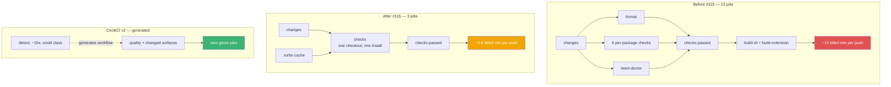
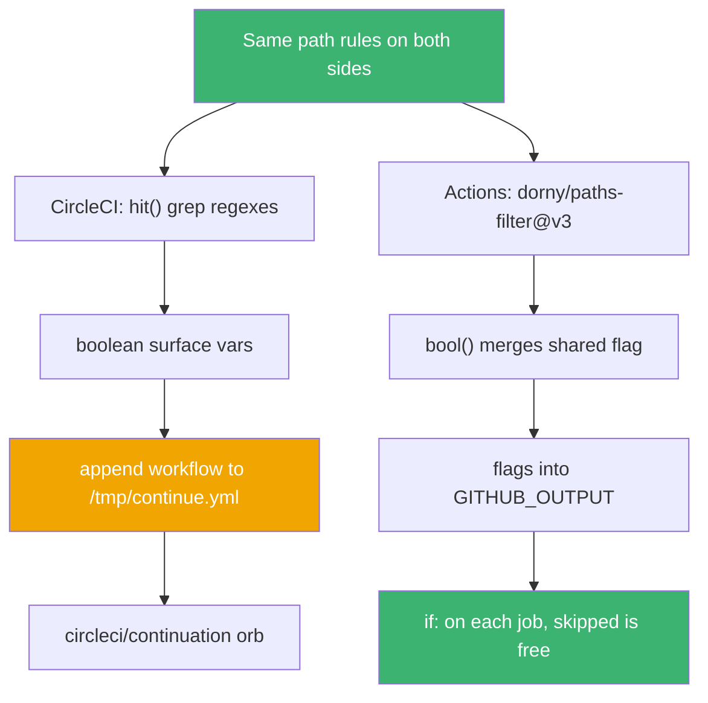

On 2026-07-16 at 15:23 UTC I merged a pull request titled "split blog + docs into standalone apps". Buried inside it, under eleven commits nobody would look for there, I moved every single CI job in the Envpilot monorepo off GitHub Actions and onto CircleCI. The first of those commits says `ci: move branch/PR checks to CircleCI (temp)`.

The word `temp` did a lot of work in that sentence.

On 2026-07-17 at 23:16 UTC I merged [#139](https://github.com/rafay99-epic/envpilot.dev/pull/139) and moved all of it back. That is **thirty-two hours** as a CircleCI shop. This is the story of why the move was correct, why the move back was also correct, and what a round trip costs even when both legs of it were the right call.

## Act zero: five files and a folder of shell scripts

Before any of this, `.github/workflows/` held five workflow files — `ci.yml`, `deploy-convex.yml`, `deploy-extension.yml`, `release-cli.yml`, `build-extension.yml` — plus three deploy scripts in `scripts/`. Five places to look when something did not ship.

[#61](https://github.com/rafay99-epic/envpilot.dev/pull/61) (2026-04-17) collapsed all of it into one 697-line `ci-deploy.yml`, renamed the five originals to `*.yml.disabled`, and deleted the shell scripts. Then [#74](https://github.com/rafay99-epic/envpilot.dev/pull/74) (2026-07-03) deleted _that_ file and replaced it with a 445-line orchestrator plus three reusable workflows and a composite `.github/actions/setup` action.

That second refactor produced a shape: `changes → parallel scoped checks → checks-passed gate → artifact builds → main-only deploys → release`.

Remember that shape. It is the file running my CI right now.

## The bill, day twelve

Here is the thing about a per-package check matrix: it is genuinely the nicest way to read a failed pipeline. A red X next to `check-cli` tells you where to look before you have opened anything.

It is also the most expensive possible way to buy compute.

From the body of [#115](https://github.com/rafay99-epic/envpilot.dev/pull/115), merged 2026-07-12:

> Free-tier Actions minutes nearly gone 12 days into the billing cycle. Measured a typical PR push: ~13 jobs, each billed as a rounded-up minute and each paying its own checkout + bun install → ~15 billed minutes per push, dozens of pushes/day.

I counted the job definitions at the commit before that merge. Thirteen exactly: `changes, format, check-web, check-admin, check-cli, check-extension, check-action, check-convex, react-doctor, checks-passed, e2e, build-cli, build-extension`.

**The architecture crime is precise: the granularity that made the pipeline readable is the same granularity the biller charges for.** Eight of those jobs were doing work Turborepo could parallelize inside one process. Instead each one paid its own `actions/checkout@v4`, its own `bun install --frozen-lockfile`, and then billed a full ceiling-rounded minute for a job that finished in well under one.

The fix is still sitting in `.github/workflows/ci.yml` as a comment, because I wanted future-me to know why one job does five things:

```yaml
# Stage 1: quality checks — ONE consolidated job (minutes diet, 2026-07-12).
#
# Previously 8 parallel jobs (format + 6 per-package checks + react-doctor),
# each billing a rounded-up minute AND paying its own checkout + bun install
# (~15 billed min per PR push). Consolidated: one job pays setup once and
# lets Turborepo parallelize internally; the .turbo cache (keyed per-SHA,
# restored from any prior run) makes unchanged packages replay instantly on
# re-pushes.
# …
checks:
  name: Checks (format, lint, typecheck, build, test)
```

Eight cold `bun install`s became one, plus a cache:

```yaml
- name: Cache Turborepo
  uses: actions/cache@v4
  with:
    path: .turbo
    key: turbo-${{ runner.os }}-${{ github.sha }}
    restore-keys: |
      turbo-${{ runner.os }}-
```

**The Result:** roughly **15 billed minutes per push down to 3-6**, about a 70% cut. Today a PR push runs exactly three jobs — `changes → checks → checks-passed`.

And the diff that did it? **Two files. +42/−77.** A net deletion of thirty-five lines. (I wrote about the Convex side of that same week's cost fight in [the quota war post](/blog/the-convex-quota-war) — different meter, same month.)



Read left to right: column two shrank the bill, column three shrank the graph, and column one's readability is what both of them gave up.

## It wasn't enough

A 70% cut on a number that had already hit zero is still a number that already hit zero.

So on 2026-07-16, inside the blog/docs split PR ([#116](https://github.com/rafay99-epic/envpilot.dev/pull/116)), there is a CI subplot in eleven commits. The commit subjects tell the story better than I can:

```
44cb48e2 ci: move branch/PR checks to CircleCI (temp); GHA main-only
5287bf20 ci(circleci): large resource class + turbo concurrency cap
6ac0f11b ci(circleci): install bun via npm; back to medium class
04f17196 ci(circleci): TURBO_UI=false (CircleCI TTY crashes turbo's terminal UI)
9dea397c ci(circleci): sudo for global bun install (cimg runs as circleci user)
1ff7f792 ci(circleci): large class + serialized builds (evidence: exit 137 OOM)
296077a1 ci: full pipeline moved to CircleCI — checks, all deploys, release, version tracker
bff20bd9 ci(circleci): exit 0 after halt (halt is async — script raced past it)
fa9e58d3 ci(circleci): demand publish secrets only when a publish will happen
```

Commit one says `temp`. Commit seven says `full pipeline moved`. Nothing in between changed my mind — I just kept going until there was nothing left on the other side.

Look at what those middle commits actually are. An OOM kill (exit 137). A TTY that crashes Turborepo's terminal UI, so `TURBO_UI: "false"` forever. `sudo` because `cimg` images run as a non-root `circleci` user. An async `halt` that the shell script sprinted straight past.

**None of that is product work.** That is the tax you pay for standing up somewhere new, and you pay it in full whether you stay a year or a day.

The same PR left a tombstone at the top of `.github/workflows/ci.yml`:

```yaml
# ⛔ DORMANT — FULL CI/CD MOVED TO CIRCLECI (2026-07-16). GitHub Actions
# billing is unpaid, so nothing here runs; the entire pipeline (checks +
# every deploy + release) now lives in .circleci/config.yml. This file is
# kept verbatim for reference/revert. Moving back: restore
#   on: { push: { branches: [main] }, pull_request: }
# and retire the CircleCI deploy workflow (or every merge deploys twice).
# workflow_dispatch remains as a manual escape hatch if billing is fixed.
on:
  workflow_dispatch:
```

Past-me left instructions for future-me. Hold that thought.

## The two hours where it got genuinely good

Two hours and thirty-four minutes after that merge, [#119](https://github.com/rafay99-epic/envpilot.dev/pull/119) landed — CircleCI pipeline v2. And this is the part where I have to be fair to the platform I am about to trash.

CircleCI can do something GitHub Actions structurally cannot: run a job that _writes the workflow_. A ~15-second `detect` job on the `small` resource class diffs the push and emits the pipeline:

```bash
if [ "$CIRCLE_BRANCH" = "main" ]; then
  RANGE="HEAD^..HEAD"; IS_MAIN=true
else
  git fetch origin main --quiet
  BASE=$(git merge-base origin/main HEAD)
  RANGE="$BASE..HEAD"; IS_MAIN=false
fi
CHANGED=$(git diff --name-only "$RANGE")
printf 'Changed files vs %s:\n%s\n\n' "$RANGE" "$CHANGED"

hit() { echo "$CHANGED" | grep -qE "$1" && echo true || echo false; }

CONVEX=$(hit '^convex/')
WEB=$(hit '^apps/web/')
# … one line per surface …

# packages/ui feeds the three Next sites + web.
if [ "$(hit '^packages/ui/')" = "true" ]; then
  WEB=true; BLOG=true; DOCS=true
fi
```

Then it computes the `requires:` chains per combination and appends them to a file:

```bash
cp .circleci/jobs.yml /tmp/continue.yml
{
  echo ""
  echo "workflows:"
  echo "  pipeline:"
  echo "    jobs:"
  echo "      - quality"

  if [ "$WEB" = "true" ]; then echo "      - build-web:       { requires: [quality] }"; fi
  # … one line per build surface …

  if [ "$IS_MAIN" = "true" ]; then
    # Backend first: clients require deploy-convex when it exists.
    AFTER_CONVEX=""
    if [ "$CONVEX" = "true" ]; then
      echo "      - deploy-convex:   { requires: [quality] }"
      AFTER_CONVEX=", deploy-convex"
    fi
    # …
    if [ "$CLI" = "true" ]; then
      echo "      - publish-cli:     { requires: [build-cli${AFTER_CONVEX}] }"
      echo "      - deploy-homebrew: { requires: [publish-cli] }"
```

**The Insight:** this solves the exact problem #115 could only mitigate. #115 made cheap jobs cheaper. Pipeline v2 made unneeded jobs _not exist_. The header of that config is blunt about the goal — "no more 22s ghost jobs". A docs-only push generated a pipeline with no CLI job in it at all, not a skipped one.

It was, honestly, the best CI I have built. It lasted about twenty-nine hours.

## The tax comes due, at 21:06

On 2026-07-17 between 21:06 and 22:25 UTC I merged six PRs straight to main — [#129](https://github.com/rafay99-epic/envpilot.dev/pull/129), [#132](https://github.com/rafay99-epic/envpilot.dev/pull/132), [#134](https://github.com/rafay99-epic/envpilot.dev/pull/134), [#135](https://github.com/rafay99-epic/envpilot.dev/pull/135), [#136](https://github.com/rafay99-epic/envpilot.dev/pull/136), [#137](https://github.com/rafay99-epic/envpilot.dev/pull/137) — every one of them fighting the CircleCI extension-publish step. One of them shipped a deliberate `exit 1` to main as a forensic probe.

That whole saga is [its own post](/blog/six-prs-to-find-one-bug), so I will only give you the punchline: `BUNDLE=$(unzip -p ...)` — bash strips NUL bytes out of command substitution, which truncated a 500 KB minified bundle, so a guard's `grep` could not find a value that was absolutely in there.

Six merges. Just under eighty minutes. Zero product work.

## MIT, and the constraint evaporates

At 23:12 UTC on 2026-07-17, [#138](https://github.com/rafay99-epic/envpilot.dev/pull/138) relicensed the monorepo under MIT.

Four minutes later, [#139](https://github.com/rafay99-epic/envpilot.dev/pull/139) moved CI back to GitHub Actions.

Four minutes, because public repos get free Actions minutes, and the constraint that had produced every architectural decision of the previous thirty-two hours just stopped being a constraint. The migration back was **4 files, +80/−25**: rename `config.yml` to `config.yml.old`, flip `on:` back on, revert the forensic `exit 1` out of the archived jobs, add gitleaks.

Past-me's instructions were followed exactly. The tombstone got replaced in place:

```yaml
# ✅ ACTIVE — CI/CD runs on GitHub Actions (2026-07-18). Envpilot is now
# open source, so Actions minutes are free; the full pipeline (quality gate
# + per-surface builds + main-only deploys + release) lives here. CircleCI
# is retired (.circleci/config.yml renamed to .old so it no longer runs).
# The E2E gate stays disabled (see the e2e job's `false &&`).
on:
  push:
    branches: [main]
  pull_request:
  workflow_dispatch:
```


Notice that the arrow labels are constraints, never technologies. Nobody picked a platform here. The bill picked it twice.

## What actually ported, and what didn't

Here is what surprised me. The path rules — every one of them — moved across untouched. `^apps/web/`, `^convex/`, `packages/ui` fanning out to web plus blog plus docs, root manifests fanning out to everything. On Actions that is `dorny/paths-filter@v3` and a four-line shell helper:

```bash
bool() { if [ "$1" = "true" ] || [ "$2" = "true" ]; then echo true; else echo false; fi; }
run_web=$(bool "$WEB" "$SHARED")
# … one line per surface: blog, docs, admin, cli, extension, action …
# Shared changes (lockfile, configs) can break convex typecheck,
# so they re-run the convex CHECK — but only convex/** changes
# trigger a convex DEPLOY.
run_convex=$(bool "$CONVEX" "$SHARED")
deploy_convex="$CONVEX"
```



Same rules top to bottom, different plumbing under each branch.

**The Revelation:** the domain knowledge was completely portable. The platform plumbing was not, and the plumbing is what cost six PRs, an OOM, a TTY crash and a `sudo`. When you evaluate a CI migration, the thing you think you are moving — your build logic — is the cheap part.

One piece survived all three platforms without a single edit, and it is the reason the whole minutes diet was safe in the first place:

```yaml
- name: Verify no check failed
  env:
    RESULTS: ${{ toJSON(needs) }}
  run: |
    echo "$RESULTS" | jq .
    if echo "$RESULTS" | jq -e '[.[] | select(.result == "failure" or .result == "cancelled")] | length > 0' > /dev/null; then
      echo "::error::One or more checks failed."
      exit 1
    fi
    echo "All required checks passed (skipped = not applicable)."
```

That predicate says `skipped` is not `failure`. Every "gate this job off" optimization I shipped depends on it. CircleCI's equivalent needed `circleci-agent step halt` — plus that `bff20bd9 exit 0 after halt` fix, because `halt` is async and the script raced past it.

The round trip also added one thing neither platform had before: a gitleaks `8.30.1` filesystem scan in the quality gate, with a 38-line `.gitleaks.toml` allowlisting nine verified non-secrets. Including Stripe's own public documentation key, which sits on my landing page and trips every secret scanner on earth.

## The cost nobody priced

I thought the round trip was over. Then on 2026-07-18, from the body of [#148](https://github.com/rafay99-epic/envpilot.dev/pull/148):

> Nothing has deployed to Vercel since the GitHub Actions migration (#139). Two switches were both off: 1. Every Vercel deploy job in `ci.yml` was hard-disabled (`if: false &&`)… 2. That integration was never turned on — all four `vercel.json` files still have `git.deploymentEnabled: false`. Merges to main landed with no deploy ever triggered.

There it is.

Those `false &&` guards were a fossil. Back on 2026-07-12 I had disabled the Actions deploy jobs and handed web and admin to Vercel's git integration — a perfectly correct decision _at that moment_; the blog/docs split inherited the same pattern. Then #139 flipped the switch back on a file #116 had kept "verbatim for reference/revert", exactly as the comment promised.

**Restoring a file verbatim restores its stale assumptions verbatim too.** #139 merged at 23:16 UTC on the 17th; #148 merged at 16:05 UTC on the 18th. That is nearly **seventeen hours** of main branch deployed precisely nowhere, and the only reason I found it is that I went looking. #148 also caught a live landmine on the way: `deploy-vercel.yml` was running `vercel build` on the runner, where the workflow-level stub `NEXT_PUBLIC_CONVEX_URL: http://127.0.0.1:3210` would have been baked straight into a production bundle. Now the source uploads and Vercel builds it.

## The doc that lies, and it is the important one

Twenty-five minutes after #139, [#142](https://github.com/rafay99-epic/envpilot.dev/pull/142) correctly updated `docs/ci.md`, `docs/DEPLOYMENT.md` and `README.md`.

It missed two files. Here is what `CLAUDE.md` says on `main` as I write this:

```markdown
### CI/CD — CircleCI "pipeline v2" (CRITICAL)

ALL CI/CD runs on CircleCI (`.circleci/config.yml` + `.circleci/jobs.yml`).
GitHub Actions is DORMANT: every `.github/workflows/*.yml` is kept for
reference but triggers only on `workflow_dispatch` — nothing runs there.
```

Every clause is false. `.circleci/config.yml` does not exist — it is `config.yml.old`. GitHub Actions is the pipeline. `ci.yml` triggers on `push` and `pull_request`. `AGENTS.md` line 5 still advertises "the CircleCI pipeline" too.

**But here's the kicker:** of every doc in the repo, the one that went stale is the one marked **CRITICAL** — the file every AI coding agent reads first, before it touches anything. My human-facing docs were accurate within twenty-five minutes. My machine-facing doc has been wrong for a day, and it is the doc that gets read on _every single task_.

So the honest lesson is not "docs lag". Docs did not lag. The instruction file lagged, and instruction files are executable-ish now.

## Where I land

Both moves were right. I do not get to un-know that Actions minutes were gone on day twelve, and I do not get to pretend free minutes were not worth returning for. Both things are true.

What I would tell 2026-07-16 me is narrower than "don't migrate". It is this: the cost of a CI migration is not the port. The port is a weekend of YAML. The cost is the platform-specific scar tissue — the `TURBO_UI: "false"`, the `sudo`, the async `halt`, the six PRs chasing a bash quirk — plus the far quieter cost of every stale assumption you resurrect when you restore a file "verbatim". Seventeen hours of undeployed main was not in any estimate I would have made.

CircleCI's dynamic config is genuinely better than anything Actions offers. Generated workflows beat skipped jobs. I gave it up anyway, because "free" beats "elegant" when you are paying the bill yourself, and free minutes make ghost jobs a cosmetic complaint instead of a line item.

`.circleci/jobs.yml` is still sitting there at its live path, 669 lines, fully working. CircleCI only reads `config.yml`, so it runs nothing today — the entry point is parked at `config.yml.old`, which is the off switch. Rename it back and the CircleCI pipeline wakes up.

That is on purpose. The repo is MIT now, and I would rather both pipelines stay real than declare a winner. Fork Envpilot and want Actions? It is already wired. Want CircleCI? Rename one file. Neither is a second-class citizen, and neither is a museum piece.

I am aware of what I have signed up for. Two pipeline definitions means two things to keep in sync, and the honest version of this paragraph admits that keeping both alive is a choice I have to keep making, not one I made once. Ask me in six months.

Go read your `CLAUDE.md`. I bet it is lying to you about something.

Until then, keep your workflows boring, nerds.
