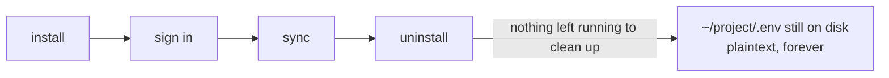
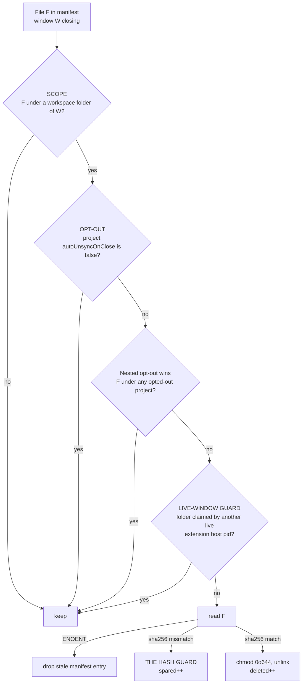

The entire pitch for Envpilot is that your secrets never sit in plaintext in my database. Convex stores a reference ID. WorkOS Vault stores the ciphertext. I can defend that all day.

Then I wrote a VS Code extension whose whole job is to take a decrypted secret and write it to `<workspace>/.env` so your dev server can actually boot.

So much for that.

The second that file lands, the secret exists in three places I do not control: a file on a laptop, a buffer in an editor, and — one `⌘C` later — the operating system clipboard. Every one of those is what I started calling an **exit path**: a way the value gets off the machine and out of my reach.

This is the story of hunting them down across five PRs. Including the ones I opened while closing others.

## The Settings That Pointed at Somebody Else's Server

The first fix had nothing to do with files.

[#69](https://github.com/rafay99-epic/envpilot.dev/pull/69) (merged July 1st, +452/−205) started as a boring performance pass. I pulled `@sentry/node` out of the activation bundle — roughly **2.8MB down to 1MB** — and added a `metadataOnly` mode to `/api/extension/variables` so that drawing the sidebar tree stopped decrypting every single variable just to print its name.

That second one had a side effect I did not expect. Rendering the tree was writing export audit events. Every glance at the sidebar looked, in the audit log, like somebody reading a secret.

Fixing the performance problem fixed the audit noise. They were the same bug from two angles.

The security findings in that PR were nastier. `envpilot.serverUrl` and `envpilot.convexUrl` were **workspace-scoped** settings. Meaning: a `.vscode/settings.json` file committed into any repo you clone could quietly point my extension — carrying _your_ auth token — at a server the repo author controls.

Both are machine-scoped now. Your machine decides where your token goes, not a checked-in file.

Same PR, the sign-in URL stopped being copied to your clipboard by default. It carries a session token. It now only goes to the clipboard if opening a browser outright fails.

That was the first time the clipboard showed up as an exit path. It was nowhere near the last.

## The Day `deactivate()` Ate a File It Didn't Write

Here's what shipped before [#73](https://github.com/rafay99-epic/envpilot.dev/pull/73):

```typescript
export async function deactivate() {
  // Clean up synced .env files to prevent secrets from persisting on disk
  const projects = storageService.getLinkedProjectsMetadataV2();
  for (const project of projects) {
    for (const dir of project.directories) {
      const envFilePath = path.resolve(dir.directoryPath, dir.targetFile);
      try {
        await fs.chmod(envFilePath, 0o644);
        await fs.unlink(envFilePath);
      } catch {
        // File may not exist or be inaccessible
      }
    }
  }
}
```

The intent is perfect. The blast radius is not.

Look at the `chmod`. It strips the read-only bit my own file protection set, then unlinks. Unconditionally. It never once asks whether the file sitting on disk is still the file I wrote.

**And here's the kicker:** `deactivate()` does not mean "the user is finished with this extension." It runs on every extension-host shutdown. Closing a window. Reload Window. An extension update. Routine, constant.

So if you added one hand-written line to a synced `.env` and then closed the window, I deleted it. No backup. No notification.

I ripped the deletion out in #73 and left a comment in the source forbidding anyone from putting it back.

That PR was a bloodbath generally — +5,875/−527, merged July 3rd. It also fixed a dashboard webview that was **completely non-functional in production**: strict nonce CSP blocks inline `onclick`, so every button in that panel was dead, and I had shipped it that way. Rewrote it with `data-action` event delegation and kept the CSP strict. It scoped down a clipboard guard that had been hijacking copy and cut for _all_ files instead of just protected ones. And it added the extension's first tests ever — 21 vitest cases for `src/roles.ts`.

Before that PR: zero tests.

## Congratulations, I Reopened the Original Hole

Fine. `deactivate()` no longer deletes anything. Now walk this through with me:



Follow the path to the end: the extension is gone, so nothing is left running that could ever clean up. The secrets just sit there.

I could not fix this from `deactivate()`. That's the exact code I had just banned from deleting, and it can't tell "uninstall" from "window close" anyway.

VS Code does give you a hook: `vscode:uninstall`. It runs as a plain Node script on the first launch after the extension is fully removed. It does not fire on updates or reloads. Good.

But it has no `vscode` API at all. No `ExtensionContext`. No `globalStorageUri`. No `SecretStorage`. It's a script in a void.

That constraint wrote the design for me. If the cleanup code can't ask VS Code where my data lives, the data has to live somewhere fixed and predictable. [#104](https://github.com/rafay99-epic/envpilot.dev/pull/104) (merged July 11th) added `~/.envpilot/vscode-managed-files.json`, mode 0600, holding `{ path, sha256 }` per file. Never a value.

The hash is the interesting bit, and it isn't there for integrity. It's the data-loss guard that #73 forced me to invent. Straight from the module docstring:

> The hash is the data-loss guard: the uninstall hook deletes a file ONLY if its on-disk content still matches what the extension last wrote. Hand-edited files are always spared (see the `deactivate()` comment in extension.ts for the incident that makes this non-negotiable).

The purge is one readable loop (the selector call that applies the guards is elided here):

```typescript
let content: string;
try {
  content = await fs.readFile(entry.path, "utf-8");
} catch {
  continue; // Already gone — drop the stale manifest entry.
}
if (hashContent(content) !== entry.sha256) {
  spared++; // Hand-edited since last sync — never delete user data.
  kept.push(entry);
  continue;
}
try {
  await fs.chmod(entry.path, 0o644);
  await fs.unlink(entry.path);
  deleted++;
} catch {
  failed++;
  kept.push(entry); // Keep the entry so a later purge can retry.
}
```

**The whole hook is 21 lines**, built as a separate esbuild entry to `dist/uninstall.js`. That's the reason `managedFiles.ts` and `paths.ts` must stay completely free of `vscode` imports — they get bundled into a script that runs outside VS Code entirely.

One thing this hook genuinely cannot do: clear your WorkOS token. That lives in VS Code `SecretStorage`, which is the OS keychain, reachable only through the API the hook doesn't have. My mitigation is server-side device-session revocation — which is a different guarantee than "the token is gone from your machine," and I shipped it as a documented limitation instead of pretending it wasn't.

## Putting the Deletion Back, This Time With Four Guards

With a hash guard in hand I could finally put deletion back into `deactivate()` — where it belonged the whole time, because uninstall is the _rarest_ exit, not the common one. [#124](https://github.com/rafay99-epic/envpilot.dev/pull/124) (merged July 17th, +1,641/−68 across 33 files) added unsync-on-close. Files no longer outlive the editor session.

Four guards, not one. One guard is precisely what got me here.



Read it top to bottom: a file has to survive all four gates before anything is allowed to touch it.

The live-window guard exists because two VS Code windows can have the same folder open, and closing one must not yank the file out from under the other. PID liveness is a heuristic — a recycled pid makes a dead session look alive — but it fails toward _not_ deleting, which is the correct direction for a heuristic to fail in.

## Then My Own File Watcher Undid the Purge

The purge shipped. The purge did not work.

The reason was my own code.

`FileProtectionService` watches every managed file and treats deletion as tampering: `onDidDelete` → 500ms debounce → resync. So `deactivate()` deleted the file, and the watcher cheerfully put it back before the extension host finished dying. The comment in the current source records it verbatim:

> purge reported deleted=1, file was back seconds later.

The fix was ordering, not logic (comments abridged):

```typescript
// TEAR DOWN EVERY FILE WRITER FIRST.
try {
  fileProtectionService?.dispose();
  realTimeSyncService?.dispose();
  syncService?.dispose();
} catch {
  // Never let teardown stop the purge.
}
// Marker is cleared LAST: if the purge dies mid-shutdown the marker
// survives, so the next activation's crash sweep retries the cleanup.
await runUnsyncPurge("close");
await clearSessionMarker(process.pid);
```

Crashes get handled from the other end. A session marker left behind by a dead pid means that session never ran `deactivate()`, so the next activation reaps it and sweeps the _crashed_ session's folders — not the current window's, because a crash in project X has to be cleaned up even when you next open project Y.

Ordering matters there for the opposite reason. On a crash sweep the hash guard fails toward _deletion_, since a fresh sync writes a file whose hash matches the manifest exactly. So the sweep has to run before anything can trigger a sync.

The backend half is small and deliberately boring. `resolveUnsyncOnClose` returns `member override ?? project default ?? true`, and every failure mode — no project, not a member, feature gate closed — returns `true`, the secure answer. Non-members get the platform default instead of an error, so the query neither confirms a project exists nor leaks its settings across an org boundary. The resolved flag rides along inside `pullValues` with variables the extension already fetches, which is why the purge works with no network at all. The pro gate is re-checked at read time, so a pro-to-free downgrade re-locks immediately.

Audit rows carry counts only: `deletedCount`, `sparedCount`, `trigger`, `occurredAt`. No paths, no keys.

And I accepted one behavior that looks like a bug and isn't: the purge fires on Reload Window and extension updates too. The next activation's auto-sync restores the files. That _is_ the security semantics — files never outlive the session.

## The Bug I Found While Fixing a Different Bug

While migrating extension code to Convex's `features/*` paths in #124, I found that seven of those paths had been dead in production since [#95](https://github.com/rafay99-epic/envpilot.dev/pull/95) restructured the backend.

That refactor moved `projectAccess` and `permissionRevocationEvents` under `convex/features/` and shimmed 16 functions. But published extension builds call the backend by baked-in string refs, and **seven of those refs had no shim.** Extension link and unlink. Both real-time subscriptions. Revocation acknowledge. `projects:listForUser`. `featureRegistry:checkFeature`.

Nobody noticed because the errors were swallowed client-side.

Which means real-time permission revocation — a security feature — was silently non-functional in shipped builds.

That is a worse failure than any clipboard hole in this entire post, and it's worth saying why. An exit path you _know_ is open gets a mitigation. An exit path you _believe_ is closed gets nothing at all.

I added the shims, migrated the extension source to full `features/*` paths, and wrote a verify-before-assuming rule into the shim inventory in `convex/README.md`. The shims themselves got deleted later in [#131](https://github.com/rafay99-epic/envpilot.dev/pull/131), once `minExtension` was raised to `1.15.0` and no supported client depended on them.

## I Built the Clipboard Guard as a Permissions Feature. Wrong Frame.

[#144](https://github.com/rafay99-epic/envpilot.dev/pull/144) merged July 18th — +2,154/−344 across 32 files, five stacked blocks of one commit each (clipboard lockdown, autocomplete and hover, sync correctness, auth lifecycle, UI polish), plus 26 fixes and two rounds of review repair.

The clipboard change itself is one function and a flipped default:

```typescript
export function shouldBlock(
  scope: ClipboardGuardScope,
  mode: ProtectionMode | undefined
): boolean {
  if (mode === undefined || scope === "off") {
    return false;
  }
  if (scope === "all-managed") {
    return true;
  }
  // "readonly-roles": block only non-writable roles
  return mode === "strict-readonly" || mode === "readonly-with-request";
}
```

The default became `all-managed`. Before this, the guard keyed off your role — writable roles could copy freely, because I had built the thing as a _permissions_ feature.

That framing was just wrong. Your role decides whether you may **edit** a value. It says absolutely nothing about whether that value belongs on the system clipboard, where any process on the machine can read it.

Exfiltration and authorization are different questions. I had been answering one of them and filing it under the other.

## Three Boundaries That Were Almost Complete

Three of the 26 fixes are worth showing, because they're all the same species of mistake.

**The Command Palette bypass.** I guarded `editor.action.clipboardCopyAction`. I did not guard `editor.action.clipboardCopyWithSyntaxHighlightingAction`, which is sitting right there in the Command Palette, one search away.

**The unguarded startup window.** On window reload, restored tabs were copyable until the first sync re-registered them with the guard. Fixing that meant re-arming from the manifest at activation — which meant adding an optional `mode` field to manifest entries, and older manifests don't have it. So `readManifest` drops unknown modes and the `?? "readonly-with-request"` fallback fails closed.

**Path identity.** The guard is a `Map` keyed by path, so two spellings of one file is a free bypass. `normalizePath` resolves symlinks first (collapsing `/tmp` and `/private/tmp` on macOS), then the key case-folds where the filesystem is usually case-insensitive:

```typescript
export function pathKey(inputPath: string): string {
  const normalized = normalizePath(inputPath);
  return process.platform === "darwin" || process.platform === "win32"
    ? normalized.toLowerCase()
    : normalized;
}
```

Note that this is the _key_, never the stored path. `process.platform` cannot tell you whether a specific volume is case-sensitive, so case-folding a path you then hand to `fs.*` is a bug patiently waiting for a case-sensitive mount.

Hover and IntelliSense got built on the same principle — surface the name, never the value (abridged from `src/providers/envHover.ts`):

```typescript
// The value itself is NEVER rendered here — only the mask.
markdown.appendMarkdown("**Envpilot**\n\nProject: ");
markdown.appendText(resolved.project.projectName);
markdown.appendCodeblock(MASK, "text");
markdown.appendMarkdown(
  `\n[Reveal value](command:envpilot.revealHoverValue?${args})`
);
// Trust ONLY the one command the hover needs — never blanket-trust.
markdown.isTrusted = { enabledCommands: ["envpilot.revealHoverValue"] };
```

Project and environment names are server-controlled, so they get appended as _text_ — a crafted project name can't smuggle a command link into your hover. And `isTrusted` names exactly one command, because blanket trust would execute any command URI that made it into that markdown. The masks are fixed-length in both the hover and the inline cloak decoration, so the mask never leaks the value's length.

The key-matching regex came from DopplerHQ's extension (Apache-2.0, with derivation headers and a `THIRD_PARTY_NOTICES.md`). Porting it fixed a range-anchoring bug I inherited along with it: the original located the key with `line.indexOf(key)`, which returns the first occurrence and mis-highlights when the same key shows up twice on a line. `ENV['ENV']` and `process.env.env` are real test cases now.

## The Best Finding Wasn't Mine

The cubic review caught something I'd have never gone looking for: #69's 30-second response cache and #144's hover **compose into a leak.** A hover opened just before a permission revocation could still pass its role check and read a value straight out of the stale cache.

Two features. Individually safe. Lethal together.

The fix is one line in the revocation handler — `apiService.clearCache()` — so the refetch actually hits the server, and the server denies the revoked caller.

## What Actually Landed

| PR                                                            | Title                                                                                                          | What it changed                                                                                                                                                    |
| ------------------------------------------------------------- | -------------------------------------------------------------------------------------------------------------- | ------------------------------------------------------------------------------------------------------------------------------------------------------------------ |
| [#69](https://github.com/rafay99-epic/envpilot.dev/pull/69)   | perf(extension): faster activation and variable loading, security hardening                                    | Lazy Sentry load (~2.8MB → ~1MB), `metadataOnly` variable reads, machine-scoped server URL settings, sign-in URL off the clipboard by default                      |
| [#73](https://github.com/rafay99-epic/envpilot.dev/pull/73)   | VS Code extension: unified RBAC, brutal-review fixes, optimization                                             | Removed the unconditional `deactivate()` deletion, fixed a fully dead CSP-blocked webview, scoped the clipboard guard to protected files, added the first 21 tests |
| [#104](https://github.com/rafay99-epic/envpilot.dev/pull/104) | fix(extension): purge synced .env files on uninstall (ext v1.12.0)                                             | `vscode:uninstall` hook, `~/.envpilot/vscode-managed-files.json` manifest, sha256 hand-edit guard                                                                  |
| [#124](https://github.com/rafay99-epic/envpilot.dev/pull/124) | feat: VS Code unsync-on-close — hash-guarded purge, pro-gated toggles, audit; restore 7 broken extension paths | Purge on window close with four guards, crash sweep, pro-gated per-project/per-member toggles, counts-only audit, and repair of 7 Convex paths dead in production  |
| [#144](https://github.com/rafay99-epic/envpilot.dev/pull/144) | feat(extension): clipboard lockdown, IntelliSense, and 26 verified bug fixes (1.16.0)                          | Clipboard blocked for all roles by default, fixed-length value cloaking, name-only hover and autocomplete, path-identity and startup-window fixes                  |

The extension sits at `1.16.0`. `minExtension` sits at `1.15.0`.

## Where I Actually Land On This

Cloaking is deterrence, not a boundary. The minimap, peek views, and diff editors all render raw text, and the setting description says so out loud rather than implying a guarantee I can't make.

The manifest is shared by every VS Code fork on the machine, so Code, Cursor, and VSCodium all write to one file. In-process access is locked. Cross-_process_ read-modify-write still races, with the bounded damage documented at the call site.

And the uninstall hook still cannot clear the token out of your OS keychain.

Now the honest structural point, the one none of these five PRs touch: **none of this prevents `cat .env`.**

Once a value is decrypted onto a developer's disk, I am managing the number of easy exits. I am not eliminating them. What #124 actually changed is the _duration_ — the file exists for a session instead of forever.

That's a smaller window. It is not a closed one. And I think the correct next move is to shrink the window further rather than bolt another guard onto the outside of it, because every guard in this post was something I believed was complete right up until it wasn't.

Until then, hash your files and check your exits, nerds.
