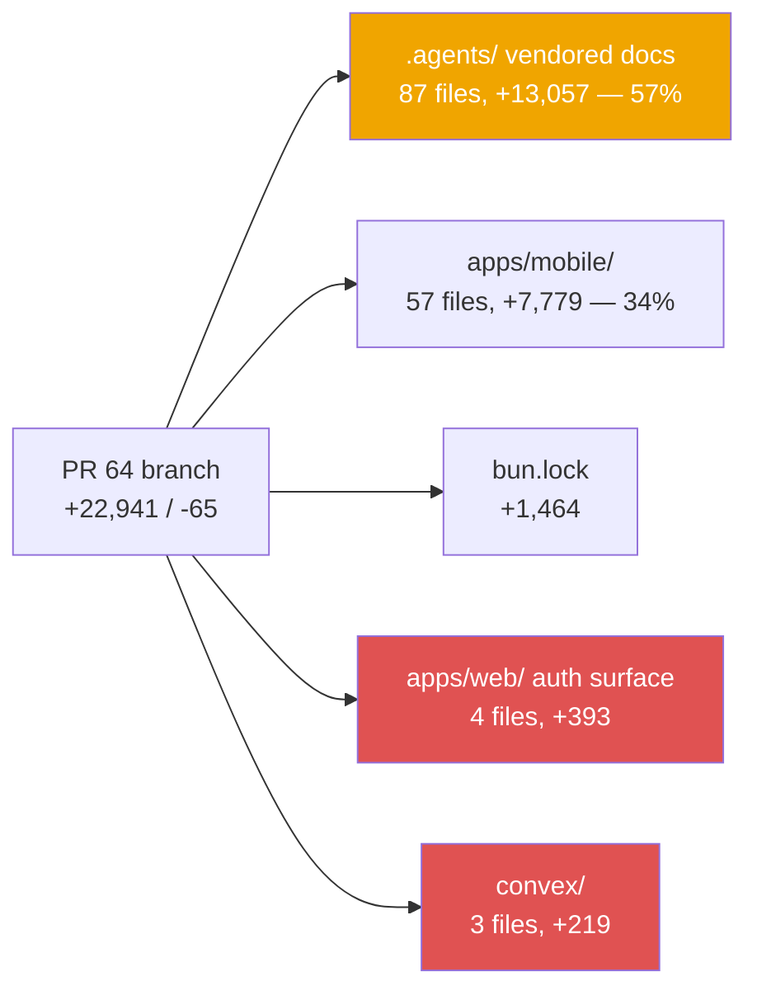
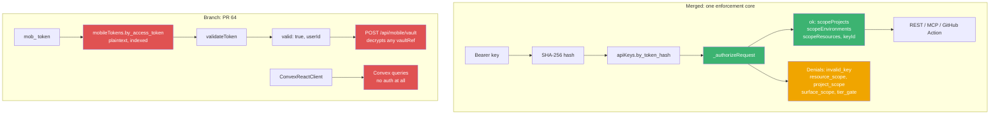
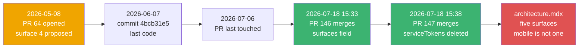

On 2026-05-08 at 18:38 UTC I opened [PR #64](https://github.com/rafay99-epic/envpilot.dev/pull/64), titled "Add React Native mobile app (Expo SDK 55)". The first bullet of the body says exactly what I thought I was doing:

> "Adds `apps/mobile/` — the 4th client surface for Envpilot, built with Expo SDK 55 (React 19, RN 0.83), Expo Router, NativeWind, and direct Convex subscriptions"

As I write this, that PR is still open. Still a draft. **+22,941 / −65**, last touched 2026-07-06, base `main`, head `feat/mobile-app`. Ten weeks of sitting there while `main` walked away from it.

This is the story of what I actually built, why it can't be merged now, and the one design principle it violated so thoroughly that the platform later shipped a public doc contradicting it.

## What "158 files" actually means

The diff stat looks impressive until you break it down by directory. So let me break it down by directory.



Read the top branch first, because it's the biggest one: **87 files and 13,057 lines — 57% of the branch — are not the app.**

They're `.agents/`. Vendored copies of `react-native-best-practices` and `vercel-react-native-skills` reference docs. Rules files. Guidance. The instructions for building the thing were **larger than the thing**.

The app itself is `apps/mobile/`, 57 files and 7,779 lines, and it is not a toy. `@envpilot/mobile` v0.0.1, `expo ~55.0.0`, `react-native 0.83.6`, `react 19.2.0`, Expo Router, `nativewind 4.2.3`, `zustand 5.0.13`, `@shopify/flash-list 2.0.2`, `react-native-reanimated 4.2.1`. Eighteen route files. `index.tsx` is 753 lines, `activity.tsx` 685, `projects/[id]/index.tsx` 656, `projects.tsx` 433. I added `dev:mobile`, `build:mobile:android` and `build:mobile:ios` to the root `package.json` and amended `setup` to symlink `.env.local` into `apps/mobile`.

And then there's the part that matters, the smallest slice on that chart: `convex/` at 219 lines and `apps/web/` at 393.

**That's the auth system.** Roughly 600 lines, under three percent of the branch, and the reason none of the other 22,000 can ship.

## A fourth surface means a fourth way to log in

Here's the thing about client surfaces: the UI is the cheap part. Every new surface needs its own answer to "who is this and what are they allowed to touch," and that answer is where the cost actually lives.

Envpilot already had three surfaces and three credential stories. I added a fourth from scratch:

- `convex/mobileTokens.ts` — 197 lines, six registered functions: `createToken`, `validateToken`, `refreshToken`, `revokeToken`, `updateLastUsed`, `listUserTokens`
- a new `mobileTokens` table with three indexes
- `apps/web/src/app/api/mobile/auth/route.ts` — 254 lines of OAuth PKCE callback, refresh and revoke
- `apps/web/src/lib/mobile-auth.ts` — 82 lines
- `apps/web/src/app/api/mobile/vault/route.ts` — 55 lines
- a hole punched in `apps/web/src/proxy.ts` for `/api/mobile/(.*)`

Real PKCE, too — `code_challenge_method=S256`, `provider=authkit`, deep link back to `envpilot://callback`. Not a shortcut.

I want to be fair to past-me here, because one detail in `mobileTokens.ts` is genuinely careful work:

```typescript
// convex/mobileTokens.ts (branch)
function generateToken(prefix: string): string {
  const chars =
    "ABCDEFGHIJKLMNOPQRSTUVWXYZabcdefghijklmnopqrstuvwxyz0123456789";
  const maxValid = 256 - (256 % chars.length); // 248 for 62 chars — reject 248-255
  const result: string[] = [prefix];
  while (result.length - 1 < 48) {
    const bytes = new Uint8Array(64);
    crypto.getRandomValues(bytes);
    for (const byte of bytes) {
      if (byte < maxValid && result.length - 1 < 48) {
        result.push(chars.charAt(byte % chars.length));
      }
    }
  }
  return result.join("");
}
```

**Rejection sampling to kill modulo bias.** That is more rigor than most of the codebase applies to random values, and I stand by it.

Now look at where those beautifully unbiased tokens got stored.

## The table that stored the password

Every machine credential on `main` follows one rule, and `convex/schema.ts` states it in a comment right on the field:

```typescript
// convex/schema.ts:589-594 (main)
apiKeys: defineTable({
  organizationId: v.id("organizations"),
  // Human label ("Vercel deploy hook", "Terraform CI")
  name: v.string(),
  // SHA-256 hex of the plaintext key — the only stored credential form
  tokenHash: v.string(),
```

The only stored credential form. Here's what I shipped on the branch:

```typescript
// convex/schema.ts (branch), lines 1424-1439
mobileTokens: defineTable({
  userId: v.id("users"),
  accessToken: v.string(),
  refreshToken: v.string(),
  deviceName: v.string(),
  deviceId: v.string(),
  platform: v.union(v.literal("ios"), v.literal("android")),
  lastUsedAt: v.number(),
  expiresAt: v.number(),
  isActive: v.boolean(),
  createdAt: v.number(),
  revokedAt: v.optional(v.number()),
})
  .index("by_access_token", ["accessToken"])
  .index("by_refresh_token", ["refreshToken"])
  .index("by_user", ["userId"]),
```

**Both tokens in plaintext.** Indexed _by their plaintext value_, because that's how `validateToken` looked them up. `ACCESS_TOKEN_EXPIRY_MS` is 30 days. `REFRESH_TOKEN_EXPIRY_MS` is 90 days. So: ninety days of live, replayable credentials, readable by anything that can read the database, in a product whose entire pitch is that it never stores your secrets in the clear.

I did not do this because I didn't know better. The hashing convention was already in the codebase. I did it because I was building a fourth thing in isolation and never went and looked at the third one.

## The vault route with no scope check

This is the file I'd point at if someone asked me what "building in isolation" costs. All 55 lines, and the interesting part is what _isn't_ there:

```typescript
// apps/web/src/app/api/mobile/vault/route.ts (branch, abridged)
const decryptSchema = z.object({
  vaultRef: z.string().min(1).max(255),
});

export async function POST(request: NextRequest) {
  // ...
  const auth = await authenticateMobileRequest(request, convex);
  if (!auth.valid) {
    return unauthorizedResponse(auth.error);
  }

  const result = decryptSchema.safeParse(body);
  if (!result.success) {
    return NextResponse.json({ error: "Invalid request" }, { status: 400 });
  }

  const value = await readSecret(result.data.vaultRef);
  return NextResponse.json({ value });
}
```

**No project check. No environment check. No organization check. No per-variable permission check.** The token proves you are _a_ user. Then you name a `vaultRef` and get plaintext back.

Meanwhile `_authorizeRequest` — the function every other machine path goes through — returns `scopeProjects`, `scopeEnvironments`, `scopeResources` and `keyId`, and can deny with `invalid_key`, `resource_scope`, `environment_scope`, `project_scope`, `surface_scope` or `tier_gate`.

Six denial reasons over there. One over here.

## The provider that authenticates nothing

The PR body advertised "direct Convex subscriptions." Here is the entire provider file:

```tsx
// apps/mobile/src/providers/convex.tsx (branch) — the whole file
import { ConvexProvider, ConvexReactClient } from "convex/react";
import { type ReactNode } from "react";
import { CONVEX_URL } from "@/lib/constants";

const convex = new ConvexReactClient(CONVEX_URL);

export function ConvexClientProvider({ children }: { children: ReactNode }) {
  return <ConvexProvider client={convex}>{children}</ConvexProvider>;
}
```

No `ConvexProviderWithAuth`. No `client.setAuth()`. Nothing.

So the `mob_` token guards the REST routes, and the Convex subscriptions that power _every screen in the app_ carry no identity whatsoever. Authorization happens by the client politely passing an org ID:

```tsx
// apps/mobile/app/(app)/(tabs)/projects.tsx:155-158 (branch)
const projects = useQuery(
  api.projects.listByOrganization,
  activeOrgId ? { organizationId: activeOrgId } : "skip"
);
```

And it worked. Every screen rendered.

Which raises the obvious question: _why_ did it work?

## But here's the kicker

That query has no identity check. On `main`, today:

```typescript
// convex/features/projects/queries.ts:15-25
export const listByOrganization = query({
  args: { organizationId: v.id("organizations") },
  handler: async (ctx, args) => {
    return await ctx.db
      .query("projects")
      .withIndex("by_organization", (q) =>
        q.eq("organizationId", args.organizationId)
      )
      .collect()
      .then((rows) => rows.filter((doc) => doc.deletedAt === undefined));
  },
});
```

That file imports `requireAuthedUser` from `../../lib/identity` and calls it three times. Not here. Pass an organization ID, receive its projects, no credential required.

To be precise about blame: this is not a mobile-branch bug. It is a live characteristic of `main` that the mobile app _depended on_. The unauthenticated Convex client only functioned because the hole was already there.

Read that again, because it's the worst sentence in this post: **fixing the security gap would have silently broken my app.** That's what building a surface on top of an unaudited assumption buys you — a feature that quietly votes against ever hardening the backend.



Two lanes, same platform. Count the green boxes on each side.

## Why no rebase saves it

I could not merge this branch today if I wanted to, and `git rebase` is not the tool for the job.

The branch was written against the old flat Convex root. `git ls-tree origin/feat/mobile-app convex/` lists `convex/admin.ts`, `convex/analytics.ts`, `convex/variables.ts`, `convex/projects.ts`, `convex/users.ts`, and dozens more. On `main`, `ls convex/*.ts` returns exactly **four** files: `auth.config.ts`, `convex.config.ts`, `crons.ts`, `schema.ts`. Everything else moved into `convex/features/<feature>/`, and `CLAUDE.md` now says flatly: "Never register functions at the convex root."

So every Convex path the app names is dead:

- `api.users.getByWorkosId` → now `api.features.users.users.getByWorkosId`
- `api.projects.listByOrganization` → now `convex/features/projects/queries.ts`
- `api.variables.listByOrganization` → **doesn't exist anywhere on `main`**. It lived at `convex/variables.ts:51` on the branch and was never re-created.
- `api.mobileTokens.*` → would itself be an illegal root registration under the current convention

And the branch's one edit to a shared doc, `docs/ROADMAP.md`, targets a file deleted from `main` on 2026-07-18 in `747527a5`. A merge conflict against a file that no longer exists.

It doesn't need a rebase. It needs a rewrite.

## What shipped instead, five minutes apart



Follow the bottom-right: the two PRs that landed while #64 sat open.

[#146](https://github.com/rafay99-epic/envpilot.dev/pull/146) merged at **2026-07-18T15:33:24Z**, +680/−523. It added `apiKeys.surfaces` — an optional array of `github_action | rest_api | mcp_server` — gave `_authorizeRequest` a `surface` parameter and a `surface_scope` denial mapping to HTTP 403 `FORBIDDEN_SURFACE`, and derived the tier gate from the surface. Its reasoning, from the body: "a leaked CI token must never stay usable on REST/MCP."

[#147](https://github.com/rafay99-epic/envpilot.dev/pull/147) merged at **2026-07-18T15:38:49Z**. Five minutes later. +2,216/−1,719. It deleted the entire `serviceTokens` table, `cicd/tokens.ts`, the pull-path fallback, the CI/CD settings tab, the `cicd_service_tokens` flag and the drain migration. What's left in `convex/schema.ts` where the table used to be is a tombstone comment: "The legacy `serviceTokens` table (CI/CD pull tokens) is RETIRED: every row was drained into apiKeys…"

Two PRs, five minutes apart, whose entire content is _deleting a second way to authenticate a machine._

And the docstring at the top of `convex/features/api/authorize.ts` reads like a reply I wasn't in the room for:

> "One function every surface calls — the REST API, the MCP server, and (indirectly, via a compat lookup) the legacy CI/CD pull endpoint all authenticate through `_authorizeRequest`. **New surfaces never re-implement authorization**; they hash their bearer credential and call this."

My branch is 600 lines of a new surface re-implementing authorization. Including the part where it doesn't hash.

## The line that closed the case

#147 also shipped `apps/docs/content/architecture.mdx`, the canonical public description of the system. Its frontmatter:

> `title: "Architecture: the machine surfaces"`

And the first paragraph:

> "Envpilot exposes your projects and variables through five client surfaces. Two are driven by a human at a keyboard, two are driven by programs, and one is a hard-locked CI reader… they all funnel through a **single enforcement core**, so there is exactly one place where scope, plan, and audit are decided."

Five surfaces: CLI, VS Code extension, REST API, MCP server, GitHub Action.

The repo went from three documented surfaces to five while my branch sat open. **The one surface I actually wrote 22,941 lines of code for is in neither count.** The word `mobile` appears zero times in `CLAUDE.md` — I checked with `grep -niw` and got nothing back.

## What I'd tell 2026-05-08 me

Not "don't build the mobile app." Mobile is a reasonable idea and 7,779 lines of Expo Router screens is real work I'd reuse.

What I'd say is: **the auth was under three percent of the diff and one hundred percent of the reason it died.** I spent my care in the wrong place — rejection-sampling a token generator for a table that stored the token in plaintext anyway. Precision on the fourth copy of something that should never have had a fourth copy.

If I'd started at `authorize.ts` instead of at `apps/mobile/`, the mobile app would be a `mobile_app` value in the `surfaces` array and about forty lines of client code. It would have merged. Instead I built a parallel universe and the main one moved.

And I'd tell him the ugliest part isn't the plaintext tokens. It's that the app worked because `listByOrganization` doesn't check who's asking — a gap that is _still live on `main` right now_, that I only found because I went digging for why an unauthenticated Convex client rendered a full dashboard.

The abandoned branch's one genuine contribution to this codebase is a security finding.

PR #64 is still open. I'm leaving it open, because a draft PR with a 22,941-line diff and a dead `convex/` tree is a better reminder than a closed one.

Until then — go read your own abandoned branches, nerds. There's a bug report in there.
