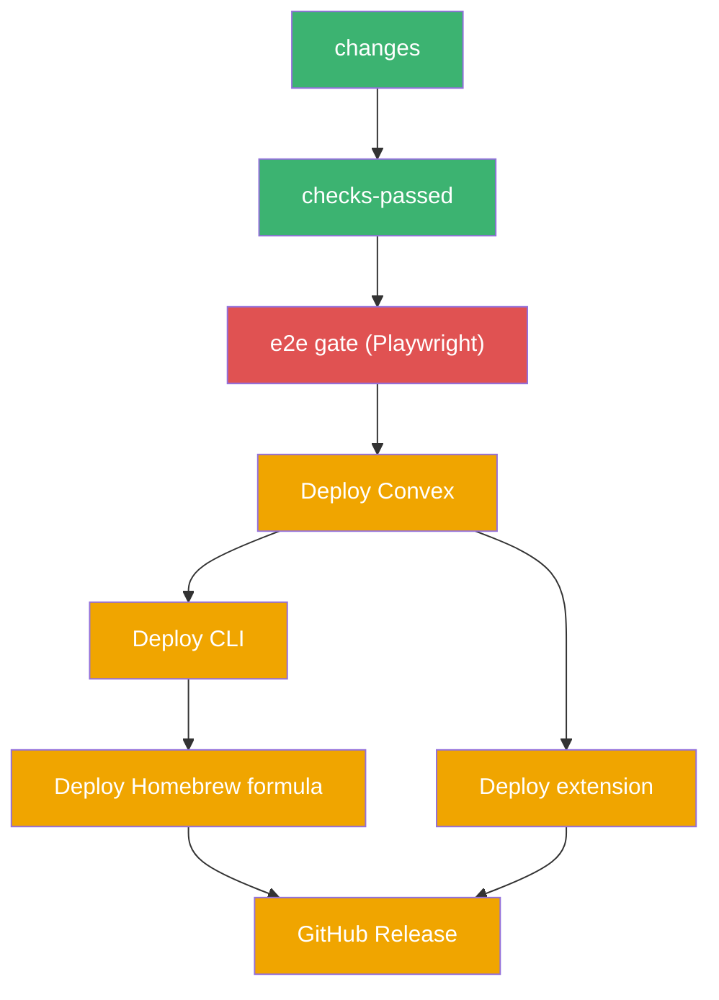
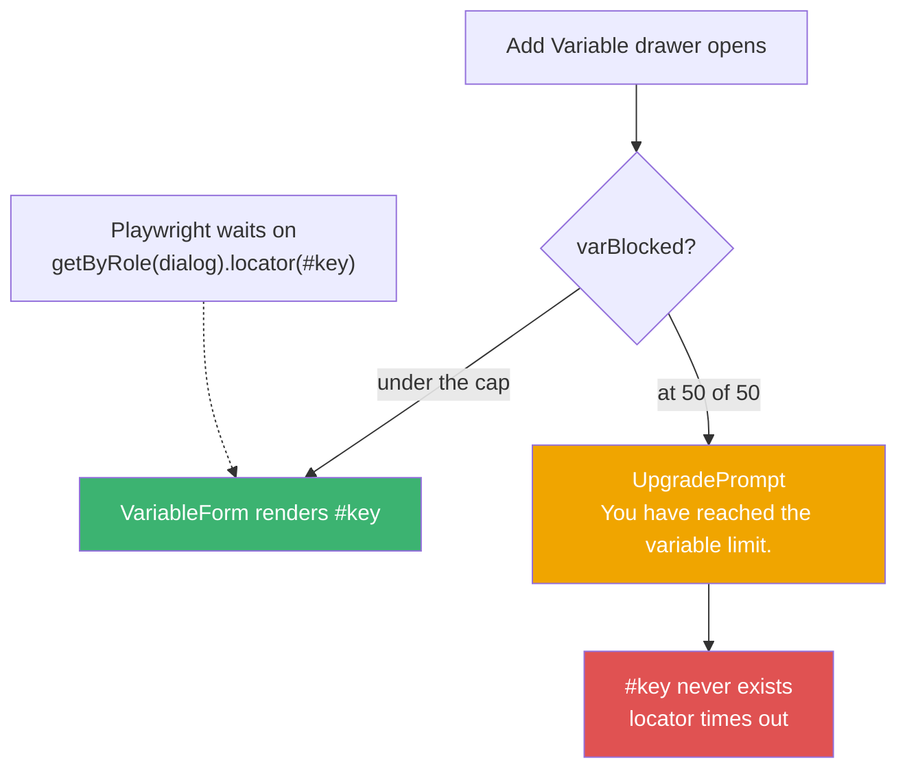
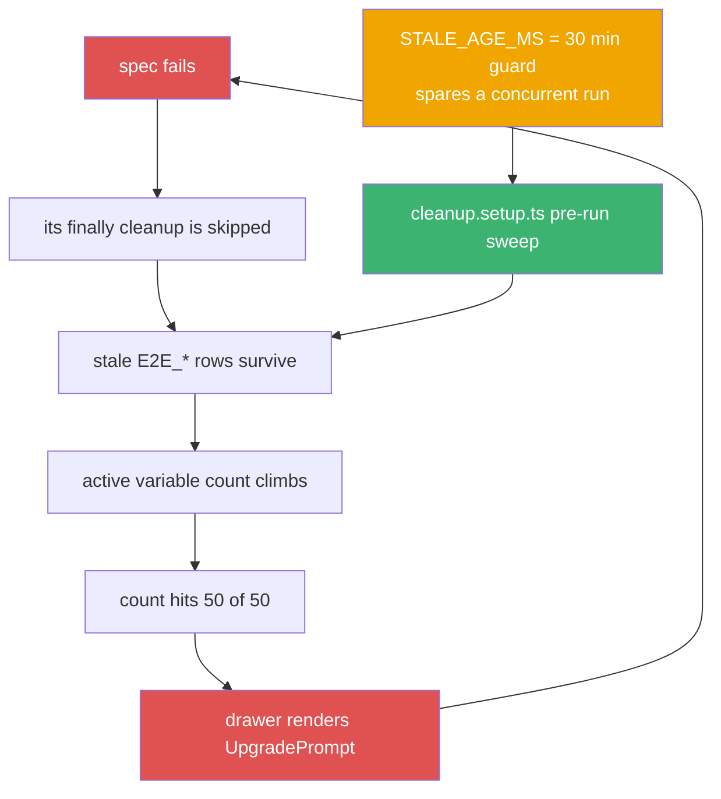

On July 10th, 2026, at `14:43:50` UTC, I merged [PR #96](https://github.com/rafay99-epic/envpilot.dev/pull/96) and gave Envpilot a real end-to-end test gate. Full Playwright suite on every push to main, against an isolated Convex deployment, hard-blocking every deploy job below it. The thing every engineering blog tells you to build.

At `22:45:59` UTC the same day, I turned it off.

**Eight hours and two minutes.** That's the entire lifespan of the strictest quality gate I've ever written. It's still off today, eight days later, and this is the story of why — including the part where the tests were wrong and the product was right.

## Why I built it in the first place

An hour before #96, I'd merged [#95](https://github.com/rafay99-epic/envpilot.dev/pull/95), which moved every single Convex function into `convex/features/*` paths. Every query, every mutation, new addresses.

CLI `1.16.0` and extension `1.10.0` were the first client builds compiled against those new paths. Shipping a client against a backend contract nobody had exercised end-to-end is exactly the mistake that eats a weekend.

So the gate. `bunx convex deploy --yes` to a throwaway deployment, run the suite against it, and wire `needs.e2e.result == 'success'` into deploy-convex, deploy-cli, deploy-extension and the GitHub release.



Red at the top means nothing below it moves — that's the whole design, and on the first two runs it worked exactly as drawn.

The one part of #96 I still think is unambiguously correct is this guard:

```yaml
# A gate that silently skips is fake safety: the authenticated specs
# self-skip without credentials and the suite would go green having
# tested nothing. Fail loudly instead until the secrets exist.
- name: Verify e2e secrets are configured
  run: |
    missing=""
    [ -z "$E2E_CONVEX_DEPLOY_KEY" ] && missing="$missing E2E_CONVEX_DEPLOY_KEY"
    [ -z "$E2E_CONVEX_URL" ] && missing="$missing E2E_CONVEX_URL"
    # ...five more
    if [ -n "$missing" ]; then
      echo "::error::E2E gate cannot run — missing repo secrets:$missing."
      exit 1
    fi
```

**Why that matters:** three files away, `apps/web/tests/e2e/env.ts` exports `hasE2ECredentials`, and every authenticated spec self-skips when it's false. Without the guard, a misconfigured CI produces a beautiful green checkmark for a suite that tested precisely nothing. Hold that thought. It comes back later, and it bites me.

## Run one: twelve minutes to find a bug that wasn't CI's fault

First gate run, `29100933255`. Failed in **12m57s**. The Playwright summary line:

```
6 failed
3 flaky
5 skipped
28 passed (12.0m)
```

Locally that same suite runs serial in **5.5 minutes**. On the runner, `next dev` was compiling every route cold, on demand, the first time a test touched it. Twelve minutes versus five and a half — roughly **double** the window for anything timing-sensitive to lose its race.

And something was losing a race. `useConvexUser` was firing a `useQuery` before the WorkOS JWT had attached to the Convex socket. [#97](https://github.com/rafay99-epic/envpilot.dev/pull/97) fixed it:

```typescript
// Gate on the Convex client's OWN auth state, not just the app-level
// WorkOS user: `workosId` is available immediately (SSR-hydrated) while
// the JWT attach to the Convex socket is still in flight. Firing then
// throws the transient "Unauthenticated: no verified user identity"
// race — and every downstream convexUserId-gated query inherits the
// same window. isAuthenticated flips only after the token is attached.
const { isLoading: authLoading, isAuthenticated } = useConvexAuth();
const authReady = !authLoading && isAuthenticated;

const convexUser = useQuery(
  api.features.users.users.getByWorkosId,
  workosId && authReady ? { workosId } : "skip"
);
```

**The Insight:** that's a genuine product bug. A real user on a slow connection could hit that window. My CI gate, on its very first run, found something my local machine was too fast to ever show me. I also switched the gate to `next build` + `bun run start` in the same PR, because testing a dev server is testing a thing users never touch.

At that point I was feeling pretty good about the gate.

## Run two: the suite couldn't even finish failing

Run `29104803530`. It didn't fail.

It ran for **30m17s** and got shot by its own `timeout-minutes: 30`.

Read that again. The gate did not report red. It ran out of budget mid-suite and GitHub cancelled it. Five deploy jobs — Convex, CLI, extension, Homebrew, GitHub Release — sat there `skipped` for the second time that day.

Every failure had the same signature: `getByRole('dialog').locator('#key')` timing out. The Add Variable drawer opened, and the key input wasn't in it. Not slow. Not flaky. _Absent._

I went looking for what broke the drawer.

Nothing had.

> The shared "E2E Fixture Project" was sitting at **50 of 50** active variables — the free-tier `max_variables_per_project` cap — and all fifty were stale `E2E_*` rows left behind by the two earlier failed runs.

Here's the branch in `variable-create-drawer.tsx` that deleted my locator:

```tsx
{activeTab === "single" ? (
  varBlocked ? (
    <UpgradePrompt
      reason={varCheck.reason || "You have reached the variable limit."}
      feature="Unlimited Variables"
      currentTier="free"
      variant="inline"
    />
  ) : (
    <VariableForm
```



Follow the right-hand branch: nothing on it is broken, and `#key` is nowhere on it.

**The Revelation:** `#key` didn't exist because the product had correctly decided this user was not allowed to create another variable. Tier gating did its job. `UpgradePrompt` rendered instead of `VariableForm`. My suite read a correct product decision as a broken selector and burned thirty minutes staring at a dialog that was telling it the truth in plain English.

That is the most humbling class of test failure there is. The test was wrong and the code was right, and the test was the thing with a red X next to it.

## The ratchet

The worst part isn't that it happened. It's that it was self-feeding.



Follow the loop clockwise — every failing run makes the next run more likely to fail.

Each spec creates uniquely-named `E2E_*` variables and cleans up after itself. A spec that _fails_ skips its own `finally`. So run one's debris raised the count, run two's debris raised it further, and once the count touched 50 every variable-creating spec in the suite failed for a reason that had nothing to do with the code under test.

[#98](https://github.com/rafay99-epic/envpilot.dev/pull/98) broke the loop, +593/−147 across 15 files. The core of it is a new `cleanup` Playwright project that sweeps the fixture org before the specs run — and it has exactly one commit in its entire history, `baac0856`. Shipped once, never touched since.

The comment I left on the age guard is my favourite thing in that PR:

```typescript
/**
 * Only purge fixtures older than this. A concurrent suite run (another
 * terminal, CI) creates variables/tags seconds before using them — an
 * age-blind sweep here deletes them out from under that run's assertions
 * (this actually happened: one run's cleanup emptied another run's export).
 * Real debris is hours old; 30 minutes is far beyond any single run.
 */
const STALE_AGE_MS = 30 * 60 * 1000;
```

**The Challenge:** my fix for the poisoning nearly became the next poisoning. I wrote a sweeper to delete stale test data, and the first version of it deleted a live run's data mid-assertion. Thirty minutes of grace, and the ouroboros stops eating.

I also added a fail-fast, because a 90-second retry loop against a permanently-blocked drawer is a 90-second way to learn nothing:

```typescript
// Set when the drawer shows the tier-limit Upgrade prompt instead of the
// form. That state is persistent (the project is genuinely at the cap), so
// retrying inside toPass would burn the whole 90s budget on every call —
// exit the loop and fail the spec immediately with an actionable message.
let tierLimitError: Error | null = null;
```

The message it throws names `max_variables_per_project`, names `cleanup.setup.ts`, and tells you to delete leftover `E2E_*` rows. Thirty minutes of mystery became one line of instruction.

## The tests that had been green by not running

#98 also put the e2e account on the pro tier, through an internal-only mutation:

```typescript
/**
 * Puts the e2e test account on the pro tier so the shared fixture org has
 * unlimited projects/variables/accounts. ... tier gating itself is not what
 * the suite asserts (specs self-skip when a feature is gated).
 * Idempotent: safe to run on every CI deploy.
 */
export const ensureE2EUserPro = internalMutation({
```

There's a yes-but here, and it's the one that actually changed how I think.

On the free tier, `max_active_shares` is `"0"`. Which means the share-gated specs had been _self-skipping_ — the product said no, so they never ran. The moment the account could afford them, the serial run went from **39 passed / 6 self-skipped** to **42 passed / 3 skipped**.

**The Discovery:** remember the loud-failure guard from #96, the one I wrote specifically to stop a suite from going green without testing anything? The suite had a quieter version of the same disease the whole time, and I shipped the guard without noticing. The product said no, and the tests recorded that as a pass. Same bug, one layer down, in code I'd just finished congratulating myself about.

I should have caught that when I wrote the skip logic. I didn't, because a skipped test in a Playwright summary looks like a decision someone made on purpose. It looked deliberate. It was accidental.

## Two green runs

That's it. Two.

- `29122517700`, the #98 merge — `success` in **3m42s**, `42 passed / 3 skipped (1.2m)`
- `29127080727`, a Polar billing hardening merge — `success` in **4m01s**
- `29128624765` — gate `skipped`

The third one is [#100](https://github.com/rafay99-epic/envpilot.dev/pull/100), commit `221dcc6d`, `ci: disable the cloud e2e gate (Convex quota/cost)`. Every gate run drives a cloud Convex dev deployment, and the free-tier Database I/O quota was gone. CI was the main burner.

```yaml
if: |
  false &&
  github.event_name == 'push' && github.ref == 'refs/heads/main' &&
  needs.changes.outputs.any == 'true'
```

Two characters and an ampersand. The deploy jobs were relaxed to accept `'success' || 'skipped'`, so a failing gate still blocks deploys the moment it's switched back on. It's a light switch, not a demolition.

The comment above it is dated `2026-07-11` while the merge landed at `22:45:59` UTC on the 10th. My timezone had rolled over. I like that the file disagrees with git about what day I did this.

## What it actually cost

CLI `1.16.0` and extension `1.10.0` were version-bumped in #96 and did not reach npm and the marketplace until `20:53Z`. **Six hours and ten minutes** late.

None of that delay was caused by a product defect. One real bug was found — the auth race in #97, and that one was worth it. The rest of the delay was the gate failing on its own test data and then failing on the consequences of having failed.

## The scar came home

Here's the part I didn't plan.

[#102](https://github.com/rafay99-epic/envpilot.dev/pull/102), merged about two hours after the switch-off, wrote the outcome into `CLAUDE.md` as policy: _"The full local run before every merge is mandatory and is the only gate."_ CI enforcement replaced by a sentence in a docs file.

Then [#139](https://github.com/rafay99-epic/envpilot.dev/pull/139) migrated the whole pipeline off CircleCI and back onto GitHub Actions. That migration carried the `false &&` back into the pipeline of record — acknowledged in a header comment, never re-enabled. Five days earlier, [#115](https://github.com/rafay99-epic/envpilot.dev/pull/115) had reworked CI for build minutes and didn't touch it either.

That switch has now survived a full CI platform migration without a single person, me included, arguing for turning it back on.

The workflow comment promises a replacement: run the suite against a self-hosted `ghcr.io/get-convex/convex-backend` in CI, zero cloud quota. That plan exists. It's 19K of research on my laptop, in a gitignored directory. If you clone the repo and follow the comment, you find nothing. It hasn't shipped in eight days.

## Where I land on this

Meanwhile the suite kept growing. It's **97 `test()` declarations across 32 spec files** now, against the 45 that run three actually executed. Every one of them runs on my machine, by hand, before every merge, forever, with absolutely nothing verifying that I did it.

And honestly? I'd do it again in the same order.

The gate wasn't a waste. It paid for itself in eight hours by finding the Convex auth race, and it exposed a suite that had been silently skipping its own share-link coverage. Those are real defects that survived every local run I'd ever done. The cost was one late release and a lot of reading.

But a gate that runs against metered cloud infrastructure isn't a gate — it's a subscription with a veto. When the meter ran out, the safety got switched off, because the only two options at that moment were "ship nothing" and "trust myself." I picked trust myself, and I wrote it down honestly in a comment with a re-enable instruction instead of quietly deleting the job.

That's the compromise I'd defend. What I _won't_ defend is that the replacement is still sitting in a gitignored folder. A disabled gate with a plan is fine for a week. Eight days in, it's just a disabled gate.

I know exactly which two characters to delete.

Until then, run your suite locally, nerds.
