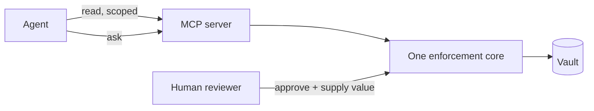

# Giving an agent secrets safely

A coding agent that cannot see your environment variables writes code that guesses at them. An agent with your `.env` on disk is a credential you cannot revoke. The middle path is a scoped, audited, read-only key — plus a way for the agent to ask when it needs more.

## The shape of it



The agent reads within its scope and files requests outside it. Every value it reads is logged against its key, and it can never write.

## Set it up

<Steps>

### Mint a narrow key

**Organization → Settings → API Keys → New API Key**:

- surface: **MCP server** only
- projects: the one repository's project — not "all projects"
- environments: **development** only, unless the agent genuinely deploys
- resources: `projects`, `variables`, and `requests`

Leave `files` off unless the agent runs builds that need a keystore. Choose an expiry.

### Keep the key out of your config

```bash
read -rs "ENVPILOT_API_KEY?Envpilot API key: "; echo
export ENVPILOT_API_KEY
```

Then reference the variable by name in the client config, never the plaintext. Full instructions per platform: [MCP setup](/mcp/setup).

### Connect the client

```bash
claude mcp add --transport http --scope user \
  envpilot https://www.envpilot.dev/api/mcp \
  --header 'Authorization: Bearer ${ENVPILOT_API_KEY}'
```

Single quotes matter — they keep the placeholder literal in the saved config.

### Verify the tools loaded

Run `/mcp` inside a session. A server that is _listed_ is not the same as a server whose tools are _live_.

</Steps>

## What a good session looks like

1. The agent calls `envpilot_list_projects` to find the project.
2. It calls `envpilot_get_variables` with `metadata_only` to see which keys exist — no decrypt, no audit entry, no values in its context window.
3. It reads only the specific values it needs, by key.
4. Missing something? `envpilot_request_variable` with a justification. You approve in the dashboard or with `envpilot requests approve <id>` and type the value yourself.

Step 2 is the habit worth encouraging in your prompt: **look at key names first, fetch values last**. Most code an agent writes needs to know a variable exists, not what it says.

## Guardrails you get for free

| Risk                               | What stops it                                                       |
| ---------------------------------- | ------------------------------------------------------------------- |
| Agent edits a production secret    | No machine credential can write. There is no such tool              |
| Agent invents a value and files it | Requests carry no value; the reviewer supplies it                   |
| Agent loops and spams reviewers    | 5 requests/hour, 5 open at a time, 24-hour cooldown after rejection |
| Key leaks into a log               | Revoke it; the next call fails, with no grace period                |
| You need to know what it read      | Every value read is audited against the key                         |

## Guardrails you must add yourself

- **Scope narrowly.** "All projects" includes projects that do not exist yet.
- **Prefer development.** An agent rarely needs production to write code.
- **Set an expiry.** An experiment from March should not still hold a key in November.
- **Do not grant `files` casually.** A leaked string rotates in minutes; a leaked signing key does not.
- **Watch the context window.** Once a value is in a transcript, it lives wherever that transcript lives.

<Callout type="warning" title="The agent's context is not a vault">
  Envpilot controls what an agent can fetch, not what happens after. Anything
  read into a conversation may be stored by the client, synced, or reviewed
  later. Treat every value an agent reads as disclosed to that client's whole
  retention policy.
</Callout>

## Limits

- Pro plan (`mcp_server`), re-checked on every call.
- Scope is immutable — widening access means a new key and a client restart.
- Hosted Claude connectors expect OAuth and cannot carry a fixed bearer key; use Claude Code.
- Tool calls draw on the same rate buckets as REST for that key.

## See also

- [MCP overview](/mcp/overview) · [Tools](/mcp/tools) · [Agent requests](/mcp/agent-requests)
- [Architecture](/start/architecture) — the trust model in full
