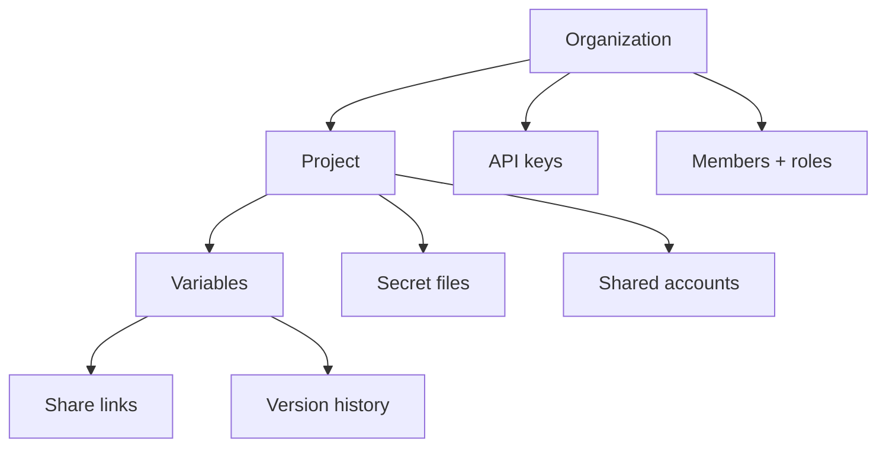

# Data model

Two different secrets, two different storage patterns. Understanding which is which explains most of the behaviour you will meet in the CLI, the API, and the dashboard.

## The shape of things



An organization owns projects, members, and API keys. A project owns variables, secret files, and shared accounts. Everything below the project is scoped to one or more of the three fixed environments.

## Pattern 1 — variables: reference, never plaintext

A variable row in Convex holds its key, environments, description, tags, flags, timestamps… and a **vault reference id**. The value itself lives in WorkOS Vault, encrypted at rest.

```
Convex row  →  vaultSecretId  →  WorkOS Vault  →  plaintext value
```

Convex never sees plaintext. A database dump is a list of key names and pointers. Reading a value requires a live, authorized call that resolves the reference through Vault.

## Pattern 2 — secret files: envelope encryption

A keystore is not a string you can hand a key-value vault, so [secret files](/platform/secret-files) split the secret across **two** stores:

```
plaintext --AES-256-GCM--> ciphertext  →  Convex file storage
                 key + iv              →  WorkOS Vault
```

Neither store alone is enough: Convex holds bytes it cannot read, Vault holds a key to something it does not have. That is strictly stronger than the variable model, where the Vault object _is_ the secret.

Every upload mints a **fresh** key and nonce. There is no "re-encrypt in place" path, so the one catastrophic failure mode of AES-GCM — reusing a (key, nonce) pair — is unreachable by construction rather than prevented by a check somebody could later delete.

## What each store knows

| Store             | Holds                                                                    | Useless without                    |
| ----------------- | ------------------------------------------------------------------------ | ---------------------------------- |
| Convex            | Metadata, roles, grants, audit log, vault reference ids, file ciphertext | Vault (for values and file keys)   |
| WorkOS Vault      | Variable values, shared-account credentials, secret-file key material    | Convex (for which secret is which) |
| Your machine / CI | Whatever a pull just wrote to disk                                       | —                                  |

The third row is the honest one: once you pull, the plaintext is on your disk under your control. Everything Envpilot does after that — [commit guards](/extension/protection), `.gitignore` writes, value cloaking — is about keeping that copy from escaping.

## Invariants worth knowing

- **(key, environment) is unique per project.** Enforced on every variable write path — create, update, request approval, restore. See [Variables](/platform/variables).
- **(path, environment) is unique per project** for secret files, with the same logic.
- **Deletes are soft** for 7 days, then purged with their vault objects. Restores re-run the uniqueness check rather than merging silently.
- **Reads are bounded and never partial.** A read that cannot be completed in full fails loudly instead of returning a truncated set — a half-populated `.env` is worse than an error, because the process starts and then misbehaves.
- **Every value-returning machine read is audited** against the API key that made it.

## Identifiers you will see

| Prefix / shape   | What it is                                                      |
| ---------------- | --------------------------------------------------------------- |
| `envpk_…`        | An API key. Shown once at creation; only its SHA-256 is stored. |
| Project slug     | URL-safe project identifier, used by the CLI and REST API.      |
| Destination path | Where a secret file is written, relative to the project root.   |

## Limits

- Convex holds no plaintext values, so nothing in the database alone can be decrypted — but a compromised Vault credential _and_ a compromised database is a different story.
- 1000 active secret files per project; every reader is bounded by that same number.
- Version history is Pro-only; on Free, changes apply without a comparable record.
- Once a client pulls, the plaintext on that disk is outside this model.

## See also

- [Security](/platform/security) — encryption, revocation, audit
- [Secret files](/platform/secret-files) — the file object in full
- [Architecture](/start/architecture) — the enforcement core every surface shares
