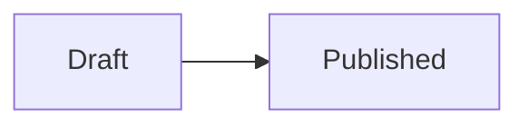
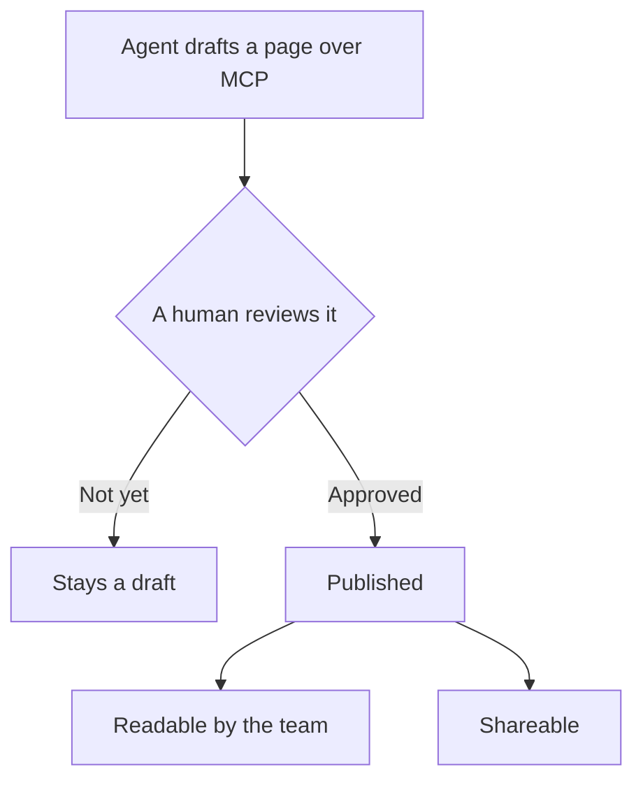
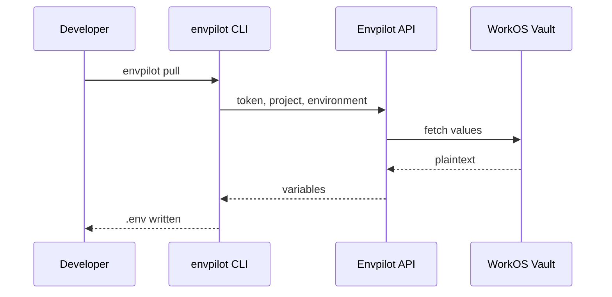

# Diagrams in documentation

A page describing a deploy pipeline, an auth handshake or an approval flow is
mostly a picture with sentences around it. An uploaded image goes stale the
moment the flow changes, and nobody can diff a PNG.

A documentation page body can instead carry [mermaid](https://mermaid.js.org)
source in a fenced code block. The diagram lives in the page as text, so it
diffs like prose, is found by search like prose, and can be written by a coding
agent over MCP like prose.

## Writing one

Fence a block with the language `mermaid`, anywhere in the body:

````markdown

````

In the editor, **Insert → Blocks → Diagram** drops in a starter flowchart so
you do not have to remember the fence.

The same fence renders on every surface that shows a page body:

| Surface                               | What renders                              |
| ------------------------------------- | ----------------------------------------- |
| Dashboard reader                      | The diagram                               |
| Split-view editor                     | The diagram, live, as you type            |
| [Shared pages](/platform/doc-sharing) | The diagram, exactly as its author saw it |

The renderer is ~500 KB, so it is loaded only once a page actually contains a
`mermaid` fence. A page without one costs nothing.

## Two examples

Both of these are plain fences in this page's markdown source — open the raw
markdown from the page actions if you want to copy one.

A flowchart of the documentation review gate:



A sequence diagram of a CLI pull:



## What a diagram may not do

Mermaid runs at `securityLevel: "strict"`. HTML inside a node label is escaped
rather than rendered, and `click` callbacks are ignored.

<Callout type="warning" title="Strict mode is load-bearing here">
  Documentation bodies are written by teammates **and** by coding agents over
  MCP. A looser security level lets a diagram carry HTML in a node label and
  bind click handlers — which is stored XSS in the next reader's authenticated
  session. The restriction is the reason the feature can accept machine-authored
  input at all.
</Callout>

## Bounds and the fallback

Two parser bounds apply, because a body of `graph TD` edges is perfectly legal
markdown and would otherwise hang the reader's tab:

| Bound         | Value             |
| ------------- | ----------------- |
| `maxTextSize` | 50,000 characters |
| `maxEdges`    | 500               |

A diagram that exceeds a bound, or that does not parse, **falls back to its own
source rendered as a plain code block**. The rest of the page is unaffected —
one broken diagram never costs you the page around it.

The editor preview depends on this: a diagram fails on nearly every keystroke
while you are typing it, and recovers the moment it parses.

## No tier gate

Rendering happens in the browser and costs the platform nothing, so there is no
feature key for it and no Free/Pro difference. The
[page caps](/limits/plans) on documentation still apply — a diagram is part of
a page, not a resource of its own.

## See also

- [Sharing documentation](/platform/doc-sharing) — handing a published page to a teammate or minting a public link
- [MCP tools](/mcp/tools) — how an agent drafts a page, and what a human must do to publish it
- [Plans & limits](/limits/plans) — documentation page caps per project and per organization
