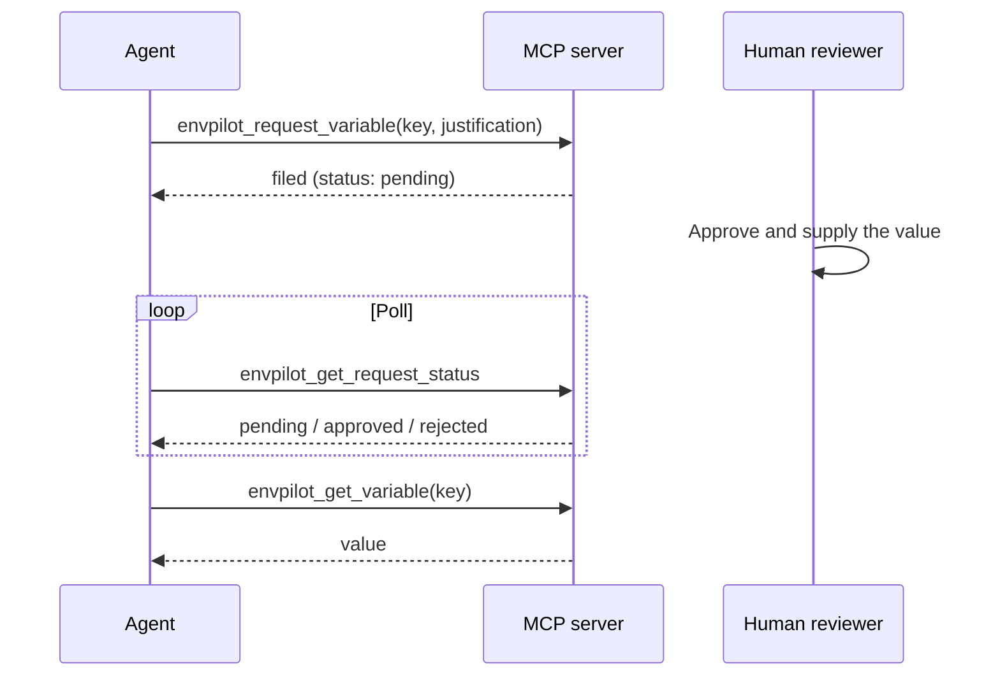

# Requests & approvals

A request is an ask, not a change: _"I need `STRIPE_SECRET_KEY` in production, here is why."_ It lands in a reviewer's queue, and if the reviewer approves, **the reviewer supplies the value**. The requester never proposes secret material.

That single rule is what lets Envpilot hand a coding agent real access without handing it write access.

## Who can file, who can review

| Actor                                           | Files requests       | Reviews requests |
| ----------------------------------------------- | -------------------- | ---------------- |
| Owner, Project Manager, Team Lead               | — (creates directly) | ✓                |
| Developer                                       | ✓                    | —                |
| Editor, Viewer                                  | —                    | —                |
| API key with the `requests` resource (MCP only) | ✓                    | —                |

Reviewing needs the `project.requests.review` capability. Developers see only their own requests; reviewers see every request in their projects.

## The human loop

<Steps>

### File it

From the dashboard (**Request Variable**), the CLI (`envpilot request`), or VS Code (**Envpilot: Request Variable**). You supply the key, the environments, and why you need it. A developer's environment choices are limited to their assigned scope.

### Review it

The reviewer sees the request in the project's Requests inbox, in `envpilot requests`, or via email. They approve, reject with a reason, or leave it pending.

### Supply the value

Approval is where the value is entered. In the CLI that is a masked prompt; in CI, `--value-stdin` keeps it out of `argv` and out of shell history.

### Use it

Once approved, the variable exists and appears in the requester's next pull.

</Steps>

Rejection carries the reviewer's reason back to the requester, so nobody has to guess whether they were denied or ignored. Cancelling is available to the requester while a request is still pending.

## The agent loop

An API key with the `requests` resource — used over the [MCP server](/mcp/overview) — can file exactly the same kind of request. It cannot approve one, and it cannot supply a value.

A justification is **required** on machine-filed requests. A reviewer approving a request should be able to tell what the agent was doing when it asked.

## Limits

Every approval fans out an email, so an agent stuck in a retry loop is a reviewer-spam engine unless it is capped twice:

| Cap                            | Value                           |
| ------------------------------ | ------------------------------- |
| Machine request rate           | 5 per hour per API key, burst 2 |
| Machine requests standing open | 5 pending per API key           |

Hitting the standing cap returns a plain refusal: wait for a human to review what you already filed. Both caps are per **key**, so revoking a runaway agent's key stops it instantly. See [Rate limits](/limits/rate-limits).

Other boundaries worth knowing:

- Requests create variables. They are not a channel for editing an existing value — that is a direct write by someone who holds the capability.
- The GitHub Action can never file a request. CI reads; it does not negotiate.
- Approval is the only path where a machine-originated request produces a value, and a human always types it.

## See also

- [CLI: requests](/cli/requests) — `request`, `requests list/approve/reject/cancel`
- [MCP: agent requests](/mcp/agent-requests)
- [Roles & permissions](/platform/rbac)
